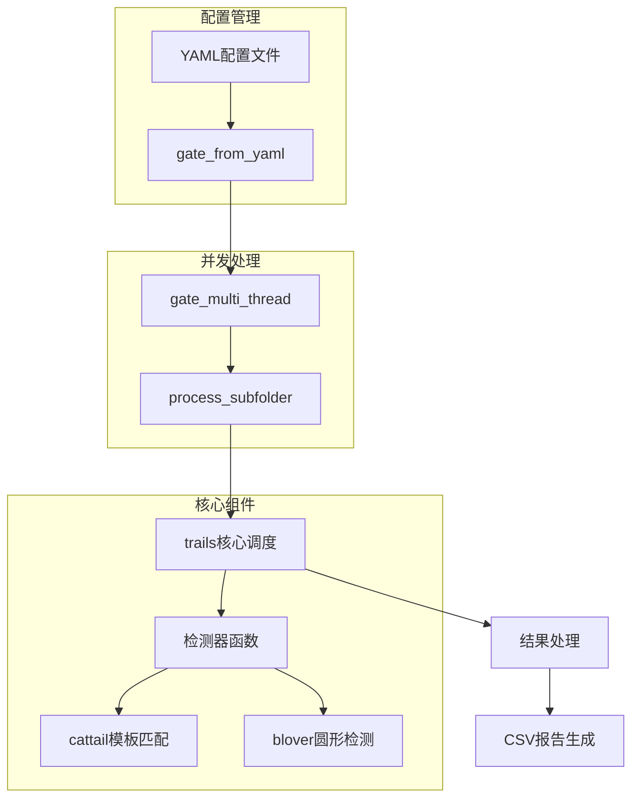
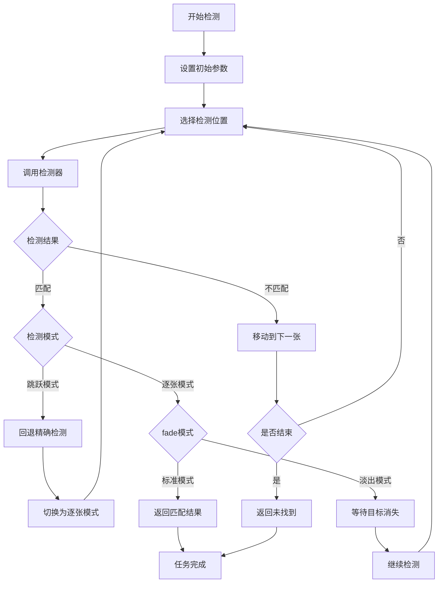
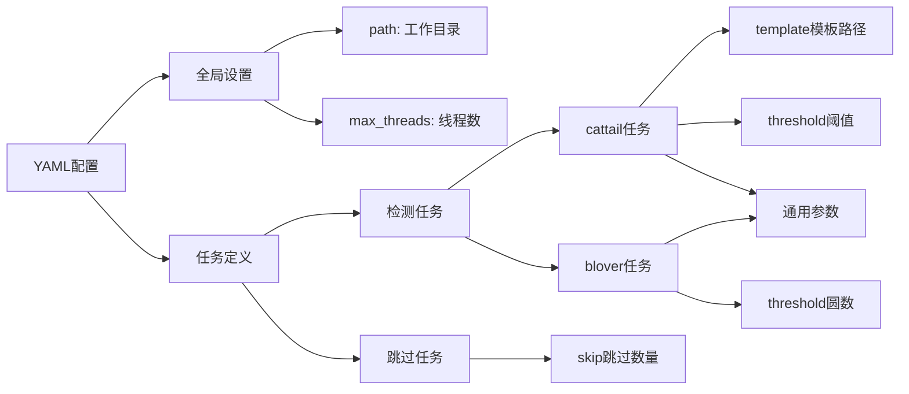
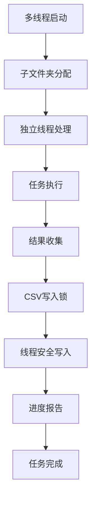
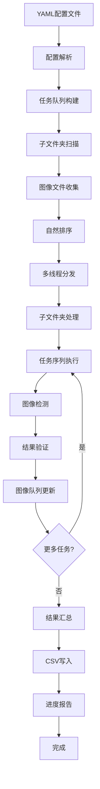
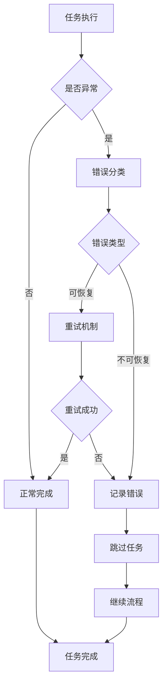

# Perf Garden 代码结构与逻辑分析

## 概述

Perf Garden 是一个基于 Python 和 OpenCV 的图像自动化处理框架，专门用于批量图像识别和性能测试场景。该项目设计目标是通过高效的图像模板匹配和检测算法，自动化完成大量图像的识别任务，特别适用于移动应用性能测试中的录屏分析。

## 技术栈与依赖

| 技术组件 | 版本要求 | 用途 |
|---------|---------|------|
| Python | 3.x | 主要开发语言 |
| OpenCV (cv2) | 最新版 | 核心图像处理引擎 |
| NumPy | 最新版 | 数值计算和数组操作 |
| PyYAML | 最新版 | 配置文件解析 |
| concurrent.futures | 内置模块 | 多线程并发处理 |
| threading | 内置模块 | 线程同步控制 |
| csv | 内置模块 | 结果数据导出 |

## 架构概览



## 核心功能模块

### 1. 图像检测器模块

#### cattail 模板匹配检测器

**设计意图**: 实现基于OpenCV模板匹配的图像识别功能，用于在目标图像中查找特定的模板内容。

**核心逻辑**:
- 接收图像路径、模板路径、匹配阈值和裁剪参数
- 执行图像安全读取和参数验证
- 支持图像区域裁剪优化检测范围
- 使用OpenCV的TM_CCOEFF_NORMED算法进行模板匹配
- 返回标准化的检测结果

**输入参数**:
| 参数名 | 类型 | 默认值 | 说明 |
|--------|------|--------|------|
| img_path | str | 必填 | 待检测图片路径 |
| template_path | str | 必填 | 模板图片路径 |
| threshold | float | 0.9 | 匹配阈值 (0~1) |
| crop | int | 0 | 裁剪比例 (-99~99) |

**返回值结构**:
```
(status, matched, confidence, duration)
- status: 状态码 ("PASS" 或错误码)
- matched: 是否匹配成功 (布尔值)
- confidence: 匹配置信度 (0.00~1.00)
- duration: 执行耗时 (秒)
```

**错误处理机制**:
- EC01: 参数校验失败
- EC02: 图像读取失败
- EC03: 模板尺寸超出目标图像

#### blover 圆形检测器

**设计意图**: 基于霍夫圆变换算法检测图像中的圆形数量，特别适用于检测加载动画、进度指示器等圆形UI元素。

**核心逻辑**:
- 使用霍夫圆变换检测圆形特征
- 支持参数调优的圆形检测算法
- 预处理图像以减少噪声干扰
- 计算检测到的圆形数量并与期望值比较

**算法参数配置**:
| 参数 | 值 | 作用 |
|------|-----|------|
| dp | 1 | 图像分辨率与累加器分辨率比例 |
| minDist | 100 | 圆心间最小距离 |
| param1 | 90 | Canny边缘检测高阈值 |
| param2 | 32 | 圆心累加器阈值 |
| minRadius | 20 | 最小圆半径 |
| maxRadius | 25 | 最大圆半径 |

**返回值结构**:
```
(status, matched, confidence, duration)
- status: 状态码 ("PASS" 或错误码)
- matched: 检测圆数是否满足条件
- confidence: 实际检测到的圆形数量
- duration: 执行耗时
```

### 2. 任务调度模块

#### trails 核心调度引擎

**设计意图**: 作为系统的核心调度器，统一管理图像检测任务的执行流程，支持智能跳跃检测和淡入淡出模式。

**智能检测策略**:
- **跳跃检测**: 通过leap参数控制检测间隔，发现目标后自动回退精确定位
- **淡入淡出模式**: 支持检测目标出现(fade=false)或消失(fade=true)时刻
- **图像序列管理**: 维护剩余图像列表，支持任务链式执行

**执行流程**:


**参数控制机制**:
| 参数 | 功能 | 默认值 |
|------|------|--------|
| leap | 智能跳跃间隔 | 3 |
| fade | 淡入淡出模式 | false |
| crop | 图像裁剪 | 0 |
| threshold | 检测阈值 | 检测器默认 |

### 3. 配置管理模块

#### YAML配置解析器

**设计意图**: 提供灵活的配置管理机制，支持复杂的任务流程定义和参数配置。

**配置结构设计**:


**任务类型支持**:
- **cattail任务**: 模板匹配检测
- **blover任务**: 圆形检测
- **skip任务**: 跳过指定数量图片

**配置兼容性**: 支持新旧两种配置格式，确保向后兼容性

### 4. 并发处理模块

#### 多线程任务处理器

**设计意图**: 通过多线程并发处理提升整体处理性能，同时确保结果输出的一致性和线程安全。

**线程管理策略**:
- 使用ThreadPoolExecutor管理线程池
- 每个子文件夹分配独立线程处理
- 线程数量可通过配置文件或系统CPU核心数自动确定

**线程安全保障**:


**重试机制**: CSV写入支持最多3次重试，处理文件权限冲突

### 5. 结果管理模块

#### CSV报告生成器

**设计意图**: 将处理结果以结构化形式保存，便于后续分析和数据处理。

**报告结构**:
| 列名 | 内容 | 说明 |
|------|------|------|
| 子文件夹名 | 任务组标识 | 对应单次测试或实验 |
| cattail1, cattail2... | 检测结果 | 匹配文件名或状态码 |
| blover1, blover2... | 检测结果 | 匹配文件名或状态码 |
| skip1, skip2... | 跳过操作 | 跳过张数记录 |

**状态码定义**:
- **PASS**: 任务执行成功
- **ERROR**: 检测器报错
- **UNFOUND**: 未找到匹配
- **未执行**: 因前置任务失败跳过

## 数据流架构

### 整体数据流向



### 图像处理流水线


## 性能优化策略

### 1. 算法层面优化

**图像预处理优化**:
- 使用灰度图减少计算复杂度
- 智能裁剪减少处理区域
- 安全读取机制避免异常中断

**检测算法优化**:
- cattail使用TM_CCOEFF_NORMED提高匹配精度
- blover采用高斯模糊预处理减少噪声
- 参数调优适应不同场景需求

### 2. 执行策略优化

**智能跳跃机制**:
- 大间隔初步检测快速定位目标区域
- 发现目标后回退进行精确检测
- 显著减少不必要的图像处理

**任务链式执行**:
- 每个任务使用前一任务的剩余图像
- 避免重复处理已匹配的图像
- 失败任务自动终止后续流程

### 3. 并发性能优化

**多线程并行处理**:
- 子文件夹级别的并行处理
- 线程池管理避免资源浪费
- 线程安全的结果汇总机制

**资源管理优化**:
- 自动检测CPU核心数设置默认线程数
- 支持手动配置适应不同硬件环境
- 内存使用优化避免大量图像同时加载

## 错误处理与异常管理

### 错误分类体系

**系统级错误**:
- 配置文件解析错误
- 文件路径访问权限问题
- 线程池创建失败

**任务级错误**:
- 图像文件读取失败
- 模板匹配参数错误
- 检测算法执行异常

**数据级错误**:
- 图像格式不支持
- 模板尺寸不匹配
- 参数范围越界

### 异常恢复机制

**优雅降级策略**:
- 单个任务失败不影响其他任务
- 子文件夹处理错误不影响整体流程
- 自动跳过无效图像文件

**容错处理流程**:


## 扩展性设计

### 检测器扩展机制

**检测器接口标准**:
- 统一的参数传递接口
- 标准化的返回值格式
- 一致的错误处理机制

**新检测器集成**:
- 函数映射机制支持动态添加
- 配置文件无需修改即可使用新检测器
- 参数验证自动适配新检测器要求

### 配置系统扩展

**参数系统扩展性**:
- 支持检测器特定参数
- 向后兼容的配置格式
- 动态参数验证机制

**任务类型扩展**:
- 易于添加新的任务类型
- 灵活的任务参数定义
- 统一的任务执行接口

## 测试策略

### 单元测试覆盖

**核心功能测试**:
- 各检测器功能验证
- 参数边界测试
- 错误条件测试

**集成测试范围**:
- 端到端工作流测试
- 多线程并发测试
- 大数据量性能测试

### 性能基准测试

**基准指标**:
- 单张图像处理时间
- 多线程加速比
- 内存使用峰值
- CPU利用率

**对比测试**:
- 与传统OCR方法性能对比
- 不同参数配置性能影响
- 硬件配置对性能的影响

## 重构改进建议

### 代码结构重构

**模块化改进**:
- 将检测器抽象为独立的类
- 创建配置管理器类
- 建立结果处理器类
- 设计任务调度器类

**接口标准化**:
- 定义检测器基类接口
- 统一异常处理机制
- 标准化日志输出格式

### 功能增强建议

**新检测器支持**:
- OCR文字识别检测器
- 颜色分布检测器
- 边缘特征检测器
- 形状匹配检测器

**配置系统增强**:
- JSON配置格式支持
- 配置模板功能
- 参数验证增强
- 动态配置重载

### 性能优化方向

**算法优化**:
- GPU加速支持
- 图像缓存机制
- 并行算法优化
- 内存池管理

**架构优化**:
- 异步处理框架
- 流式处理支持
- 分布式处理能力
- 实时监控接口

### 用户体验改进

**易用性提升**:
- 图形界面工具
- 配置向导
- 结果可视化
- 进度详细显示

**文档和工具**:
- API文档生成
- 使用示例丰富
- 调试工具开发
- 性能分析工具