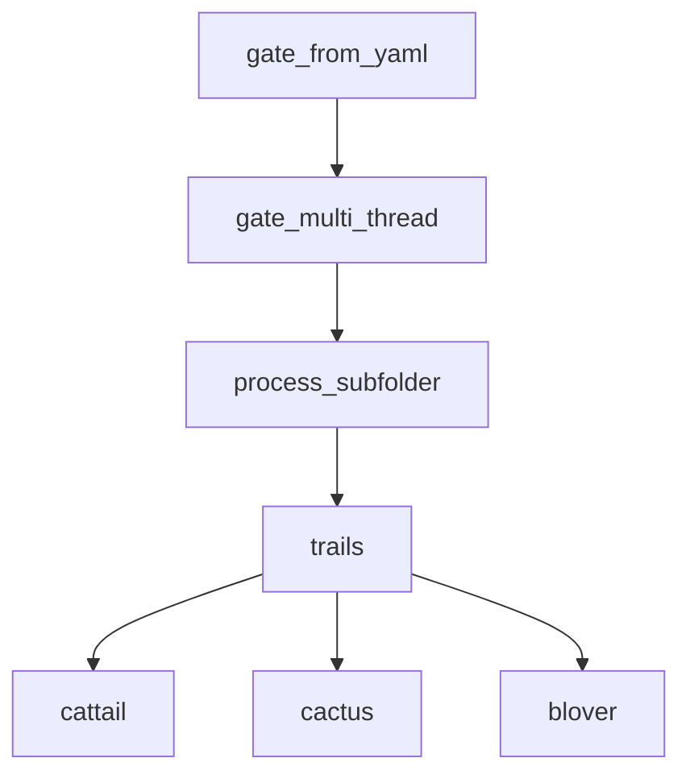

# API参考

<cite>
**Referenced Files in This Document**   
- [PerfGarden.py](file://PerfGarden.py)
</cite>

## 目录
1. [gate_from_yaml](#gate_from_yaml)
2. [gate_multi_thread](#gate_multi_thread)
3. [process_subfolder](#process_subfolder)
4. [trails](#trails)
5. [cattail](#cattail)
6. [cactus](#cactus)
7. [blover](#blover)
8. [函数调用关系](#函数调用关系)

## gate_from_yaml

`gate_from_yaml` 是 PerfGarden 的主入口函数，负责解析 YAML 配置文件并启动整个处理流程。它读取配置中的路径、任务和参数，然后调用多线程函数来处理数据。

**Section sources**
- [PerfGarden.py](file://PerfGarden.py#L384-L474)

### 参数
| 参数 | 类型 | 含义 | 默认值 |
| :--- | :--- | :--- | :--- |
| `yaml_path` | `str` | YAML 配置文件的路径 | 无（必需参数） |
| `max_threads` | `int` 或 `None` | 最大线程数。如果为 `None`，则从 YAML 配置中读取或使用默认值（CPU 核心数） | `None` |

### 返回值
- **类型**: `list`
- **含义**: 处理结果列表，包含每个子文件夹的处理结果。

### 前置条件
- `yaml_path` 必须指向一个存在的、格式正确的 YAML 文件。
- YAML 文件中必须包含 `path` 字段来指定母文件夹路径。

### 后置条件
- 成功启动多线程处理流程。
- 在母文件夹中生成名为 `处理结果.csv` 的结果文件。

### 可能引发的异常
- `ValueError`: 如果 YAML 配置中未指定母文件夹路径。

### 调用示例
```python
# 直接调用 gate_from_yaml 函数
results = gate_from_yaml("config.yaml", max_threads=4)
print(results)
```

## gate_multi_thread

`gate_multi_thread` 函数负责使用多线程并发处理母文件夹内的所有子文件夹。它是 `gate_from_yaml` 的核心执行引擎，通过线程池分发任务。

**Section sources**
- [PerfGarden.py](file://PerfGarden.py#L660-L728)

### 参数
| 参数 | 类型 | 含义 | 默认值 |
| :--- | :--- | :--- | :--- |
| `parent_folder` | `str` | 母文件夹的路径 | 无（必需参数） |
| `tasks` | `list` | 任务参数列表，每个元素是一个包含任务配置的字典 | 无（必需参数） |
| `task_headers` | `list` | CSV 表头列表，用于生成结果文件的列名 | 无（必需参数） |
| `max_threads` | `int` | 最大线程数 | 无（必需参数） |

### 返回值
- **类型**: `list`
- **含义**: 处理结果列表，与 `gate_from_yaml` 的返回值相同。

### 前置条件
- `parent_folder` 必须是一个存在的目录。
- `tasks` 和 `task_headers` 必须与任务数量匹配。

### 后置条件
- 所有子文件夹的处理任务被分发到线程池中执行。
- 结果被异步写入 CSV 文件。

### 可能引发的异常
- 该函数内部捕获并打印异常，但不会向上抛出，以保证其他线程的正常执行。

### 调用示例
```python
# 通常由 gate_from_yaml 调用，但也可直接调用
tasks = [{"task_type": "cattail", "template_path": "template.jpg"}]
task_headers = ["cattail1"]
results = gate_multi_thread("/path/to/folder", tasks, task_headers, max_threads=4)
```

## process_subfolder

`process_subfolder` 函数在独立线程中执行，负责处理单个子文件夹内的所有任务序列。它读取图片、执行任务并管理任务间的依赖。

**Section sources**
- [PerfGarden.py](file://PerfGarden.py#L477-L609)

### 参数
| 参数 | 类型 | 含义 | 默认值 |
| :--- | :--- | :--- | :--- |
| `subfolder` | `str` | 子文件夹的路径 | 无（必需参数） |
| `tasks` | `list` | 任务参数列表 | 无（必需参数） |
| `csv_filename` | `str` | CSV 结果文件的路径 | 无（必需参数） |
| `csv_queue` | `queue.Queue` | 用于异步写入结果的队列 | 无（必需参数） |

### 返回值
- **类型**: `tuple`
- **含义**: 包含 `(subfolder_name, subfolder_results, total_time)` 的元组。
  - `subfolder_name`: 子文件夹名称。
  - `subfolder_results`: 该子文件夹的任务结果列表。
  - `total_time`: 处理该子文件夹的总耗时。

### 前置条件
- `subfolder` 必须是一个存在的目录。
- `csv_queue` 必须是有效的队列对象。

### 后置条件
- 该子文件夹的所有任务被顺序执行。
- 处理结果被放入 `csv_queue` 中等待写入。

### 可能引发的异常
- 该函数内部捕获并打印异常，但不会向上抛出。

### 调用示例
```python
# 通常由 gate_multi_thread 通过线程池调用
import queue
csv_queue = queue.Queue()
result = process_subfolder("/path/to/subfolder", tasks, "result.csv", csv_queue)
```

## trails

`trails` 函数是执行任务序列的核心逻辑。它根据给定的检测器函数（如 `cattail`, `cactus`）在图片序列中查找匹配项，支持跳跃检查和淡出模式。

**Section sources**
- [PerfGarden.py](file://PerfGarden.py#L267-L381)

### 参数
| 参数 | 类型 | 含义 | 默认值 |
| :--- | :--- | :--- | :--- |
| `image_files` | `list` | 已排序的图片文件名列表 | 无（必需参数） |
| `folder_path` | `str` | 图片文件夹的路径 | 无（必需参数） |
| `template_path` | `str` 或 `None` | 模板图片的路径 | `None` |
| `threshold` | `float`, `int` 或 `None` | 匹配阈值。如果为 `None`，则使用检测器函数的默认值 | `None` |
| `leap` | `int` | 检查间隔（跳跃步长） | `3` |
| `fade` | `bool` | 是否在匹配后继续检查直到匹配消失 | `False` |
| `crop` | `int` | 图像裁剪比例 | `0` |
| `detector_func` | `function` 或 `None` | 使用的检测器函数（如 `cattail`, `cactus`）。如果为 `None`，则默认使用 `cattail` | `None` |

### 返回值
- **类型**: `tuple`
- **含义**: 包含 `(status, matched_file, result)` 的元组。
  - `status`: 状态码，可能值为 `"PASS"` (成功), `"ERROR"` (错误), `"UNFOUND"` (未找到匹配)。
  - `matched_file`: 匹配成功的图片文件名，如果未匹配则为 `None`。
  - `result`: 检测函数的原始返回结果。

### 前置条件
- `image_files` 列表必须已排序。
- `detector_func` 必须是可调用的函数。

### 后置条件
- 在图片序列中完成指定的检测任务。
- 返回匹配结果。

### 可能引发的异常
- 无显式异常抛出，错误通过返回的状态码表示。

### 调用示例
```python
# 执行模板匹配任务
image_files = sorted(os.listdir("/path/to/images"))
status, matched_file, result = trails(
    image_files=image_files,
    folder_path="/path/to/images",
    template_path="button_template.jpg",
    detector_func=cattail,
    threshold=0.95,
    leap=2
)
```

## cattail

`cattail` 是一个基于 OpenCV 模板匹配的检测函数，用于在图片中查找与模板相似的区域。

**Section sources**
- [PerfGarden.py](file://PerfGarden.py#L14-L85)

### 参数
| 参数 | 类型 | 含义 | 默认值 |
| :--- | :--- | :--- | :--- |
| `img_path` | `str` | 待检测图片的路径 | 无（必需参数） |
| `template_path` | `str` | 模板图片的路径 | 无（必需参数） |
| `threshold` | `float` | 匹配阈值 (0~1)，值越高要求匹配越精确 | `0.9` |
| `crop` | `int` | 图像裁剪比例 (-99~99)。>0 从底部裁剪，<0 从顶部裁剪，=0 不裁剪 | `0` |

### 返回值
- **类型**: `tuple`
- **含义**: 包含 `(status, matched, confidence, duration)` 的元组。
  - `status`: 状态码，如 `"PASS"` 或 `"EC01"` (参数错误)。
  - `matched`: `bool`，表示匹配是否成功。
  - `confidence`: `float`，匹配的置信度 (0~1)。
  - `duration`: `float`，执行耗时（秒）。

### 前置条件
- `img_path` 和 `template_path` 必须指向存在的图片文件。
- 模板图片的尺寸不能大于待检测图片。

### 后置条件
- 完成一次模板匹配操作。
- 返回匹配结果。

### 可能引发的异常
- 无显式异常抛出，错误通过返回的状态码表示。

### 调用示例
```python
# 直接调用 cattail 进行模板匹配
status, matched, confidence, duration = cattail(
    img_path="screenshot.jpg",
    template_path="start_button.jpg",
    threshold=0.92,
    crop=10  # 保留底部90%的区域
)
print(f"匹配: {matched}, 置信度: {confidence:.2f}")
```

## cactus

`cactus` 是一个基于图像差异的检测函数，通过计算两张图片的像素差异百分比来判断变化。

**Section sources**
- [PerfGarden.py](file://PerfGarden.py#L88-L187)

### 参数
| 参数 | 类型 | 含义 | 默认值 |
| :--- | :--- | :--- | :--- |
| `img_path` | `str` | 待检测图片的路径 | 无（必需参数） |
| `template_path` | `str` | 作为基准的模板图片路径 | 无（必需参数） |
| `threshold` | `float` | 差异百分比阈值 (0~100)，默认为1% | `1.0` |
| `crop` | `int` | 图像裁剪比例 (-99~99)。>0 从底部裁剪，<0 从顶部裁剪，=0 不裁剪 | `0` |
| `enable_denoising` | `bool` | 是否启用降噪处理，以减少小噪声的影响 | `False` |
| `acceleration` | `int` | 加速倍数 (1, 2, 4)，通过下采样图片来加速处理 | `2` |

### 返回值
- **类型**: `tuple`
- **含义**: 包含 `(status, matched, confidence, duration)` 的元组。
  - `status`: 状态码，如 `"PASS"` 或 `"EC03"` (图像尺寸不匹配)。
  - `matched`: `bool`，表示差异是否超过阈值。
  - `confidence`: `float`，差异百分比。
  - `duration`: `float`，执行耗时（秒）。

### 前置条件
- `img_path` 和 `template_path` 必须指向存在的图片文件。
- 两张图片的尺寸必须相同。

### 后置条件
- 完成一次图像差异计算。
- 返回差异结果。

### 可能引发的异常
- 无显式异常抛出，错误通过返回的状态码表示。

### 调用示例
```python
# 直接调用 cactus 检测图片变化
status, changed, diff_percent, duration = cactus(
    img_path="after_loading.jpg",
    template_path="before_loading.jpg",
    threshold=5.0,  # 差异超过5%即认为有变化
    enable_denoising=True,
    acceleration=2
)
print(f"有变化: {changed}, 差异: {diff_percent:.2f}%")
```

## blover

`blover` 是一个基于霍夫圆变换的圆圈检测函数，用于检测图片中的圆形物体。

**Section sources**
- [PerfGarden.py](file://PerfGarden.py#L192-L263)

### 参数
| 参数 | 类型 | 含义 | 默认值 |
| :--- | :--- | :--- | :--- |
| `img_path` | `str` | 待检测图片的路径 | 无（必需参数） |
| `template_path` | `str` 或 `None` | （未使用）此参数在函数中未被使用，保留以保持接口一致性 | `None` |
| `threshold` | `int` | 需要检测到的圆圈数量（正整数） | `1` |
| `crop` | `int` | 图像裁剪比例 (-99~99)。>0 从底部裁剪，<0 从顶部裁剪，=0 不裁剪 | `0` |

### 返回值
- **类型**: `tuple`
- **含义**: 包含 `(status, matched, confidence, duration)` 的元组。
  - `status`: 状态码，如 `"PASS"` 或 `"EB01"` (参数错误)。
  - `matched`: `bool`，表示检测到的圆圈数量是否大于等于 `threshold`。
  - `confidence`: `int`，实际检测到的圆圈数量。
  - `duration`: `float`，执行耗时（秒）。

### 前置条件
- `img_path` 必须指向一个存在的图片文件。
- `threshold` 必须是正整数。

### 后置条件
- 完成一次圆圈检测操作。
- 返回检测结果。

### 可能引发的异常
- 无显式异常抛出，错误通过返回的状态码表示。

### 调用示例
```python
# 直接调用 blover 检测圆圈
status, found, circle_count, duration = blover(
    img_path="game_screen.jpg",
    threshold=3,  # 至少检测到3个圆圈
    crop=20       # 保留顶部80%的区域
)
print(f"找到足够圆圈: {found}, 数量: {circle_count}")
```

## 函数调用关系

以下图表展示了各公共函数之间的调用依赖关系。



**Diagram sources**
- [PerfGarden.py](file://PerfGarden.py#L384-L474)
- [PerfGarden.py](file://PerfGarden.py#L660-L728)
- [PerfGarden.py](file://PerfGarden.py#L477-L609)
- [PerfGarden.py](file://PerfGarden.py#L267-L381)
- [PerfGarden.py](file://PerfGarden.py#L14-L85)
- [PerfGarden.py](file://PerfGarden.py#L88-L187)
- [PerfGarden.py](file://PerfGarden.py#L192-L263)

**Section sources**
- [PerfGarden.py](file://PerfGarden.py)