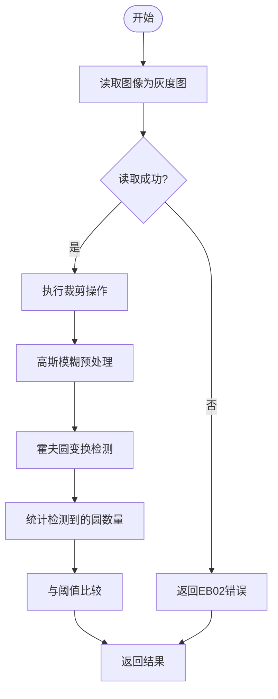
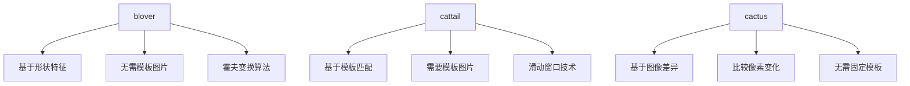

# blover 函数

<cite>
**Referenced Files in This Document**   
- [PerfGarden.py](file://PerfGarden.py)
- [README.md](file://README.md)
</cite>

## 目录
1. [简介](#简介)
2. [核心参数说明](#核心参数说明)
3. [内部实现机制](#内部实现机制)
4. [返回值解析](#返回值解析)
5. [与cattail/cactus的差异](#与cattailcactus的差异)
6. [调用示例](#调用示例)
7. [适用场景](#适用场景)
8. [局限性](#局限性)

## 简介

`blover`函数是Perf Garden图像自动化框架中的一个核心检测方法，专门用于检测图像中的圆形目标。该函数基于霍夫变换（Hough Transform）算法实现，能够在复杂背景下快速识别圆形特征，无需依赖模板图片。作为框架三大检测方法之一，`blover`特别适用于识别具有圆形特征的UI元素，如加载动画、状态指示器等。

**Section sources**
- [PerfGarden.py](file://PerfGarden.py#L180-L250)
- [README.md](file://README.md#L130-L145)

## 核心参数说明

`blover`函数接受三个主要参数，用于控制圆检测的行为和范围：

- **img_path**：待检测图片的路径。函数会从该路径读取图像并进行处理。
- **threshold**：需匹配的圆数量阈值。这是一个正整数，表示期望在图像中检测到的圆的数量。函数将检测结果与该阈值进行比较以判断匹配状态。
- **crop**：裁剪比例（-99~99）。该参数允许对输入图像进行区域裁剪：
  - 正值：从底部向上裁剪，保留底部指定百分比的区域，适合检测底部的圆形元素。
  - 负值：从顶部向下裁剪，保留顶部指定百分比的区域，适合检测顶部的圆形元素。
  - 零值：不进行裁剪，使用完整图像。

**Section sources**
- [PerfGarden.py](file://PerfGarden.py#L185-L195)
- [README.md](file://README.md#L135-L140)

## 内部实现机制

`blover`函数的内部实现基于OpenCV的霍夫圆变换算法，其处理流程如下：



**Diagram sources**
- [PerfGarden.py](file://PerfGarden.py#L200-L240)

### 预处理阶段

函数首先将输入图像转换为灰度图，然后应用高斯模糊（GaussianBlur）进行预处理。这一步骤有助于减少图像噪声，提高圆检测的准确性。

### 圆检测阶段

核心检测通过`cv2.HoughCircles`函数实现，该函数使用霍夫梯度法进行圆检测。关键参数设置如下：

- **dp**：图像分辨率与累加器分辨率之比，设置为1保持原始分辨率。
- **minDist**：圆心间最小距离，设置为100防止重叠圆检测。
- **param1**：Canny边缘检测高阈值，设置为90控制边缘检测严格度。
- **param2**：圆心累加器阈值，设置为32控制检测宽松度。
- **minRadius**：目标最小半径，设置为20作为尺寸下限。
- **maxRadius**：目标最大半径，设置为25作为尺寸上限。

这些参数需要根据实际目标特征进行调整，以获得最佳检测效果。

**Section sources**
- [PerfGarden.py](file://PerfGarden.py#L220-L240)

## 返回值解析

`blover`函数返回一个包含四个元素的元组，提供完整的检测结果信息：

- **status**：状态码，表示函数执行状态：
  - `"PASS"`：正常执行完成
  - `"EB01"`：参数错误（如threshold非正整数）
  - `"EB02"`：图像读取失败
- **matched**：布尔值，表示检测结果是否满足条件。当检测到的圆数量大于或等于阈值时返回`True`。
- **confidence**：置信度，实际检测到的圆圈数量。
- **duration**：执行耗时，单位为秒。

**Section sources**
- [PerfGarden.py](file://PerfGarden.py#L245-L250)

## 与cattail/cactus的差异

`blover`与其他检测方法有本质区别：



**Diagram sources**
- [PerfGarden.py](file://PerfGarden.py#L180-L250)
- [README.md](file://README.md#L130-L145)

与`cattail`不同，`blover`不依赖模板图片进行匹配，而是基于圆形的几何特征进行检测。这使得它能够识别形状相似但外观不同的圆形元素。与`cactus`相比，`blover`专注于特定形状的检测而非整体图像差异。

**Section sources**
- [README.md](file://README.md#L130-L145)

## 调用示例

以下是一个典型的`blover`函数调用示例，用于检测仪表盘中的指示灯数量：

```python
# 检测仪表盘中是否有至少1个圆形指示灯
status, matched, confidence, duration = blover(
    img_path="dashboard_frame.jpg",
    threshold=1,
    crop=0
)

if matched:
    print(f"检测到{confidence}个圆形指示灯，状态正常")
else:
    print(f"未检测到足够数量的指示灯，仅发现{confidence}个")
```

在YAML配置文件中，可以这样使用：

```yaml
- blover:
    - threshold: 1
    - crop: -50
    - fade: true
    - leap: 2
```

这表示检测顶部50%区域中是否存在圆形，并在圆出现后消失时记录结果。

**Section sources**
- [README.md](file://README.md#L200-L220)

## 适用场景

`blover`函数特别适用于以下场景：

- **加载动画识别**：检测页面加载时的圆形旋转动画。
- **状态指示器检测**：识别设备或界面中的圆形状态灯。
- **UI元素验证**：验证具有圆形特征的按钮或图标是否存在。
- **性能测试**：在"图片上传"等场景中，通过检测上传动画的出现和消失来确认操作完成。

该函数在处理复杂背景下的圆形识别时表现出色，尤其适合自动化测试中需要精确识别圆形元素的场景。

**Section sources**
- [README.md](file://README.md#L138-L145)

## 局限性

尽管`blover`功能强大，但仍存在一些局限性：

- **参数敏感性**：检测效果高度依赖于霍夫变换参数的设置，特别是半径范围（minRadius和maxRadius）需要根据目标特征精确调整。
- **形状限制**：只能检测完美的圆形或接近圆形的椭圆，对不规则圆形检测效果不佳。
- **光照影响**：图像光照条件的变化可能影响边缘检测效果，进而影响圆检测准确性。
- **重叠圆检测**：当多个圆形重叠或紧密排列时，可能无法正确区分各个圆。

为获得最佳效果，建议在使用前通过测试图像调整参数，并结合其他检测方法（如先用`cattail`定位区域）来提高检测准确率。

**Section sources**
- [README.md](file://README.md#L142-L145)