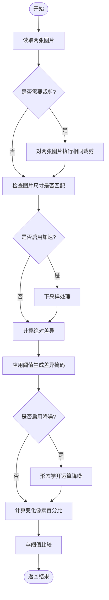
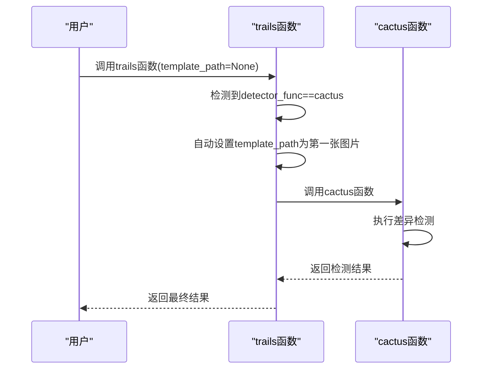

# cactus 函数

<cite>
**本文档引用的文件**
- [PerfGarden.py](file://PerfGarden.py#L88-L187)
- [README.md](file://README.md#L90-L123)
</cite>

## 目录
1. [简介](#简介)
2. [参数说明](#参数说明)
3. [工作原理](#工作原理)
4. [内部优化](#内部优化)
5. [返回值](#返回值)
6. [错误码](#错误码)
7. [调用示例](#调用示例)
8. [特殊处理](#特殊处理)
9. [典型应用场景](#典型应用场景)

## 简介
cactus函数是Perf Garden框架中的图像差异检测器，通过像素级差异分析来检测图像变化。该函数特别适用于检测动态场景中的变化，如AI对话中文字开始出现、页面内容加载完成等。其最大特点是简单易用，大多数情况下无需任何配置即可自动处理。

## 参数说明
cactus函数接受六个参数：

- **img_path**：待检测图片的路径
- **template_path**：基准图片（模板）的路径，用于与当前图片进行对比
- **threshold**：差异百分比阈值，取值范围为0~100，默认值为1.0。当图片差异区域超过此阈值时判定为检测成功
- **crop**：裁剪比例，取值范围为-99~99
  - >0：从底部向上裁剪，保留底部区域
  - <0：从顶部向下裁剪，保留顶部区域
  - =0：不进行裁剪
- **enable_denoising**：是否启用降噪处理，布尔值，默认为False（关闭）
- **acceleration**：加速倍数，可选值为1、2、4，默认为2。值越大处理速度越快但精度越低

**Section sources**
- [PerfGarden.py](file://PerfGarden.py#L88-L187)

## 工作原理
cactus函数的工作流程如下：

1. 首先对输入的两张图片进行安全读取，并转换为灰度图
2. 根据crop参数对两张图片执行相同的裁剪操作
3. 检查两张图片的尺寸是否匹配
4. 计算两图的绝对差异，生成差异图像
5. 应用阈值（3）对差异图像进行二值化处理，生成差异掩码
6. 计算差异掩码中非零像素的数量占总像素数量的百分比，即为差异百分比
7. 将计算得到的差异百分比与threshold阈值进行比较，判断是否超过阈值



**Diagram sources**
- [PerfGarden.py](file://PerfGarden.py#L88-L187)

## 内部优化
cactus函数实现了两种内部优化机制：

### 下采样加速
当acceleration参数大于1时，函数会对图片进行下采样处理：
- acceleration=2：将图片尺寸缩小为原来的1/2
- acceleration=4：将图片尺寸缩小为原来的1/4
通过减少像素数量来加快处理速度，但会相应降低检测精度。

### 形态学降噪
当enable_denoising参数为True时，函数会使用形态学开运算进行降噪处理：
- 创建2×2的结构元素（核）
- 对差异掩码应用cv2.MORPH_OPEN操作
- 有效去除小的噪点干扰，但可能会降低对微小变化的敏感度

**Section sources**
- [PerfGarden.py](file://PerfGarden.py#L88-L187)

## 返回值
cactus函数返回一个包含四个元素的元组：

- **status**：状态码，可能值为"PASS"（成功）或错误码（EC01/EC02/EC03）
- **matched**：布尔值，表示是否检测到变化（即差异百分比是否超过阈值）
- **confidence**：浮点数，表示差异百分比（置信度），精确到小数点后两位
- **duration**：浮点数，表示函数执行耗时（秒），精确到小数点后四位

其中，confidence代表实际计算得到的差异百分比，matched表示该百分比是否超过了设定的threshold阈值。

**Section sources**
- [PerfGarden.py](file://PerfGarden.py#L88-L187)

## 错误码
cactus函数可能返回以下错误码：

- **EC01**：参数无效。当threshold不在0~100范围内、crop不在-99~99范围内，或acceleration不是1、2、4时返回此错误码
- **EC02**：读取失败。当无法读取img_path或template_path指定的图片文件时返回此错误码
- **EC03**：尺寸不匹配。当裁剪后的两张图片尺寸不一致时返回此错误码

**Section sources**
- [PerfGarden.py](file://PerfGarden.py#L88-L187)
- [README.md](file://README.md#L90-L123)

## 调用示例
以下是一个检测APP界面从A状态到B状态变化的调用示例：

```yaml
- cactus:
    threshold: 2.0
    crop: 50
    enable_denoising: true
    acceleration: 2
```

此配置表示：
- 使用2.0%作为差异阈值
- 保留图片底部50%区域进行检测（适用于检测底部按钮变化）
- 启用降噪处理以减少干扰
- 使用2倍加速处理以提高效率

**Section sources**
- [README.md](file://README.md#L157-L203)

## 特殊处理
cactus函数具有一个重要的特殊处理机制：当template_path参数为None时，系统会自动将当前任务的第一张图片作为基准模板。这一设计使得在YAML配置文件中只需简单配置`- cactus:`即可自动处理，无需手动指定模板路径，特别适合处理连续帧序列的场景。

此功能在trails函数中实现，当检测器函数为cactus且template_path为None时，会自动将第一张图片的路径设置为模板路径。



**Diagram sources**
- [PerfGarden.py](file://PerfGarden.py#L296-L330)

## 典型应用场景
cactus函数在性能测试中有多种典型应用：

### 检测APP界面刷新
通过比较刷新前后的界面截图，检测界面是否发生了变化。例如，在社交媒体APP中检测动态流是否成功刷新。

### 检测页面加载完成
检测网页或APP页面是否完全加载。通过比较加载过程中的截图与预期完成状态的截图，判断加载是否完成。

### 检测动态元素变化
检测具有动态元素的界面变化，如进度条、加载动画等。即使这些元素在不断变化，cactus也能通过差异分析判断整体状态变化。

### 检测内容输出开始
在AI对话场景中，检测文字气泡是否开始出现。通过比较空白界面与开始输出文字的界面，判断AI是否开始回复。

**Section sources**
- [README.md](file://README.md#L90-L94)
- [README.md](file://README.md#L157-L203)