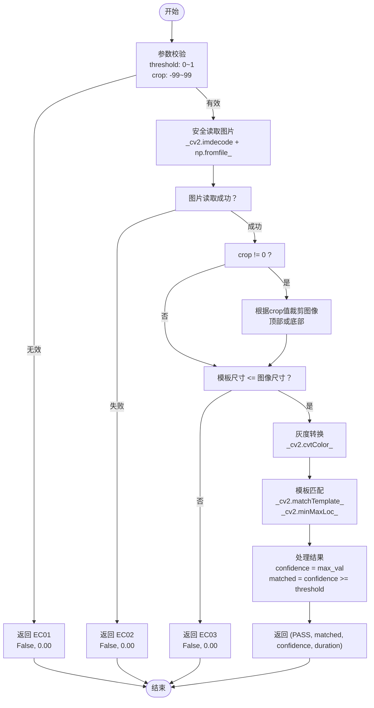
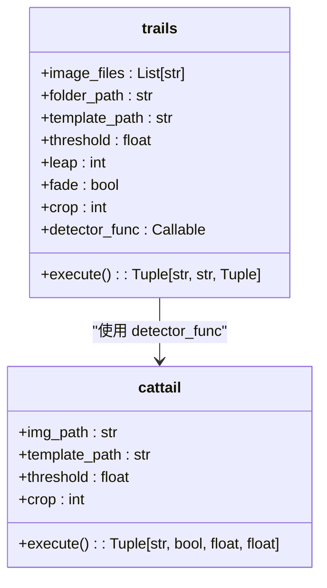

# cattail 函数

<cite>
**Referenced Files in This Document**   
- [PerfGarden.py](file://PerfGarden.py#L14-L85)
- [PerfGarden.py](file://PerfGarden.py#L267-L381)
</cite>

## 目录
1. [简介](#简介)
2. [参数详解](#参数详解)
3. [内部实现机制](#内部实现机制)
4. [返回值说明](#返回值说明)
5. [错误码列表](#错误码列表)
6. [调用示例](#调用示例)
7. [架构角色与适用场景](#架构角色与适用场景)

## 简介

`cattail` 函数是 Perf Garden 图像自动化框架中的核心检测器之一，专为模板匹配设计。该函数基于 OpenCV 的 `matchTemplate` 功能实现，能够在待检测图片中查找与模板图片相匹配的区域。它特别适用于识别界面中固定不变的视觉元素，如启动画面、按钮、图标或标题等。

函数通过计算模板与图像区域的归一化相关系数（使用 `cv2.TM_CCOEFF_NORMED` 方法）来评估匹配程度，返回一个介于 0 到 1 之间的置信度值。该函数设计简洁高效，支持中文路径读取和图像区域裁剪，是处理批量图像识别任务的理想选择。

**Section sources**
- [PerfGarden.py](file://PerfGarden.py#L14-L85)

## 参数详解

`cattail` 函数接受四个主要参数，用于控制匹配行为和处理逻辑。

- **img_path**：待检测图片的文件路径。此参数支持包含中文字符的路径，通过 `np.fromfile` 和 `cv2.imdecode` 安全读取，避免了 OpenCV 对中文路径的兼容性问题。
- **template_path**：模板图片的文件路径。这是用于在待检测图片中搜索的目标图像，同样支持中文路径。
- **threshold**：匹配阈值，取值范围为 0 到 1。这是一个浮点数，表示匹配成功的最低置信度要求。例如，设置为 `0.9` 意味着只有当匹配度达到或超过 90% 时，才认为匹配成功。默认值为 `0.9`。
- **crop**：裁剪比例，取值范围为 -99 到 99。这是一个整数，用于指定在进行匹配前对图像进行裁剪的区域。
  - 当 `crop > 0` 时，从图像底部向上裁剪，保留底部 `(100 - crop)%` 的区域，适用于检测屏幕底部的元素（如按钮）。
  - 当 `crop < 0` 时，从图像顶部向下裁剪，保留顶部 `|crop|%` 的区域，适用于检测屏幕顶部的元素（如标题）。
  - 当 `crop = 0` 时，不进行任何裁剪，使用完整的图像进行匹配。默认值为 `0`。

**Section sources**
- [PerfGarden.py](file://PerfGarden.py#L14-L85)

## 内部实现机制

`cattail` 函数的内部实现遵循一个清晰的处理流程，确保了高效性和鲁棒性。



**Diagram sources**
- [PerfGarden.py](file://PerfGarden.py#L14-L85)

**Section sources**
- [PerfGarden.py](file://PerfGarden.py#L14-L85)

### 安全读取图片
函数内部定义了一个 `_safe_read` 辅助函数，利用 `np.fromfile` 读取文件字节流，再通过 `cv2.imdecode` 解码为 OpenCV 图像对象。这种方法绕过了 OpenCV 直接读取文件路径时对非ASCII字符的限制，从而完美支持中文路径。

### 图像裁剪
在读取图片后，函数会根据 `crop` 参数的值对 `img` 图像进行裁剪。裁剪操作直接通过 NumPy 的数组切片完成，效率极高。例如，`img[h - new_h: h, :]` 保留了图像的底部区域。

### 灰度转换与模板匹配
为了提高匹配速度和减少颜色变化的影响，函数会将待检测图像和模板图像都转换为灰度图。随后，使用 `cv2.matchTemplate` 函数在灰度图像上执行模板匹配，并通过 `cv2.minMaxLoc` 获取最高匹配值 `max_val`，该值即为归一化的匹配置信度。

## 返回值说明

`cattail` 函数返回一个四元组 `(status, matched, confidence, duration)`，提供完整的匹配结果信息。

- **status**：状态码，表示函数执行的最终状态。
  - `"PASS"`：匹配过程成功完成，结果有效。
  - `"EC01"`：参数无效（`threshold` 或 `crop` 超出范围）。
  - `"EC02"`：图片读取失败（文件不存在或格式错误）。
  - `"EC03"`：模板尺寸过大（模板比待检测图像大）。
- **matched**：布尔值，表示是否匹配成功。其值由 `confidence >= threshold` 计算得出。
- **confidence**：置信度，一个 0 到 1 之间的浮点数，表示最高匹配区域的归一化相关系数。值越接近 1，表示匹配度越高。该值会被四舍五入到小数点后两位。
- **duration**：执行耗时，以秒为单位的浮点数，表示从函数开始执行到返回结果所花费的时间，精确到小数点后两位。

**Section sources**
- [PerfGarden.py](file://PerfGarden.py#L14-L85)

## 错误码列表

| 错误码 | 含义 | 触发条件 |
| :--- | :--- | :--- |
| **EC01** | 参数无效 | `threshold` 不在 [0, 1] 范围内，或 `crop` 不在 [-99, 99] 范围内 |
| **EC02** | 读取失败 | `img_path` 或 `template_path` 指向的文件无法被读取（文件不存在、权限不足、格式不支持等） |
| **EC03** | 模板尺寸过大 | 模板图片的宽度或高度大于待检测图片的宽度或高度 |

**Section sources**
- [PerfGarden.py](file://PerfGarden.py#L14-L85)

## 调用示例

以下是一个 Python 调用示例，展示如何使用 `cattail` 函数直接比较两张图片的相似度：

```python
# 直接调用 cattail 函数比较两张图片
result = cattail(
    img_path="path/to/target_image.jpg",      # 待检测的图片
    template_path="path/to/template.jpg",     # 作为模板的图片
    threshold=0.85,                           # 设置匹配阈值为 85%
    crop=0                                    # 不进行裁剪
)

# 解包返回结果
status, matched, confidence, duration = result

# 输出结果
print(f"匹配状态: {status}")
print(f"是否匹配: {'是' if matched else '否'}")
print(f"相似度: {confidence * 100:.2f}%")
print(f"耗时: {duration:.2f} 秒")
```

此示例可用于快速判断两张图片是否高度相似，例如验证截图是否与预期界面一致。

**Section sources**
- [PerfGarden.py](file://PerfGarden.py#L14-L85)

## 架构角色与适用场景

`cattail` 函数在 Perf Garden 框架中扮演着 `detector_func` 的角色，是 `trails` 函数可调用的多种检测策略之一。`trails` 函数负责调度和管理一系列图像处理任务，而 `cattail` 则是执行具体模板匹配任务的“执行单元”。



**Diagram sources**
- [PerfGarden.py](file://PerfGarden.py#L14-L85)
- [PerfGarden.py](file://PerfGarden.py#L267-L381)

**Section sources**
- [PerfGarden.py](file://PerfGarden.py#L14-L85)
- [PerfGarden.py](file://PerfGarden.py#L267-L381)

### 适用场景
`cattail` 函数最适合用于识别界面中**固定、静态**的视觉元素。典型应用场景包括：
- **启动画面检测**：识别应用启动时的 Logo 或欢迎界面。
- **按钮识别**：定位并确认特定功能按钮（如“开始”、“下一步”）的存在。
- **图标匹配**：验证特定图标（如分享、设置）是否出现在界面上。
- **标题验证**：确认当前页面的标题是否符合预期。

由于其基于像素的精确匹配，`cattail` 对图像的尺寸、角度和局部变化非常敏感。因此，建议使用从目标设备上直接裁剪的图片作为模板，以获得最佳的匹配效果。对于动态或有动画的元素，建议使用 `cactus`（图像差异检测）或 `blover`（圆圈检测）等其他检测方法。