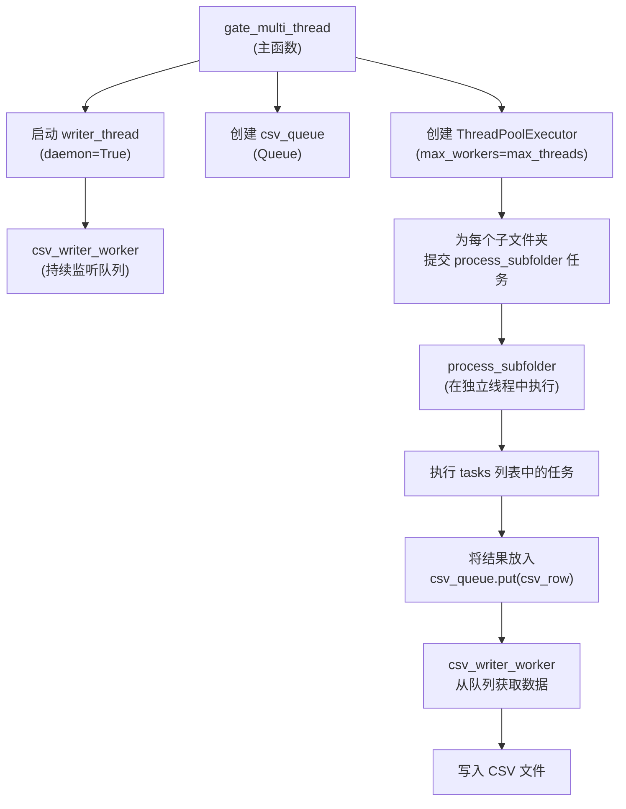
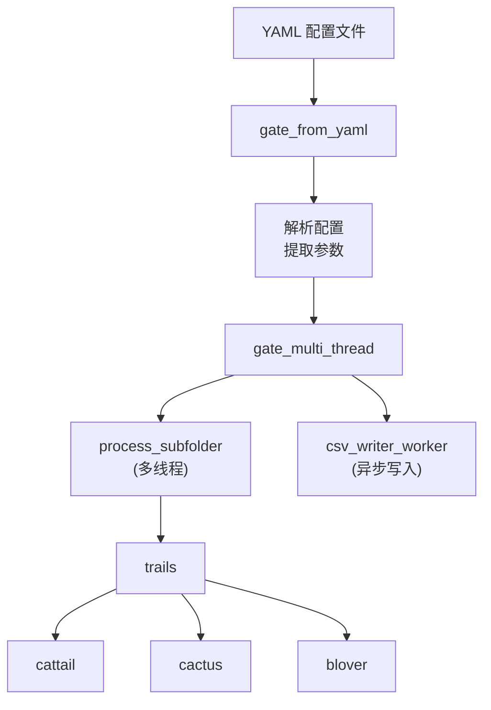

# gate_multi_thread 函数

<cite>
**Referenced Files in This Document**   
- [PerfGarden.py](file://PerfGarden.py#L660-L728)
- [PerfGarden.py](file://PerfGarden.py#L477-L609)
- [PerfGarden.py](file://PerfGarden.py#L612-L657)
- [PerfGarden.py](file://PerfGarden.py#L384-L474)
- [PerfGarden.py](file://PerfGarden.py#L14-L85)
- [PerfGarden.py](file://PerfGarden.py#L88-L187)
- [PerfGarden.py](file://PerfGarden.py#L192-L263)
</cite>

## 目录
1. [简介](#简介)
2. [核心功能与参数](#核心功能与参数)
3. [返回值结构](#返回值结构)
4. [调用示例](#调用示例)
5. [架构角色与集成](#架构角色与集成)
6. [性能与优化](#性能与优化)

## 简介

`gate_multi_thread` 函数是 PerfGarden 自动化测试框架中的核心多线程任务分发引擎。该函数负责协调对指定母文件夹内所有子文件夹的并行处理，通过高效的多线程机制执行一系列图像检测任务，并将结果异步写入 CSV 文件。它作为 `gate_from_yaml` 函数的下游执行器，将从 YAML 配置文件解析出的任务指令转化为实际的并行处理流程，是整个框架实现高性能批量处理的关键组件。

**Section sources**
- [PerfGarden.py](file://PerfGarden.py#L660-L728)

## 核心功能与参数

`gate_multi_thread` 函数通过接收四个核心参数来定义其处理行为，实现了高度的灵活性和可配置性。

### 参数详解

| 参数 | 类型 | 必需 | 描述 |
| :--- | :--- | :--- | :--- |
| `parent_folder` | `str` | 是 | 指定待处理的母文件夹路径。函数将遍历此路径下的所有子目录，并对每个子目录独立执行任务列表。 |
| `tasks` | `list[dict]` | 是 | 一个字典列表，定义了需要执行的任务序列。每个字典代表一个任务，其结构包含 `task_type`（任务类型，如 `"cattail"`, `"cactus"`, `"blover"`）以及其他与具体任务相关的参数（如 `template_path`, `threshold`, `crop` 等）。任务将按列表顺序在每个子文件夹中依次执行。 |
| `task_headers` | `list[str]` | 是 | 一个字符串列表，用于生成 CSV 结果文件的列标题。列表中的每个元素对应 `tasks` 列表中一个任务的结果列。例如，`["cattail1", "cactus1"]` 会生成两列，分别记录第一个 `cattail` 任务和第一个 `cactus` 任务的匹配结果。 |
| `max_threads` | `int` | 是 | 指定用于并行处理的最大线程数。该值直接决定了 `ThreadPoolExecutor` 的最大工作线程数量，从而控制并发度。 |

### 内部执行机制

1.  **线程池创建**：函数内部使用 `concurrent.futures.ThreadPoolExecutor` 创建一个线程池，其最大工作线程数由 `max_threads` 参数设定。这为并行处理提供了基础。
2.  **子文件夹分发**：函数通过 `os.scandir` 获取 `parent_folder` 下的所有子文件夹路径，并为每个子文件夹提交一个 `process_subfolder` 任务到线程池中。每个 `process_subfolder` 任务在独立的线程中执行，实现了子文件夹间的并行处理。
3.  **异步写入机制**：为了确保写入操作不会阻塞主线程和处理线程，函数创建了一个 `queue.Queue` 实例（`csv_queue`）和一个守护线程（`writer_thread`）。`writer_thread` 运行 `csv_writer_worker` 函数，该函数持续监听 `csv_queue`。当 `process_subfolder` 任务完成时，它会将结果数据（`csv_row`）放入 `csv_queue`，而 `csv_writer_worker` 则负责从队列中取出数据并安全地写入 CSV 文件。这种生产者-消费者模式实现了非阻塞的异步 I/O。



**Diagram sources**
- [PerfGarden.py](file://PerfGarden.py#L660-L728)
- [PerfGarden.py](file://PerfGarden.py#L477-L609)
- [PerfGarden.py](file://PerfGarden.py#L612-L657)

**Section sources**
- [PerfGarden.py](file://PerfGarden.py#L660-L728)
- [PerfGarden.py](file://PerfGarden.py#L477-L609)
- [PerfGarden.py](file://PerfGarden.py#L612-L657)

## 返回值结构

`gate_multi_thread` 函数的返回值是一个元组列表，每个元组对应一个被处理的子文件夹。

```python
[
    (subfolder_name_1, subfolder_results_1, total_time_1),
    (subfolder_name_2, subfolder_results_2, total_time_2),
    ...
]
```

*   **`subfolder_name`** (`str`): 子文件夹的名称。
*   **`subfolder_results`** (`list[dict]`): 一个字典列表，记录了在该子文件夹上执行的每个任务的详细结果。每个字典包含：
    *   `task_idx`: 任务的索引（从1开始）。
    *   `matched_file`: 匹配成功的图片文件名，若未匹配则为 `None`。
    *   `status`: 任务状态码（如 `"PASS"`, `"UNFOUND"`, `"ERROR"`）。
    *   `time`: 执行该任务所花费的时间（秒）。
*   **`total_time`** (`float`): 处理该子文件夹所有任务所花费的总时间（秒）。

**Section sources**
- [PerfGarden.py](file://PerfGarden.py#L660-L728)

## 调用示例

以下是一个在 Python 脚本中直接调用 `gate_multi_thread` 函数的示例：

```python
import os
from PerfGarden import gate_multi_thread

# 定义母文件夹路径
parent_folder = r"C:\path\to\your\image\parent\folder"

# 定义任务列表
tasks = [
    {
        "task_type": "cattail",
        "template_path": r"C:\path\to\template1.jpg",
        "threshold": 0.95,
        "crop": 10
    },
    {
        "task_type": "cactus",
        "threshold": 2.0,
        "crop": -5
    },
    {
        "task_type": "skip",
        "skip_count": 3
    }
]

# 定义CSV表头
task_headers = ["cattail1", "cactus1", "skip1"]

# 设置最大线程数
max_threads = 4

# 调用函数
results = gate_multi_thread(parent_folder, tasks, task_headers, max_threads)

# 处理返回结果
for subfolder_name, subfolder_results, total_time in results:
    print(f"子文件夹 {subfolder_name} 处理完成，总耗时: {total_time:.2f}秒")
    for result in subfolder_results:
        print(f"  任务 {result['task_idx']}: {result['status']} -> {result['matched_file']}")
```

**Section sources**
- [PerfGarden.py](file://PerfGarden.py#L660-L728)

## 架构角色与集成

`gate_multi_thread` 函数在 PerfGarden 框架中扮演着“执行引擎”的角色。它通常不被直接调用，而是作为 `gate_from_yaml` 函数的下游组件。

1.  **上游集成 (`gate_from_yaml`)**：`gate_from_yaml` 函数负责解析 YAML 配置文件，从中提取 `parent_folder`、`tasks`、`task_headers` 和 `max_threads` 等参数。解析完成后，它会将这些参数打包并调用 `gate_multi_thread` 来执行实际的处理逻辑。这实现了配置与执行的分离，使得用户可以通过修改 YAML 文件来改变测试流程，而无需修改代码。
2.  **下游组件**：`gate_multi_thread` 依赖于多个底层检测函数（`cattail`, `cactus`, `blover`）和核心调度函数（`trails`）来完成具体的图像分析任务。它通过 `task_type` 参数动态地选择并调用相应的检测函数。



**Diagram sources**
- [PerfGarden.py](file://PerfGarden.py#L384-L474)
- [PerfGarden.py](file://PerfGarden.py#L660-L728)
- [PerfGarden.py](file://PerfGarden.py#L477-L609)
- [PerfGarden.py](file://PerfGarden.py#L267-L381)
- [PerfGarden.py](file://PerfGarden.py#L14-L85)
- [PerfGarden.py](file://PerfGarden.py#L88-L187)
- [PerfGarden.py](file://PerfGarden.py#L192-L263)
- [PerfGarden.py](file://PerfGarden.py#L612-L657)

**Section sources**
- [PerfGarden.py](file://PerfGarden.py#L384-L474)

## 性能与优化

`gate_multi_thread` 函数在设计上充分考虑了性能优化：

*   **自适应线程数**：当 `max_threads` 参数为 `None` 时，`gate_from_yaml` 会默认将其设置为 `os.cpu_count()`（CPU 核心数）或 4（如果无法获取核心数）。这确保了线程数与硬件能力相匹配，避免了因线程过多导致的上下文切换开销或因线程过少导致的资源浪费。
*   **异步 I/O**：通过 `csv_queue` 和 `csv_writer_worker` 实现的异步写入机制，将耗时的文件 I/O 操作从主线程和处理线程中剥离，极大地提升了整体处理吞吐量。
*   **资源清理**：`csv_writer_worker` 线程被设置为守护线程（`daemon=True`），并且在所有任务完成后，主线程会向 `csv_queue` 发送 `None` 作为结束信号并调用 `writer_thread.join()`，确保了写入线程能够优雅地退出，避免了资源泄漏。
*   **错误处理**：`csv_writer_worker` 函数内置了对 `PermissionError` 的重试机制，增强了在文件被占用等常见问题下的鲁棒性。

**Section sources**
- [PerfGarden.py](file://PerfGarden.py#L660-L728)
- [PerfGarden.py](file://PerfGarden.py#L384-L474)