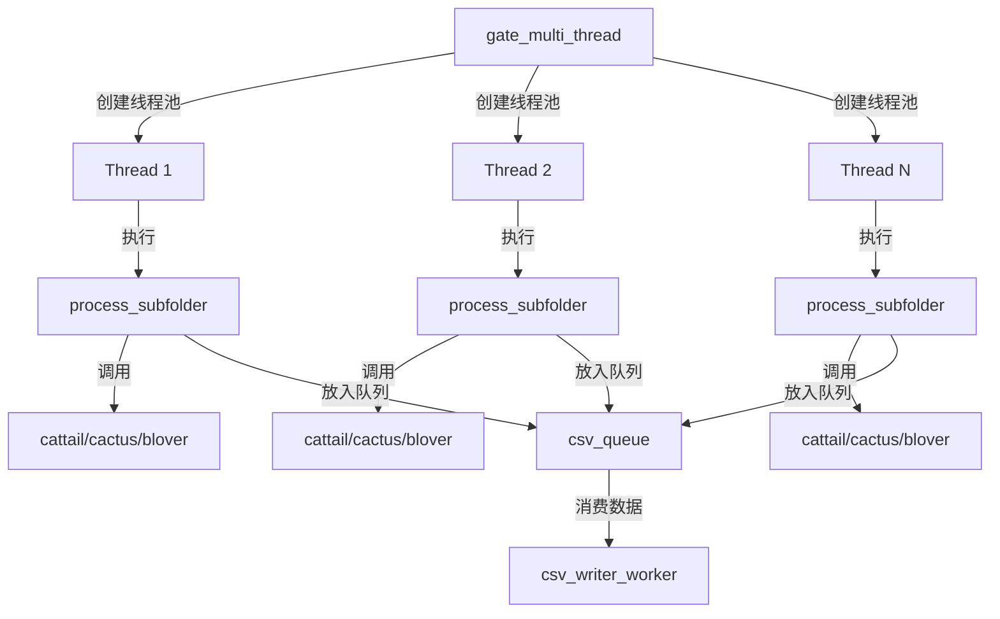

# process_subfolder 函数

<cite>
**Referenced Files in This Document**   
- [PerfGarden.py](file://PerfGarden.py#L477-L609)
- [PerfGarden.py](file://PerfGarden.py#L267-L381)
- [PerfGarden.py](file://PerfGarden.py#L14-L85)
- [PerfGarden.py](file://PerfGarden.py#L88-L187)
- [PerfGarden.py](file://PerfGarden.py#L192-L263)
- [PerfGarden.py](file://PerfGarden.py#L660-L728)
- [PerfGarden.py](file://PerfGarden.py#L612-L657)
</cite>

## 目录
1. [简介](#简介)
2. [核心参数详解](#核心参数详解)
3. [执行流程分析](#执行流程分析)
4. [任务类型与检测器映射](#任务类型与检测器映射)
5. [内部调用：trails 函数](#内部调用trails-函数)
6. [结果处理与返回值](#结果处理与返回值)
7. [异步写入机制](#异步写入机制)
8. [数据流中的角色](#数据流中的角色)
9. [模拟调用示例](#模拟调用示例)

## 简介

`process_subfolder` 函数是 PerfGarden 图像处理框架中的核心工作单元，设计为在独立线程中执行，负责处理单个子文件夹内的所有图像检测任务。该函数作为高层调度器与底层检测逻辑之间的桥梁，接收任务指令，协调多个检测器，并将结果以结构化的方式返回。其设计体现了高内聚、低耦合的原则，确保了多线程环境下的稳定性和可维护性。

**Section sources**
- [PerfGarden.py](file://PerfGarden.py#L477-L488)

## 核心参数详解

`process_subfolder` 函数接收四个关键参数，共同定义了其工作范围和行为。

- **subfolder**: 一个字符串参数，表示待处理的子文件夹的绝对路径。函数通过此路径定位并读取其中的图像文件。
- **tasks**: 一个字典列表，每个字典代表一个待执行的检测任务。任务字典中包含 `task_type`（任务类型）和 `template_path`（模板图片路径）等配置信息。
- **csv_filename**: 一个字符串参数，指定最终结果 CSV 文件的完整路径。该参数目前在函数内部未被直接使用，其作用是传递给 `csv_queue` 以供写入线程使用。
- **csv_queue**: 一个 `queue.Queue` 对象，用于实现生产者-消费者模式。`process_subfolder` 作为生产者，将处理结果放入队列；而独立的 `csv_writer_worker` 线程作为消费者，从队列中取出数据并写入文件，从而实现异步非阻塞的 I/O 操作。

**Section sources**
- [PerfGarden.py](file://PerfGarden.py#L477-L488)

## 执行流程分析

函数的执行流程严谨且高效，确保了任务的有序进行。

1.  **初始化**: 函数首先从 `subfolder` 路径中提取出文件夹名称，并初始化结果列表 `subfolder_results` 和用于写入 CSV 的行数据 `csv_row`。
2.  **文件获取与排序**: 函数遍历子文件夹，筛选出所有支持的图像文件（如 `.jpg`, `.png` 等）。随后，使用 `re.split(r"(\d+)", s)` 对文件名进行自然排序，确保 `image1.jpg`, `image2.jpg`, ..., `image10.jpg` 能够被正确排序，避免了按字典序排序导致的 `image10.jpg` 排在 `image2.jpg` 之前的错误。
3.  **任务循环**: 函数遍历 `tasks` 列表中的每一个任务。在每次迭代开始时，会检查 `remaining_files`（剩余待处理的图片列表）是否为空，若为空则跳过后续任务。
4.  **顺序执行与中断**: 所有任务严格按照 `tasks` 列表中的顺序执行。如果某个任务执行后返回的状态码（`status`）不是 `"PASS"`，函数会立即中断后续所有任务的执行，并在 `csv_row` 中为剩余任务填充 `"未执行"`，体现了任务间的依赖性和流程的健壮性。

**Section sources**
- [PerfGarden.py](file://PerfGarden.py#L490-L500)
- [PerfGarden.py](file://PerfGarden.py#L502-L512)
- [PerfGarden.py](file://PerfGarden.py#L514-L522)
- [PerfGarden.py](file://PerfGarden.py#L578-L587)

## 任务类型与检测器映射

函数的核心逻辑之一是根据 `task_type` 动态选择合适的底层检测器函数。

- **cattail**: 当 `task_type` 为 `"cattail"` 时，函数将调用 `cattail` 检测器。该检测器基于 OpenCV 的模板匹配算法，用于在图像中查找与给定模板高度相似的区域。
- **cactus**: 当 `task_type` 为 `"cactus"` 时，函数将调用 `cactus` 检测器。该检测器通过计算两张图片的像素差异来判断图像内容是否发生变化，常用于检测动态变化。
- **blover**: 当 `task_type` 为 `"blover"` 时，函数将调用 `blover` 检测器。该检测器利用霍夫圆变换来检测图像中的圆形物体。
- **skip**: 当 `task_type` 为 `"skip"` 时，函数不会调用任何检测器。它会从 `remaining_files` 中移除指定数量（`skip_count`）的图片，实现跳过部分图片的功能，常用于处理已知的无效或无关图片。

如果 `task_type` 未被识别，函数会发出警告并默认使用 `cattail` 检测器，保证了程序的容错性。

**Section sources**
- [PerfGarden.py](file://PerfGarden.py#L538-L556)

## 内部调用：trails 函数

`process_subfolder` 函数通过调用 `trails` 函数来执行具体的检测任务。

- **参数传递**: 在调用 `trails` 之前，`process_subfolder` 会从当前任务的字典中提取出 `task_type` 和 `template_path`，并将剩余的参数（如 `threshold`, `leap`, `crop` 等）打包成一个关键字参数字典 `task_kwargs_copy`。这个字典连同 `detector_func`（由 `task_type` 决定的检测器函数）一起传递给 `trails`。
- **结果处理**: `trails` 函数执行完毕后，会返回一个包含状态码、匹配文件名和原始结果的元组。`process_subfolder` 会记录下执行耗时，并将这些信息（包括 `task_idx`, `matched_file`, `status`, `time`）存入 `subfolder_results` 列表。同时，根据状态码，将匹配的文件名或状态码本身添加到 `csv_row` 中，为后续写入做准备。

**Section sources**
- [PerfGarden.py](file://PerfGarden.py#L558-L576)
- [PerfGarden.py](file://PerfGarden.py#L267-L381)

## 结果处理与返回值

函数在处理完所有任务或因错误中断后，会进行结果的整理和返回。

- **返回值**: 函数返回一个包含三个元素的元组：
  1.  `subfolder_name`: 子文件夹的名称。
  2.  `subfolder_results`: 一个字典列表，详细记录了每个任务的执行情况。
  3.  `total_time`: 处理该子文件夹所有任务所花费的总时间（秒）。
- 这个返回值会被高层的 `gate_multi_thread` 函数收集，用于生成最终的汇总报告。

**Section sources**
- [PerfGarden.py](file://PerfGarden.py#L607-L609)

## 异步写入机制

为了提高性能，避免 I/O 操作阻塞主线程，`process_subfolder` 采用了异步写入策略。

- **队列通信**: 函数将构建好的 `csv_row` 数据放入由 `csv_queue` 参数指定的队列中。
- **后台写入**: 一个独立的 `csv_writer_worker` 后台线程会持续监听这个队列。一旦有数据入队，该线程就会将其写入到 `csv_filename` 指定的 CSV 文件中。
- **异常处理**: 写入线程具备重试机制，能够处理临时的权限错误。如果重试失败，线程会直接终止整个程序，防止数据丢失。

**Section sources**
- [PerfGarden.py](file://PerfGarden.py#L605-L606)
- [PerfGarden.py](file://PerfGarden.py#L612-L657)

## 数据流中的角色

`process_subfolder` 函数在整体数据流中扮演着至关重要的角色。

- **连接点**: 它是 `gate_multi_thread` 高层调度器与 `cattail`/`cactus`/`blover` 底层检测器之间的连接点。`gate_multi_thread` 负责创建线程池并分发任务，而 `process_subfolder` 则在每个线程中具体执行这些任务。
- **工作单元**: 每个 `process_subfolder` 实例都是一个独立的工作单元，负责一个子文件夹的完整处理流程，从文件读取、排序、任务执行到结果上报，实现了任务的并行化处理。



**Diagram sources**
- [PerfGarden.py](file://PerfGarden.py#L660-L728)
- [PerfGarden.py](file://PerfGarden.py#L477-L609)
- [PerfGarden.py](file://PerfGarden.py#L14-L85)
- [PerfGarden.py](file://PerfGarden.py#L88-L187)
- [PerfGarden.py](file://PerfGarden.py#L192-L263)
- [PerfGarden.py](file://PerfGarden.py#L612-L657)

**Section sources**
- [PerfGarden.py](file://PerfGarden.py#L660-L728)

## 模拟调用示例

以下是一个模拟调用 `process_subfolder` 函数的代码片段：

```python
# 假设已定义好任务列表和队列
subfolder_path = r"C:\data\session_001"
tasks_config = [
    {"task_type": "cattail", "template_path": r"C:\templates\start.png", "threshold": 0.95},
    {"task_type": "cactus", "threshold": 5.0, "crop": 10},
    {"task_type": "skip", "skip_count": 2}
]
result_queue = queue.Queue()

# 模拟调用
subfolder_name, results, total_duration = process_subfolder(
    subfolder_path, 
    tasks_config, 
    "results.csv", 
    result_queue
)

# 处理返回结果
print(f"处理完成: {subfolder_name}, 总耗时: {total_duration:.2f}s")
```

**Section sources**
- [PerfGarden.py](file://PerfGarden.py#L477-L609)