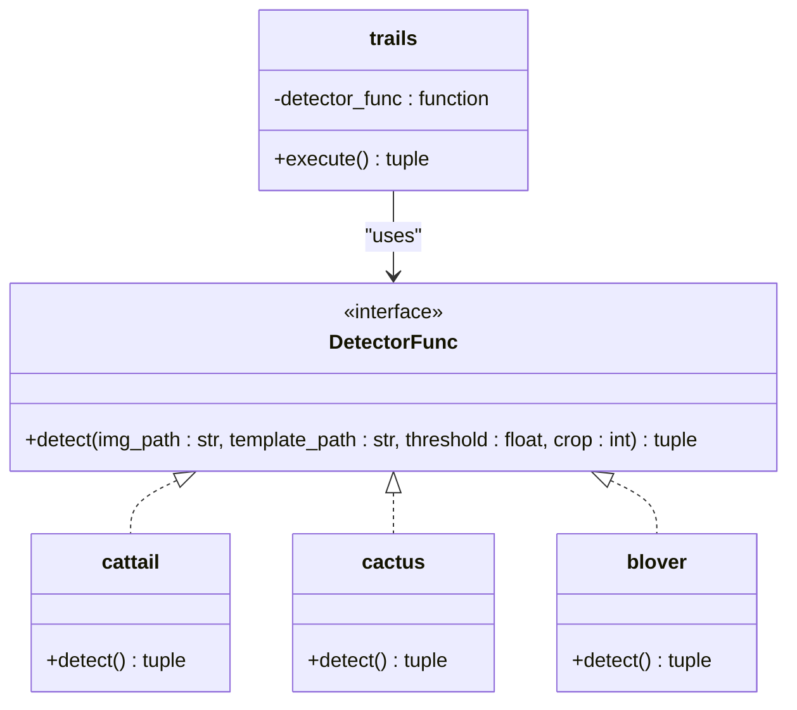
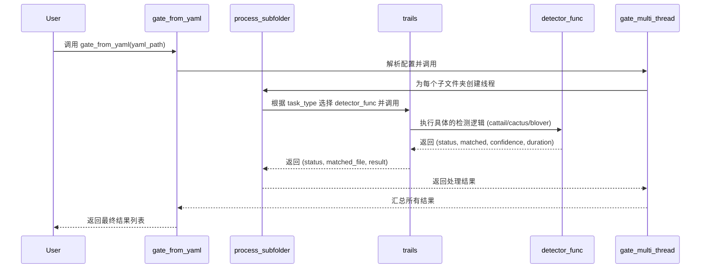

# trails 函数

<cite>
**Referenced Files in This Document**   
- [PerfGarden.py](file://PerfGarden.py)
</cite>

## 目录
1. [简介](#简介)
2. [核心参数详解](#核心参数详解)
3. [工作模式与流程](#工作模式与流程)
4. [返回值解析](#返回值解析)
5. [检测器函数策略模式](#检测器函数策略模式)
6. [调用示例](#调用示例)
7. [调用链与核心地位](#调用链与核心地位)
8. [性能优化设计](#性能优化设计)

## 简介

`trails` 函数是 PerfGarden 项目中的核心任务执行引擎，负责在图片序列中按策略执行检测任务。它作为统一的检测调度器，通过灵活的参数配置和可插拔的检测器函数，实现了对不同视觉特征的高效、精准识别。该函数被设计为一个通用的框架，能够处理从静态元素定位到动态变化检测等多种场景，是整个自动化检测流程的中枢。

**Section sources**
- [PerfGarden.py](file://PerfGarden.py#L267-L381)

## 核心参数详解

`trails` 函数接受多个关键参数，以实现高度的灵活性和可配置性。

- **`image_files`**: 一个已排序的图片文件名列表，代表待检测的图片序列。函数将按此顺序遍历图片。
- **`folder_path`**: 图片文件所在的文件夹路径，用于与 `image_files` 中的文件名拼接，生成完整的图片路径。
- **`template_path`**: 模板图片的路径，用于与序列中的图片进行比对。此参数对于 `cattail` 和 `blover` 等基于模板匹配的检测器是必需的。
- **`threshold`**: 匹配阈值，其具体含义和取值范围由所使用的 `detector_func` 决定。例如，在 `cattail` 中是0到1的置信度阈值，在 `cactus` 中是0到100的差异百分比阈值。如果未提供，则使用检测器函数自身的默认值。
- **`leap`**: 跳跃步长，用于控制扫描的粒度。当 `leap > 1` 时，函数会以跳跃的方式扫描图片序列，以提高效率。
- **`fade`**: 布尔值，指示是否在首次匹配成功后继续扫描，直到匹配状态消失。这在检测一个状态的结束点时非常有用。
- **`crop`**: 图像裁剪比例，允许在检测前对图片进行区域裁剪，以聚焦于特定区域，提高检测速度和准确性。
- **`detector_func`**: 这是最关键的参数，它是一个函数对象，指定了实际执行检测逻辑的函数。通过此参数，`trails` 实现了策略模式，可以动态地切换不同的检测算法。

**Section sources**
- [PerfGarden.py](file://PerfGarden.py#L267-L381)

## 工作模式与流程

`trails` 函数的工作流程根据 `leap` 和 `fade` 参数的不同而变化，主要分为两种模式。

### 跳跃式扫描模式 (`leap > 1`)

当 `leap` 参数大于1时，函数首先以跳跃的方式扫描图片序列。例如，`leap=3` 时，它会检查第3、6、9...张图片。一旦在某张图片上发现匹配（`matched` 为 `True`），函数会立即回退 `leap-1` 张图片，并将 `leap` 设置为1，然后从该位置开始逐帧检查。这种模式极大地避免了在序列前半部分进行不必要的全序列扫描，显著提升了在长序列中定位首个匹配点的效率。

### 消失检测模式 (`fade=True`)

当 `fade` 参数为 `True` 时，函数的行为会发生改变。在 `leap=1` 的逐帧模式下，即使首次匹配成功，函数也不会立即返回，而是继续扫描后续的图片，直到检测到匹配状态消失（`matched` 为 `False`）。此时，函数返回的是匹配消失时的那张图片。这种模式适用于需要检测某个状态结束时间点的场景。

**Section sources**
- [PerfGarden.py](file://PerfGarden.py#L267-L381)

## 返回值解析

`trails` 函数返回一个三元组 `(status, matched_file, result)`，用于描述检测任务的最终结果。

- **`status`**: 状态码，有三种可能的值：
  - **`"PASS"`**: 检测成功。表示在图片序列中找到了符合预期的匹配（或匹配消失）。
  - **`"ERROR"`**: 检测出错。表示在执行过程中，底层的 `detector_func` 返回了非 `"PASS"` 的状态码（如 `"EC01"` 参数错误），表明检测过程因异常而终止。
  - **`"UNFOUND"`**: 未找到匹配。表示在整个图片序列中都未能找到匹配项，或者在 `fade=True` 模式下未能找到匹配消失的点。
- **`matched_file`**: 匹配的文件名。当 `status` 为 `"PASS"` 时，此字段包含匹配成功的图片文件名；否则为 `None`。
- **`result`**: 原始检测结果。这是底层 `detector_func` 返回的完整结果元组。当 `status` 为 `"UNFOUND"` 时，此字段为 `None`。

**Section sources**
- [PerfGarden.py](file://PerfGarden.py#L267-L381)

## 检测器函数策略模式

`trails` 函数通过 `detector_func` 参数实现了经典的策略模式（Strategy Pattern）。`detector_func` 是一个函数指针，允许在运行时动态地指定具体的检测算法。

- **默认策略**: 当 `detector_func` 为 `None` 时，函数默认使用 `cattail` 作为检测器，即进行模板匹配。
- **可插拔设计**: 项目中定义了多个检测器函数，如 `cattail`（模板匹配）、`cactus`（图像差异检测）和 `blover`（圆形检测）。这些函数都遵循相同的接口，即接收图片路径、模板路径等参数，并返回一个包含 `(status, matched, confidence, duration)` 的元组。`trails` 函数不关心 `detector_func` 的具体实现，只依赖于这个统一的接口，从而实现了算法与执行流程的解耦。
- **特殊处理**: `trails` 函数还对特定的检测器进行了适配。例如，当 `detector_func` 为 `cactus` 且未提供 `template_path` 时，函数会自动将序列中的第一张图片作为模板，这体现了其智能的上下文感知能力。



**Diagram sources**
- [PerfGarden.py](file://PerfGarden.py#L14-L85)
- [PerfGarden.py](file://PerfGarden.py#L88-L187)
- [PerfGarden.py](file://PerfGarden.py#L192-L263)
- [PerfGarden.py](file://PerfGarden.py#L267-L381)

**Section sources**
- [PerfGarden.py](file://PerfGarden.py#L267-L381)

## 调用示例

以下是一个直接调用 `trails` 函数并传入 `cactus` 函数作为检测器的示例：

```python
# 假设我们有一个图片序列和一个模板
image_files = ["frame_001.png", "frame_002.png", "frame_003.png", ...]
folder_path = "/path/to/images"
template_path = "/path/to/template.png"

# 直接传入cactus函数进行差异检测
status, matched_file, result = trails(
    image_files=image_files,
    folder_path=folder_path,
    template_path=template_path,
    threshold=5.0,  # 差异百分比阈值设为5%
    leap=2,         # 跳跃步长为2
    fade=False,     # 找到即返回
    detector_func=cactus  # 指定使用cactus检测器
)

print(f"检测状态: {status}, 匹配文件: {matched_file}")
```

此示例展示了如何利用 `detector_func` 参数，将 `trails` 函数的通用执行框架与 `cactus` 函数的具体差异检测逻辑相结合。

**Section sources**
- [PerfGarden.py](file://PerfGarden.py#L267-L381)

## 调用链与核心地位

`trails` 函数在整个项目中处于核心的执行层。它并非直接被用户调用，而是作为更高层函数的统一执行入口。

- **调用者**: `trails` 函数主要被 `process_subfolder` 函数调用。`process_subfolder` 负责处理一个子文件夹内的所有任务，它会根据任务配置（如 `task_type: cactus`）来选择合适的 `detector_func`，然后将任务委派给 `trails` 函数执行。
- **统一入口**: 无论任务是模板匹配、差异检测还是圆形识别，最终的检测执行都通过 `trails` 函数完成。这使得 `trails` 成为所有检测策略的单一入口点，简化了上层逻辑，并保证了检测流程的一致性。



**Diagram sources**
- [PerfGarden.py](file://PerfGarden.py#L267-L381)
- [PerfGarden.py](file://PerfGarden.py#L477-L609)

**Section sources**
- [PerfGarden.py](file://PerfGarden.py#L477-L609)

## 性能优化设计

`trails` 函数在设计上充分考虑了性能优化，避免了不必要的计算开销。

- **跳跃扫描 (`leap`)**: 这是最主要的性能优化。通过设置 `leap > 1`，函数可以快速跳过大量明显不匹配的图片，将搜索空间从 O(n) 降低到接近 O(n/leap)，在长序列中效果尤为显著。
- **短路返回**: 一旦检测到错误状态（`status != "PASS"`）或在非 `fade` 模式下找到匹配，函数会立即返回，避免了对后续图片的无谓检测。
- **避免全序列扫描**: 结合跳跃扫描和短路返回，`trails` 函数确保了在绝大多数情况下，不会对整个图片序列进行完整的、逐帧的扫描，从而极大地提升了整体执行效率。