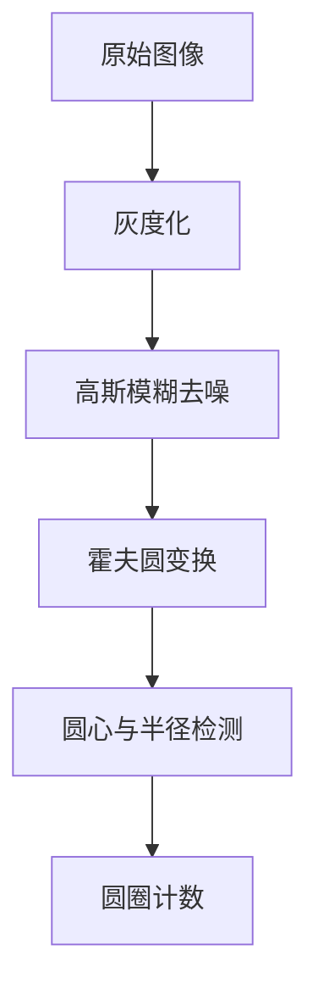

# blover函数详解

<cite>
**Referenced Files in This Document**   
- [PerfGarden.py](file://PerfGarden.py)
</cite>

## 目录
1. [简介](#简介)
2. [核心功能与设计原理](#核心功能与设计原理)
3. [参数校验逻辑](#参数校验逻辑)
4. [图像预处理流程](#图像预处理流程)
5. [霍夫圆检测实现](#霍夫圆检测实现)
6. [结果判断与返回](#结果判断与返回)
7. [实际调用示例](#实际调用示例)
8. [与cattail函数的适用性对比](#与cattail函数的适用性对比)

## 简介
`blover`函数是PerfGarden项目中用于检测图像中圆形目标的核心算法之一。该函数通过OpenCV的霍夫变换技术实现圆圈检测，适用于需要识别特定数量圆形特征的场景。与基于模板匹配的`cattail`函数不同，`blover`专注于几何形状的识别，特别适合于检测如按钮、指示灯、圆形标记等具有明显圆形轮廓的目标。

**Section sources**
- [PerfGarden.py](file://PerfGarden.py#L89-L160)

## 核心功能与设计原理
`blover`函数的设计目标是准确检测图像中的圆形对象并判断其数量是否满足预设阈值。其核心原理基于OpenCV提供的`cv2.HoughCircles`方法，该方法利用霍夫梯度法进行圆检测。整个过程包括参数校验、灰度图读取、图像裁剪、高斯模糊去噪以及最终的圆检测与计数。

该函数不依赖模板图像（`template_path`参数默认为`None`），而是直接分析输入图像的几何特征，这使得它在处理不同背景但具有相同圆形特征的图像时更具鲁棒性。

**Section sources**
- [PerfGarden.py](file://PerfGarden.py#L89-L160)

## 参数校验逻辑
函数在执行前会对关键参数进行严格校验，确保输入的合法性。

### threshold参数校验
`threshold`参数代表期望检测到的圆圈数量，必须为正整数。校验逻辑如下：
```python
if not isinstance(threshold, int) or threshold <= 0:
    return ("EB01", False, 0, time.time() - start_time)
```
若`threshold`非整数或小于等于0，则返回错误码`EB01`，表示参数无效。

### crop参数校验
`crop`参数控制图像裁剪比例，有效范围为-99到99。校验逻辑如下：
```python
if not isinstance(crop, int) or crop < -99 or crop > 99:
    return ("EB01", False, 0, time.time() - start_time)
```
超出此范围的值将导致函数提前终止并返回相同的错误码。

**Section sources**
- [PerfGarden.py](file://PerfGarden.py#L98-L104)

## 图像预处理流程
为了提高检测的准确性和稳定性，`blover`函数实施了一系列图像预处理步骤。

### 灰度图安全读取
函数采用`cv2.imdecode`结合`np.fromfile`的方式读取图像，以支持包含中文字符的文件路径，并直接以灰度模式加载，避免了后续的颜色空间转换：
```python
gray = cv2.imdecode(np.fromfile(img_path, dtype=np.uint8), cv2.IMREAD_GRAYSCALE)
```
此方法能有效防止因路径编码问题导致的读取失败。

### 图像裁剪处理
根据`crop`参数的值，函数可对图像进行顶部或底部的区域裁剪，以聚焦于感兴趣的区域（ROI）：
- 当`crop > 0`时，保留图像底部区域。
- 当`crop < 0`时，保留图像顶部区域。
- 当`crop = 0`时，不进行裁剪。

裁剪操作有助于排除无关区域的干扰，提升检测效率和准确性。

**Section sources**
- [PerfGarden.py](file://PerfGarden.py#L106-L123)

## 霍夫圆检测实现
霍夫圆变换是`blover`函数的核心，其性能和准确性高度依赖于`cv2.HoughCircles`函数的参数配置。



**Diagram sources**
- [PerfGarden.py](file://PerfGarden.py#L125-L138)

### 关键参数解析
| 参数 | 作用 | 调优策略 |
| :--- | :--- | :--- |
| `dp` | 图像分辨率与累加器分辨率之比 | 值为1时保持原始分辨率，增大该值会降低检测精度但提高速度 |
| `minDist` | 检测到的圆心之间的最小距离 | 应大于被检测圆的直径，防止重复检测同一圆或相邻圆 |
| `param1` | Canny边缘检测器的高阈值 | 值越大，边缘检测越严格，建议在50-150之间调整 |
| `param2` | 圆心累加器的阈值 | 值越小，检测越宽松，但假阳性增多，建议在10-50之间调整 |
| `minRadius` | 被检测圆的最小半径 | 根据实际目标尺寸设置，过滤过小的伪圆 |
| `maxRadius` | 被检测圆的最大半径 | 根据实际目标尺寸设置，过滤过大的伪圆 |

这些参数需要根据具体的应用场景进行精细调整，以达到最佳的检测效果。

**Section sources**
- [PerfGarden.py](file://PerfGarden.py#L125-L138)

## 结果判断与返回
检测完成后，函数对结果进行处理和判断。

### 检测结果计数
函数通过检查`cv2.HoughCircles`的返回值来确定检测到的圆圈数量：
```python
confidence = 0
if circlEB is not None:
    confidence = len(circlEB[0])
```
`confidence`变量存储了实际检测到的圆圈总数。

### 匹配判断逻辑
函数判断检测结果是否“匹配”的标准是检测到的圆圈数量是否大于或等于`threshold`：
```python
matched = confidence >= threshold
```
此逻辑允许一定的灵活性，即只要检测到的圆圈数量不少于期望值即视为成功，适用于“至少存在N个圆”的检测场景。

最终，函数返回一个包含状态码、匹配结果、置信度（圆圈数量）和执行耗时的元组。

**Section sources**
- [PerfGarden.py](file://PerfGarden.py#L140-L158)

## 实际调用示例
以下是一个`blover`函数的典型调用示例：

```python
# 检测图像中是否存在至少3个圆形按钮
status, matched, confidence, duration = blover(
    img_path="screenshots/main_menu.png",
    threshold=3,
    crop=10  # 裁剪底部10%的区域，聚焦于主界面
)

if matched:
    print(f"检测成功！共找到 {confidence} 个圆形。")
else:
    print(f"检测失败！仅找到 {confidence} 个圆形，少于期望的 {threshold} 个。")
```

**Section sources**
- [PerfGarden.py](file://PerfGarden.py#L89-L160)

## 与cattail函数的适用性对比

```mermaid
graph TD
A[检测需求] --> B{目标特征}
B --> C[精确的纹理/图案]
B --> D[几何形状(圆形)]
C --> E[cattail函数]
D --> F[blover函数]
E --> G[基于模板匹配<br>高精度匹配特定图像]
F --> H[基于霍夫变换<br>识别几何形状]
```

**Diagram sources**
- [PerfGarden.py](file://PerfGarden.py#L13-L84)
- [PerfGarden.py](file://PerfGarden.py#L89-L160)

| 特性 | `cattail`函数 | `blover`函数 |
| :--- | :--- | :--- |
| **检测原理** | 模板匹配 (Template Matching) | 霍夫圆变换 (Hough Circle Transform) |
| **输入依赖** | 需要提供模板图像 | 无需模板图像 |
| **核心参数** | `threshold` (匹配阈值 0~1) | `threshold` (期望圆圈数量) |
| **适用场景** | 检测具有特定纹理、颜色或复杂图案的对象，如图标、文字、特定UI元素 | 检测具有清晰圆形轮廓的对象，如按钮、指示灯、圆形标记 |
| **优势** | 对目标的纹理和细节匹配度高，误检率低 | 对光照、背景变化不敏感，能检测不同大小的圆 |
| **劣势** | 对旋转、缩放敏感，背景变化可能导致匹配失败 | 可能将非圆形的闭合轮廓误检为圆，对参数敏感 |

**总结**：当需要精确匹配一个已知的、复杂的图像模式时，应选择`cattail`；而当目标是识别图像中是否存在特定数量的圆形时，`blover`是更高效和鲁棒的选择。