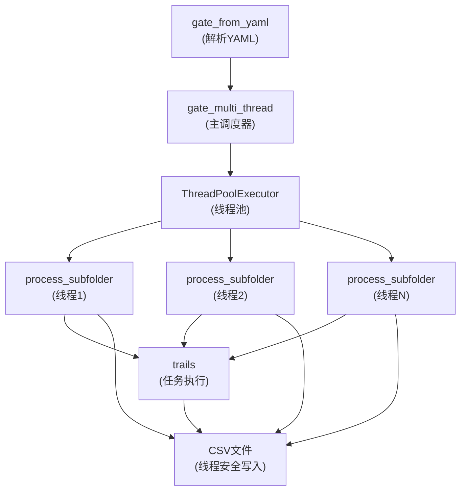
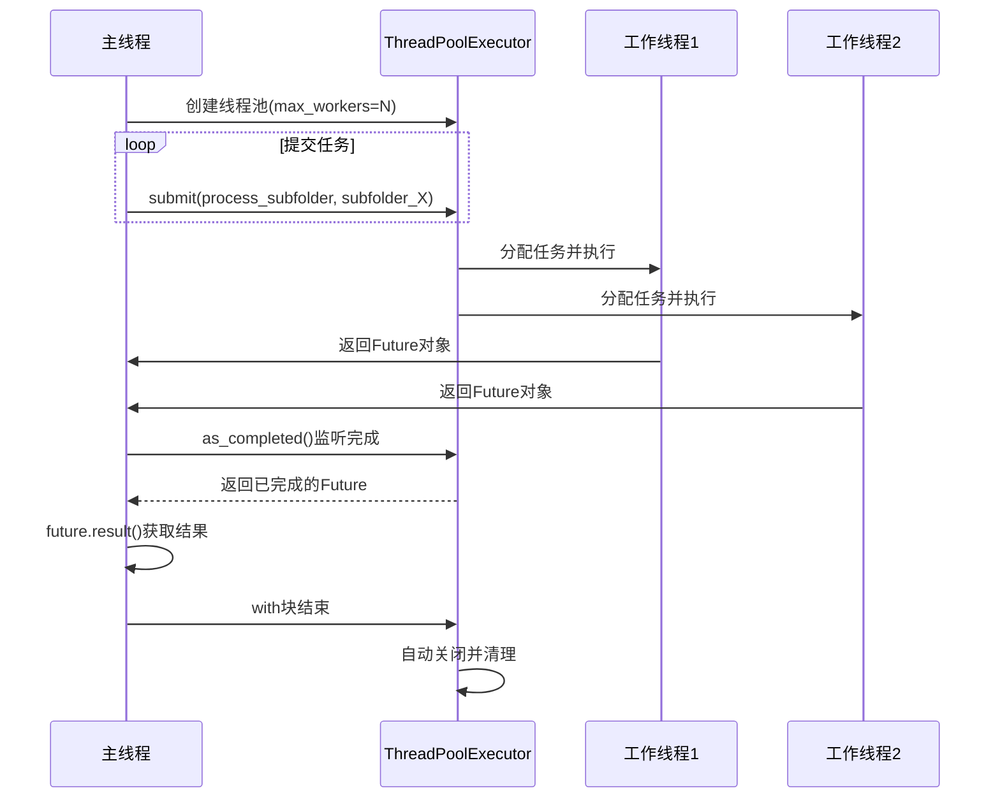
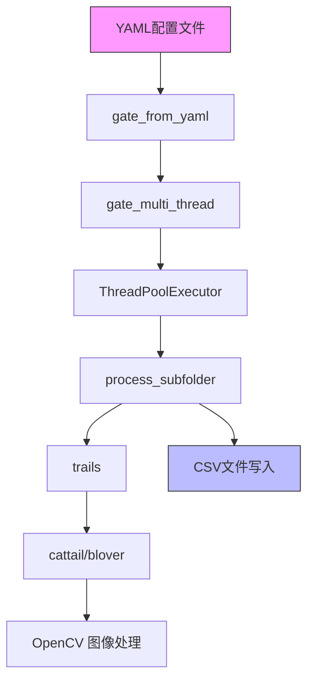

# gate_multi_thread函数详解

<cite>
**Referenced Files in This Document**   
- [PerfGarden.py](file://PerfGarden.py#L521-L583)
- [PerfGarden.py](file://PerfGarden.py#L362-L518)
- [PerfGarden.py](file://PerfGarden.py#L275-L359)
</cite>

## 目录
1. [多线程架构总览](#多线程架构总览)
2. [核心组件与数据流](#核心组件与数据流)
3. [线程池配置与管理](#线程池配置与管理)
4. [任务分发与执行流程](#任务分发与执行流程)
5. [结果收集与异常处理](#结果收集与异常处理)
6. [同步机制与文件写入](#同步机制与文件写入)
7. [性能分析与配置建议](#性能分析与配置建议)
8. [调用链路分析](#调用链路分析)

## 多线程架构总览

`gate_multi_thread`函数实现了基于`concurrent.futures.ThreadPoolExecutor`的多线程并行处理架构，旨在高效处理母文件夹内多个子文件夹的图片匹配任务。该架构采用主从模式，主线程负责任务调度和结果收集，而工作线程则独立处理各个子文件夹。

系统通过`ThreadPoolExecutor`创建一个可配置大小的线程池，将每个子文件夹的处理任务作为独立工作单元提交给线程池。这种设计实现了任务级并行，充分利用了多核CPU的计算能力，显著提升了对大量子文件夹进行批量处理的效率。

**Section sources**
- [PerfGarden.py](file://PerfGarden.py#L521-L583)

## 核心组件与数据流

该多线程系统的数据流始于`gate_from_yaml`函数，该函数解析YAML配置文件，提取出母文件夹路径、任务列表和线程数等参数，然后调用`gate_multi_thread`函数启动处理流程。

`gate_multi_thread`函数接收四个核心参数：`parent_folder`（母文件夹路径）、`tasks`（任务参数列表）、`task_headers`（CSV表头）和`max_threads`（最大线程数）。它首先初始化CSV文件和线程锁，然后获取所有子文件夹列表，并为每个子文件夹创建一个`process_subfolder`任务。

`process_subfolder`函数是实际的工作单元，它在独立线程中执行，负责处理单个子文件夹内的所有任务序列。处理完成后，结果通过线程安全的方式写入共享的CSV文件。



**Diagram sources**
- [PerfGarden.py](file://PerfGarden.py#L275-L359)
- [PerfGarden.py](file://PerfGarden.py#L521-L583)
- [PerfGarden.py](file://PerfGarden.py#L362-L518)

**Section sources**
- [PerfGarden.py](file://PerfGarden.py#L275-L359)
- [PerfGarden.py](file://PerfGarden.py#L521-L583)
- [PerfGarden.py](file://PerfGarden.py#L362-L518)

## 线程池配置与管理

`gate_multi_thread`函数通过`concurrent.futures.ThreadPoolExecutor`类创建和管理线程池，其核心配置参数为`max_workers`，该参数直接决定了线程池中可同时运行的最大线程数量。

线程池的生命周期由`with`语句管理，确保了资源的正确释放。当`with`块执行完毕后，线程池会自动关闭并等待所有正在运行的任务完成。

线程池的大小配置至关重要。`max_threads`参数通常由`gate_from_yaml`函数根据YAML配置或系统CPU核心数（`os.cpu_count()`）确定。一个合理的线程数可以最大化利用CPU资源，而过多的线程则可能导致上下文切换开销过大，反而降低性能。



**Diagram sources**
- [PerfGarden.py](file://PerfGarden.py#L521-L583)

**Section sources**
- [PerfGarden.py](file://PerfGarden.py#L521-L583)

## 任务分发与执行流程

任务分发流程始于`gate_multi_thread`函数内部的字典推导式，它使用`executor.submit()`方法将每个子文件夹的处理任务提交给线程池。

```python
future_to_subfolder = {
    executor.submit(
        process_subfolder, subfolder, tasks, csv_filename, csv_lock
    ): subfolder
    for subfolder in subfolders
}
```

`submit`方法立即返回一个`Future`对象，该对象代表了尚未完成的异步计算。所有`Future`对象被存储在`future_to_subfolder`字典中，以实现`Future`与子文件夹路径的映射。

每个`process_subfolder`任务在独立线程中执行，其内部流程包括：
1.  扫描并自然排序子文件夹内的图片文件。
2.  遍历预定义的`tasks`列表，顺序执行每个任务。
3.  对于每个任务，调用`trails`函数进行图片匹配检测。
4.  根据前一个任务的匹配结果，更新剩余待处理的图片列表，实现任务间的逻辑衔接。

**Section sources**
- [PerfGarden.py](file://PerfGarden.py#L521-L583)
- [PerfGarden.py](file://PerfGarden.py#L362-L518)

## 结果收集与异常处理

`gate_multi_thread`函数采用`concurrent.futures.as_completed()`方法来高效地收集任务结果。该方法返回一个迭代器，每当有任务完成时，就会产生对应的`Future`对象，无需等待所有任务结束。

```python
for future in concurrent.futures.as_completed(future_to_subfolder):
    subfolder = os.path.basename(future_to_subfolder[future])
    try:
        subfolder_name, subfolder_results, subfolder_time = future.result()
        results.append((subfolder_name, subfolder_results))
        print(f"✅【完成】子文件夹 {subfolder_name} 处理完成，耗时: {subfolder_time:.2f}秒")
    except Exception as e:
        print(f"⛔【错误】子文件夹 {subfolder} 处理出错: {e}")
```

异常处理机制是该流程的关键部分。`future.result()`调用会阻塞，直到任务完成或抛出异常。通过`try-except`块，系统能够捕获在`process_subfolder`函数执行过程中发生的任何异常（如文件读取错误、权限错误等），并将其打印到控制台，从而保证了主线程的稳定运行，避免了单个子文件夹的失败导致整个批处理任务中断。

**Section sources**
- [PerfGarden.py](file://PerfGarden.py#L521-L583)

## 同步机制与文件写入

由于多个工作线程需要向同一个CSV文件写入结果，因此必须使用同步机制来防止数据竞争和文件损坏。`gate_multi_thread`函数通过`threading.Lock()`创建了一个名为`csv_lock`的线程锁。

`process_subfolder`函数在写入CSV文件前，必须先获取这个锁：
```python
with csv_lock:
    with open(csv_filename, "a", newline="", encoding="utf-8-sig") as f:
        csv.writer(f).writerow(csv_row)
```

`with`语句确保了锁的自动获取和释放。当一个线程进入`with csv_lock`代码块时，其他试图获取同一把锁的线程将被阻塞，直到当前线程退出代码块并释放锁。这保证了CSV文件的写入操作是原子的，从而维护了数据的完整性和一致性。

此外，代码还实现了带重试机制的文件写入，以应对可能的`PermissionError`，进一步增强了系统的健壮性。

**Section sources**
- [PerfGarden.py](file://PerfGarden.py#L521-L583)
- [PerfGarden.py](file://PerfGarden.py#L362-L518)

## 性能分析与配置建议

`gate_multi_thread`函数通过并行处理显著提升了整体处理效率。其性能提升效果主要体现在：

1.  **I/O等待重叠**：当一个线程因读取图片文件而等待I/O操作时，其他线程可以继续执行计算任务，有效利用了CPU空闲时间。
2.  **任务级并行**：多个子文件夹的处理任务可以同时进行，总处理时间趋近于最慢的单个子文件夹处理时间，而非所有子文件夹时间的总和。

**线程数配置最佳实践建议**：
- **一般情况**：将`max_threads`设置为系统CPU核心数（`os.cpu_count()`）。这是平衡资源利用和上下文切换开销的合理起点。
- **I/O密集型任务**：如果任务主要涉及文件读写（I/O密集型），可以适当增加线程数（例如，CPU核心数的2-4倍），因为线程大部分时间在等待I/O，增加线程数可以提高并发度。
- **CPU密集型任务**：如果任务涉及大量计算（CPU密集型），应将线程数保持在CPU核心数附近，过多的线程会导致频繁的上下文切换，降低效率。
- **内存限制**：需考虑每个线程处理图片时的内存占用。如果子文件夹图片数量巨大，过多的并发线程可能导致内存溢出。应根据可用内存进行调整。

**Section sources**
- [PerfGarden.py](file://PerfGarden.py#L521-L583)

## 调用链路分析

`gate_multi_thread`函数的完整调用链路清晰地展示了其在整个系统中的位置和作用。



1.  **入口**：`gate_from_yaml`函数作为入口，负责解析YAML配置，提取`parent_folder`、`tasks`、`task_headers`和`max_threads`等参数。
2.  **主调度**：`gate_from_yaml`调用`gate_multi_thread`，传入上述所有参数。
3.  **并行执行**：`gate_multi_thread`创建线程池，并为每个子文件夹提交一个`process_subfolder`任务。
4.  **任务处理**：`process_subfolder`在工作线程中执行，它会调用`trails`函数来执行具体的任务序列。
5.  **核心算法**：`trails`函数根据任务类型，调用底层的`cattail`（模板匹配）或`blover`（霍夫圆检测）算法进行图片分析。

此调用链路体现了清晰的分层设计，`gate_multi_thread`作为核心的并行调度器，成功地将复杂的批量处理任务分解为可并行执行的独立单元。

**Diagram sources**
- [PerfGarden.py](file://PerfGarden.py#L275-L359)
- [PerfGarden.py](file://PerfGarden.py#L521-L583)
- [PerfGarden.py](file://PerfGarden.py#L362-L518)

**Section sources**
- [PerfGarden.py](file://PerfGarden.py#L275-L359)