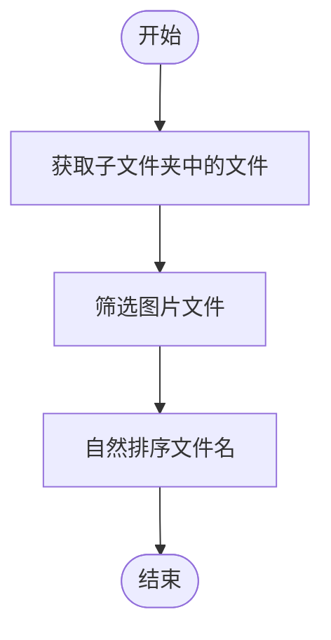
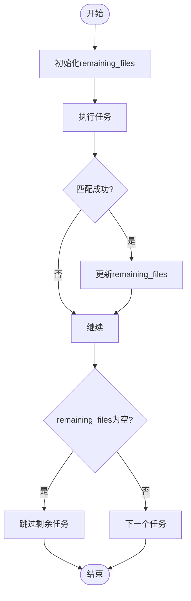
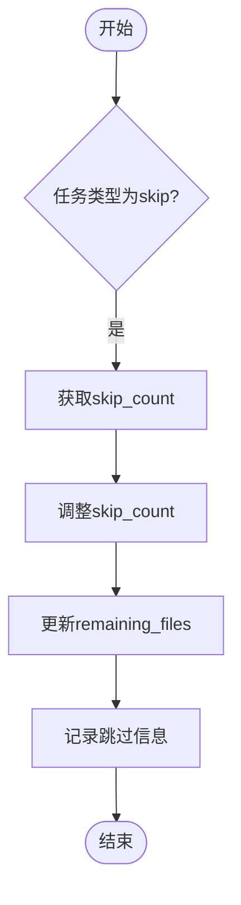
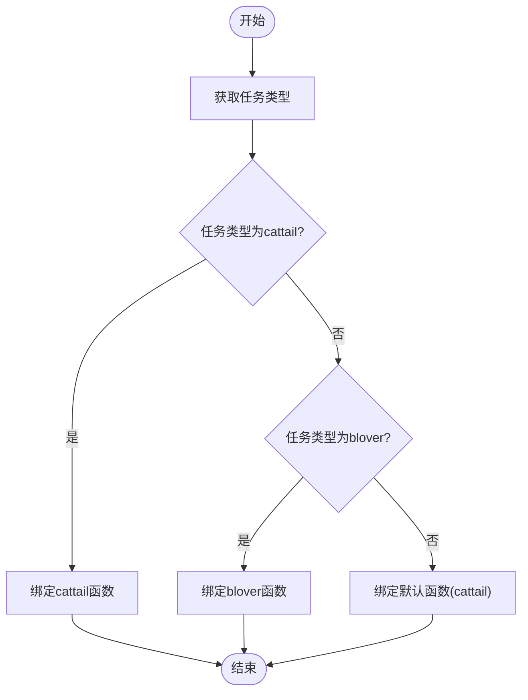
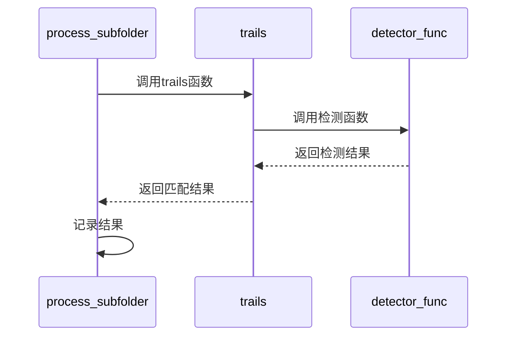
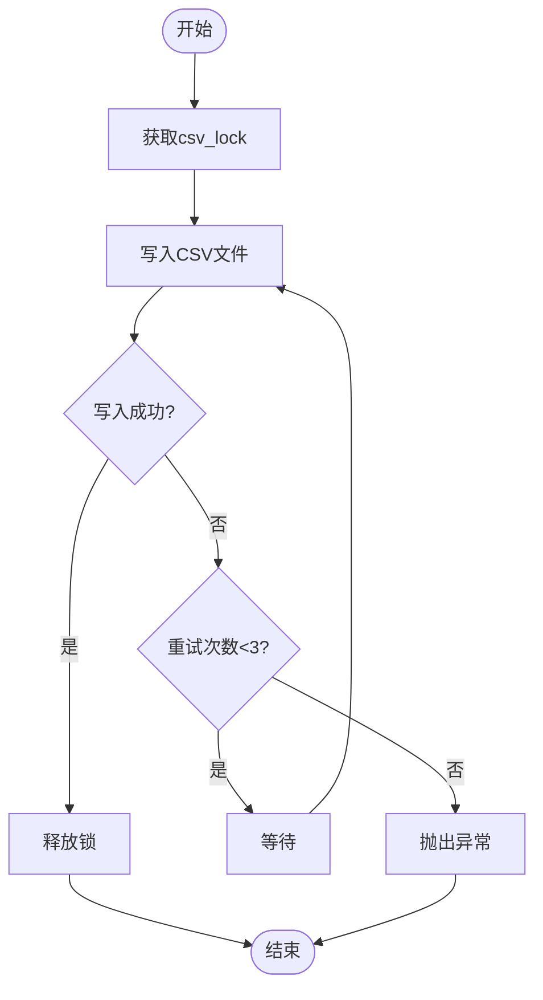
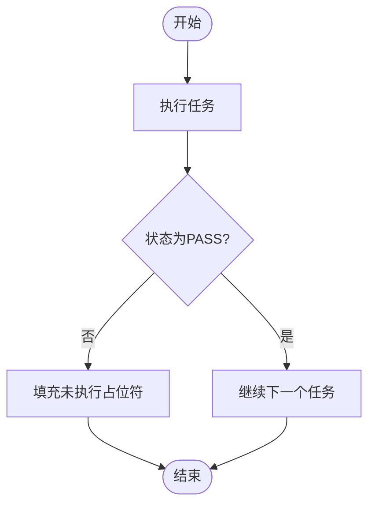

# process_subfolder函数详解

<cite>
**Referenced Files in This Document**   
- [PerfGarden.py](file://PerfGarden.py)
</cite>

## 目录
1. [简介](#简介)
2. [核心功能与执行流程](#核心功能与执行流程)
3. [图片文件的安全读取与自然排序](#图片文件的安全读取与自然排序)
4. [remaining_files剩余图片列表的维护机制](#remaining_files剩余图片列表的维护机制)
5. [skip任务的特殊处理](#skip任务的特殊处理)
6. [任务类型路由与动态绑定](#任务类型路由与动态绑定)
7. [trails函数调用封装](#trails函数调用封装)
8. [线程安全的CSV写入实现](#线程安全的CSV写入实现)
9. [任务链式执行中的中断逻辑](#任务链式执行中的中断逻辑)
10. [进度更新机制](#进度更新机制)

## 简介
`process_subfolder`函数是`PerfGarden.py`脚本中的核心处理单元，负责在多线程环境下对单个子文件夹内的图片文件进行一系列自动化任务处理。该函数通过调用`trails`函数执行模板匹配检测，并根据任务配置动态路由至`cattail`或`blover`等检测器。函数设计充分考虑了线程安全性、错误处理和资源管理，确保在并发环境中稳定运行。

## 核心功能与执行流程
`process_subfolder`函数的主要职责是处理一个子文件夹中的所有任务。其执行流程如下：
1. 初始化子文件夹名称、结果列表和CSV行数据。
2. 获取并自然排序子文件夹中的图片文件。
3. 初始化剩余图片列表。
4. 遍历任务列表，依次执行每个任务。
5. 根据任务类型（如`skip`、`cattail`、`blover`）执行相应操作。
6. 更新剩余图片列表和CSV行数据。
7. 在任务失败时中断后续任务执行。
8. 将结果安全写入CSV文件。

**Section sources**
- [PerfGarden.py](file://PerfGarden.py#L362-L518)

## 图片文件的安全读取与自然排序
`process_subfolder`函数首先通过`os.listdir`获取子文件夹中的所有文件，并筛选出常见的图片格式（`.jpg`、`.jpeg`、`.png`、`.bmp`、`.gif`）。为了确保文件名的自然排序，函数使用正则表达式`re.split(r"(\d+)", s)`将文件名分割为数字和非数字部分，并将数字部分转换为整数进行排序。这种排序方式能够正确处理包含数字的文件名，例如`image1.jpg`、`image2.jpg`、`image10.jpg`等。

**Diagram sources**
- [PerfGarden.py](file://PerfGarden.py#L368-L378)

## remaining_files剩余图片列表的维护机制
`remaining_files`列表用于跟踪当前尚未处理的图片文件。函数在初始化时将所有图片文件复制到`remaining_files`中。在执行每个任务后，如果任务成功匹配到图片，则从`remaining_files`中移除该图片及其之前的图片，确保后续任务从匹配点之后继续处理。如果`remaining_files`为空，则跳过剩余任务。

**Diagram sources**
- [PerfGarden.py](file://PerfGarden.py#L380-L381)
- [PerfGarden.py](file://PerfGarden.py#L478-L483)

## skip任务的特殊处理
`skip`任务用于跳过指定数量的图片。当任务类型为`skip`时，函数从任务参数中获取`skip_count`，并从`remaining_files`中移除前`skip_count`张图片。如果`skip_count`大于剩余图片数量，则跳过所有剩余图片。此操作确保了任务链的连续性，允许用户在处理前跳过无关图片。

**Diagram sources**
- [PerfGarden.py](file://PerfGarden.py#L385-L398)

## 任务类型路由与动态绑定
`process_subfolder`函数根据任务类型动态绑定相应的检测函数。如果任务类型为`cattail`，则绑定`cattail`函数；如果任务类型为`blover`，则绑定`blover`函数。对于未知任务类型，默认使用`cattail`函数。这种设计提高了函数的灵活性和可扩展性，允许轻松添加新的检测器。

**Diagram sources**
- [PerfGarden.py](file://PerfGarden.py#L408-L418)

## trails函数调用封装
`process_subfolder`函数通过调用`trails`函数执行具体的模板匹配任务。`trails`函数接收图片文件列表、文件夹路径、模板路径、检测函数等参数，并返回匹配结果。`process_subfolder`函数负责准备这些参数，并将结果记录到`subfolder_results`和`csv_row`中。

**Diagram sources**
- [PerfGarden.py](file://PerfGarden.py#L423-L438)
- [PerfGarden.py](file://PerfGarden.py#L164-L272)

## 线程安全的CSV写入实现
为了确保多线程环境下的数据一致性，`process_subfolder`函数使用`csv_lock`锁机制保护CSV文件的写入操作。函数在写入前获取锁，写入完成后释放锁。此外，函数还实现了重试机制，当写入失败时（如权限错误），会尝试重试最多3次，每次重试间隔递增，以提高写入成功率。

**Diagram sources**
- [PerfGarden.py](file://PerfGarden.py#L492-L518)

## 任务链式执行中的中断逻辑
`process_subfolder`函数在任务链式执行中实现了中断逻辑。当某个任务返回非`PASS`状态时，函数会立即中断后续任务的执行，并在CSV行中填充`未执行`占位符。这种设计确保了任务链的原子性，避免在失败状态下继续执行无意义的任务。

**Diagram sources**
- [PerfGarden.py](file://PerfGarden.py#L464-L472)

## 进度更新机制
`process_subfolder`函数通过打印日志信息实时更新处理进度。每次执行任务、跳过图片、更新剩余图片列表或写入CSV文件时，函数都会输出相应的日志信息。这些日志信息帮助用户了解当前处理状态，便于调试和监控。

**Section sources**
- [PerfGarden.py](file://PerfGarden.py#L387-L397)
- [PerfGarden.py](file://PerfGarden.py#L443-L449)
- [PerfGarden.py](file://PerfGarden.py#L484-L488)
- [PerfGarden.py](file://PerfGarden.py#L508-L514)