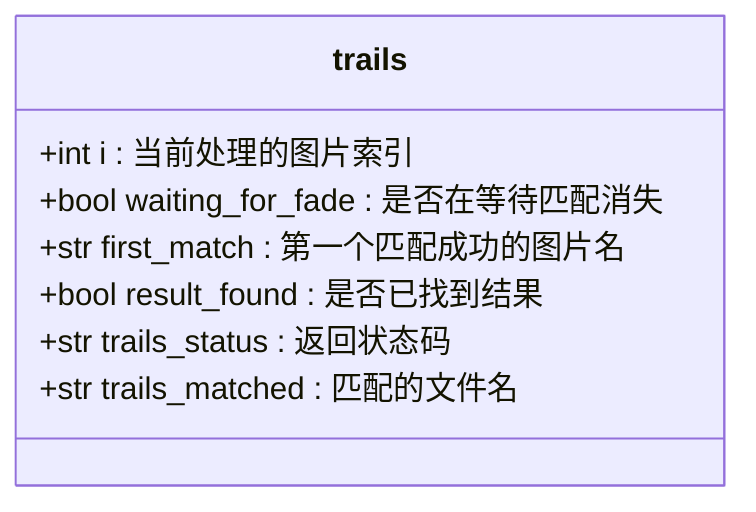
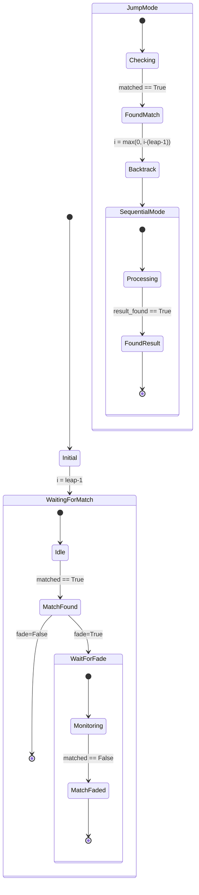
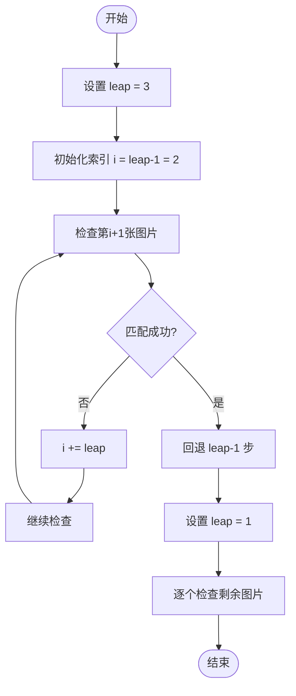
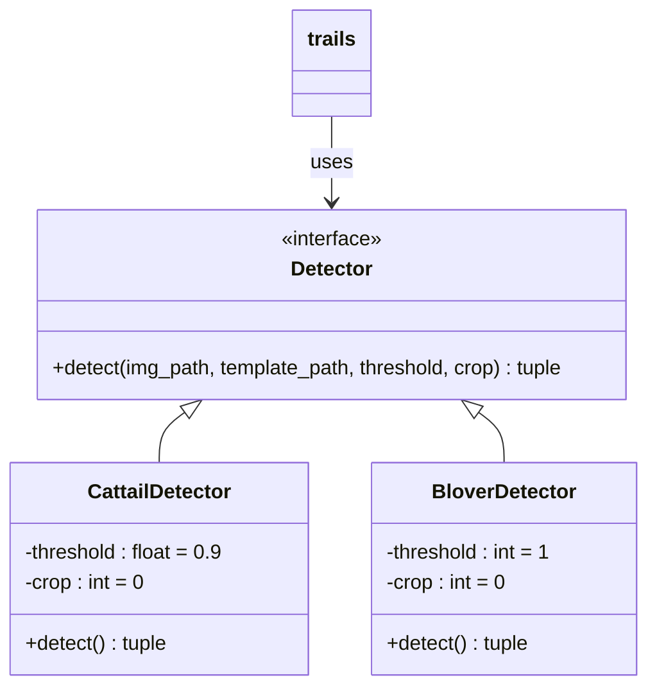

# trails函数详解

<cite>
**Referenced Files in This Document**   
- [PerfGarden.py](file://PerfGarden.py)
</cite>

## 目录
1. [引言](#引言)
2. [核心功能概述](#核心功能概述)
3. [状态机逻辑分析](#状态机逻辑分析)
4. [智能跳跃检测机制](#智能跳跃检测机制)
5. [fade模式下的匹配状态追踪](#fade模式下的匹配状态追踪)
6. [检测器动态调用机制](#检测器动态调用机制)
7. [回退与精细扫描策略](#回退与精细扫描策略)
8. [迭代控制与性能优化](#迭代控制与性能优化)
9. [典型配置参数建议](#典型配置参数建议)
10. [总结](#总结)

## 引言

`trails`函数是perf-garden项目中的核心调度器，负责协调图像处理流程中的模板匹配任务。该函数通过智能化的跳跃检测、状态追踪和动态检测器调用机制，在保证检测精度的同时显著提升了批量图像处理的效率。本文将深入解析其技术实现细节。

## 核心功能概述

`trails`函数作为图像处理流水线的核心调度器，主要承担以下职责：
- 管理图像列表的迭代过程
- 实现智能跳跃检测以提高处理效率
- 支持多种检测模式（标准模式与fade模式）
- 动态调用不同类型的检测器函数
- 维护复杂的状态机逻辑以应对各种场景

该函数通过参数化设计实现了高度的灵活性和可扩展性，使其能够适应不同的图像检测需求。

**Section sources**
- [PerfGarden.py](file://PerfGarden.py#L164-L272)

## 状态机逻辑分析

`trails`函数内部实现了一个精巧的状态机，通过多个状态变量协同工作来管理检测流程。

### 状态变量定义



**Diagram sources**
- [PerfGarden.py](file://PerfGarden.py#L189-L193)

### 状态转换流程



**Diagram sources**
- [PerfGarden.py](file://PerfGarden.py#L195-L258)

## 智能跳跃检测机制

`trails`函数通过`leap`参数实现了智能跳跃检测，这是一种在保证检测准确性的前提下大幅提升处理效率的关键技术。

### 跳跃检测原理

当`leap > 1`时，函数采用跳跃式遍历策略，即每隔`leap-1`张图片进行一次检测。这种策略特别适用于目标特征出现位置相对固定或可预测的场景。



**Diagram sources**
- [PerfGarden.py](file://PerfGarden.py#L241-L248)

### 跳跃参数的影响

| leap值 | 检测频率 | 适用场景 | 性能影响 |
|-------|---------|---------|---------|
| 1 | 逐张检测 | 高精度要求、目标位置不确定 | 性能较低 |
| 2 | 每隔一张 | 一般场景、平衡精度与性能 | 中等性能 |
| 3+ | 跳跃检测 | 目标位置可预测、大批量处理 | 高性能 |

**Section sources**
- [PerfGarden.py](file://PerfGarden.py#L177-L178)

## fade模式下的匹配状态追踪

`fade`模式是`trails`函数提供的一种特殊检测模式，用于追踪匹配状态的变化过程。

### fade模式工作流程

```mermaid
sequenceDiagram
participant T as trails函数
participant D as 检测器
participant I as 图像序列
T->>I : 从第leap张图片开始
loop 遍历图像
T->>D : 调用检测器
D-->>T : 返回匹配结果
T->>T : 检查matched状态
alt matched为True
T->>T : 设置waiting_for_fade=True
T->>T : 记录first_match
else
T->>T : 继续遍历
end
end
loop 等待匹配消失
T->>D : 继续调用检测器
D-->>T : 返回匹配结果
alt matched为False
T->>T : 找到匹配消失点
T->>T : 返回该图片
break
end
end
```

**Diagram sources**
- [PerfGarden.py](file://PerfGarden.py#L225-L235)

### 模式对比分析

当`fade=False`时，函数在找到第一个匹配项后立即返回；而当`fade=True`时，函数会继续执行直到匹配状态消失，返回匹配消失时的图片。这种设计使得函数能够适应不同的业务需求，如检测特征出现时刻或消失时刻。

**Section sources**
- [PerfGarden.py](file://PerfGarden.py#L179-L185)

## 检测器动态调用机制

`trails`函数通过`detector_func`参数实现了检测器的动态调用，支持多种检测算法的灵活切换。

### 检测器类型



**Diagram sources**
- [PerfGarden.py](file://PerfGarden.py#L13-L84)
- [PerfGarden.py](file://PerfGarden.py#L89-L160)

### 动态调用实现

函数通过以下逻辑实现检测器的动态选择：
1. 如果`detector_func`参数为`None`，默认使用`cattail`检测器
2. 通过`**detector_kwargs`参数解包机制传递检测参数
3. 统一的结果处理接口确保不同检测器的兼容性

这种设计模式体现了良好的开闭原则，便于未来扩展新的检测算法。

**Section sources**
- [PerfGarden.py](file://PerfGarden.py#L186-L190)

## 回退与精细扫描策略

当在跳跃模式下发现匹配时，`trails`函数会执行回退操作，以确保不会错过任何可能的匹配点。

### 回退机制实现

```python
i = max(0, i - (leap - 1))  # 回退leap-1张图片
leap = 1  # 设置步长为1
```

这一策略确保了即使在跳跃检测模式下，也能通过回退和精细扫描保证检测的完整性。回退距离为`leap-1`步的设计，恰好覆盖了上一次检测到本次检测之间的所有图片。

### 精细扫描流程


**Diagram sources**
- [PerfGarden.py](file://PerfGarden.py#L241-L248)

## 迭代控制与性能优化

`trails`函数通过精心设计的迭代控制逻辑，在保证功能完整性的同时实现了性能优化。

### 迭代控制逻辑

函数采用`while`循环结合索引变量`i`的方式控制迭代过程，通过动态调整`leap`值来改变遍历策略。这种设计避免了使用嵌套循环可能带来的复杂性和性能开销。

### 性能优化效果

在实际运行中，`trails`函数通过跳跃检测可以显著减少检测次数。例如，在处理1000张图片且`leap=3`的情况下，初始阶段只需进行约333次检测即可定位到匹配区域，相比逐张检测减少了约66.7%的计算量。

日志示例：
```
【进展】子文件夹 test_folder: 任务 1 (cattail), 匹配 IMG_0456.jpg, 状态 PASS, 耗时 0.12秒
```

这种高效的处理能力使得`trails`函数非常适合大规模图像数据的批量处理任务。

**Section sources**
- [PerfGarden.py](file://PerfGarden.py#L195-L260)

## 典型配置参数建议

根据不同的应用场景，推荐以下配置参数组合：

### 高精度检测场景
- `leap=1`: 逐张检测确保不遗漏任何匹配
- `fade=False`: 找到首个匹配即返回
- `crop=0`: 不进行图像裁剪
- `threshold=0.95`: 高匹配阈值确保准确性

### 大批量快速检测场景
- `leap=5`: 大跨度跳跃快速定位
- `fade=False`: 快速返回结果
- `crop=30`: 从底部裁剪30%以聚焦关键区域
- `threshold=0.8`: 适中阈值平衡速度与准确性

### 特征变化追踪场景
- `leap=2`: 适度跳跃提高效率
- `fade=True`: 追踪匹配状态变化
- `detector_func=blover`: 使用圆形检测器
- `threshold=2`: 要求至少检测到2个圆形

这些配置建议可根据具体需求进行调整，以达到最佳的检测效果。

**Section sources**
- [PerfGarden.py](file://PerfGarden.py#L164-L272)

## 总结

`trails`函数作为perf-garden项目的核心调度器，通过智能跳跃检测、状态机管理、动态检测器调用和回退精细扫描等机制，实现了高效且可靠的图像匹配功能。其模块化的设计和灵活的参数配置使其能够适应多种不同的应用场景，从高精度检测到大规模批量处理都能表现出色。该函数的设计充分体现了软件工程中的开闭原则和单一职责原则，为未来的功能扩展和维护提供了良好的基础。