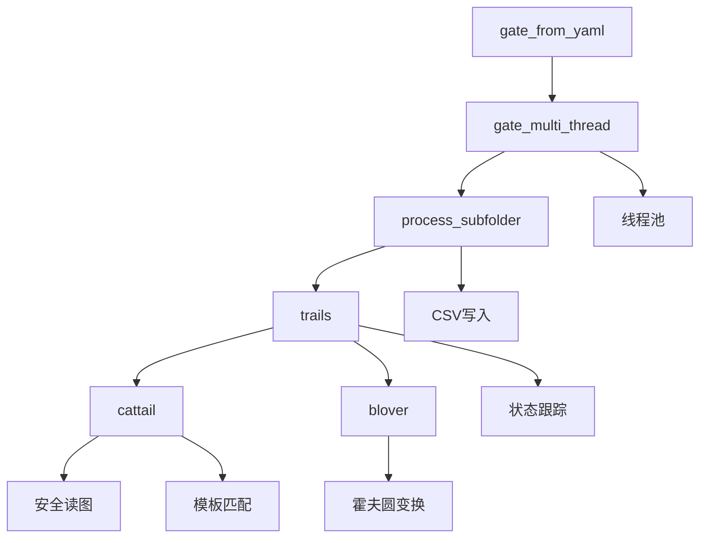

# 核心功能技术设计

<cite>
**本文档中引用的文件**  
- [PerfGarden.py](file://PerfGarden.py)
</cite>

## 目录
1. [cattail函数深度解析](#cattail函数深度解析)
2. [blover函数技术分析](#blover函数技术分析)
3. [trails函数状态跟踪机制](#trails函数状态跟踪机制)
4. [gate_from_yaml配置解析](#gate_from_yaml配置解析)
5. [process_subfolder任务协调](#process_subfolder任务协调)
6. [gate_multi_thread多线程处理](#gate_multi_thread多线程处理)
7. [函数调用关系图](#函数调用关系图)
8. [组件依赖与数据流](#组件依赖与数据流)

## cattail函数深度解析

`cattail`函数是基于OpenCV模板匹配的核心检测函数，主要用于在目标图片中查找预定义模板的出现位置。该函数首先进行严格的参数校验，确保匹配阈值（0~1）和裁剪比例（-99~99）在有效范围内。若参数非法，返回错误代码"EC01"。

为确保跨平台文件读取的稳定性，函数采用`_safe_read`内部函数，通过`np.fromfile`和`cv2.imdecode`组合方式安全地读取图片，避免因路径编码问题导致的读取失败。若图片或模板读取失败，则返回错误代码"EC02"。

在图像处理流程中，函数支持智能区域裁剪：当`crop`参数大于0时，从图片底部向上裁剪，保留底部区域；当`crop`为负值时，从顶部向下裁剪，保留顶部区域。此功能可有效缩小检测范围，提升匹配效率。裁剪后，函数会进行模板尺寸校验，确保模板不会大于待检测图片，否则返回错误代码"EC03"。

最终，函数将图片和模板转换为灰度图，使用`cv2.TM_CCOEFF_NORMED`方法执行模板匹配，并通过`cv2.minMaxLoc`获取最高匹配值。匹配置信度经四舍五入处理后，与阈值比较得出最终匹配结果。

**Section sources**
- [PerfGarden.py](file://PerfGarden.py#L13-L84)

## blover函数技术分析

`blover`函数基于霍夫圆变换（Hough Circle Transform）实现圆形目标检测，特别适用于识别加载动画、图标等圆形元素。函数首先进行类型和范围校验，确保`threshold`为正整数，`crop`在-99至99之间，否则返回错误代码"EB01"。

与`cattail`不同，`blover`直接以灰度模式读取图片，减少内存占用。图像预处理阶段，函数应用`cv2.GaussianBlur`进行高斯模糊，有效减少图像噪声，提升圆检测的准确性。

霍夫圆变换的核心参数配置如下：`dp=1`保持原始分辨率；`minDist=100`防止圆心过近导致的重复检测；`param1=90`设置Canny边缘检测的高阈值；`param2=32`控制圆心累加器的敏感度；`minRadius=20`和`maxRadius=25`限定检测圆的尺寸范围，确保只识别特定大小的圆。这些参数可根据实际应用场景进行调整。

检测结果以`circlEB`数组形式返回，函数通过计算数组长度得到实际检测到的圆圈数量（`confidence`）。匹配判断采用`confidence >= threshold`的宽松策略，而非严格相等，提高了检测的鲁棒性。

**Section sources**
- [PerfGarden.py](file://PerfGarden.py#L89-L160)

## trails函数状态跟踪机制

`trails`函数是核心逻辑调度器，负责管理图片序列的检测流程，实现跳跃检查和状态跟踪。函数通过`leap`参数控制检查步长，初始为3表示每3张图检查一次，发现匹配后自动回退`leap-1`张图并切换到逐张检查模式（`leap=1`），兼顾效率与准确性。

状态跟踪的核心在于`fade`参数。当`fade=False`时，函数在首次检测到匹配时立即返回，适用于检测"出现"事件；当`fade=True`时，函数会持续检查直到匹配消失，此时`waiting_for_fade`标志被激活，用于检测"消失"事件，如页面离开或加载完成。

函数通过`detector_func`参数实现检测器的动态注入，默认使用`cattail`，但可灵活切换为`blover`或其他检测函数。`remaining_files`机制确保后续任务在已处理的图片序列上继续执行，实现任务间的无缝衔接。整个流程具有严格的错误处理机制，一旦底层检测返回非"PASS"状态，立即终止并返回错误。

**Section sources**
- [PerfGarden.py](file://PerfGarden.py#L164-L272)

## gate_from_yaml配置解析

`gate_from_yaml`函数负责从YAML配置文件中解析任务指令。函数首先使用`yaml.safe_load`安全地加载配置，然后遍历配置项，提取`path`（母文件夹路径）和`max_threads`（最大线程数）等全局参数。

任务解析支持新旧两种格式：旧版格式将任务参数作为列表，新版格式直接使用字典。函数通过`isinstance(task_config, list)`进行判断，并统一转换为内部任务参数字典`task_kwargs`。`task_type_counts`用于为相同类型的任务生成唯一表头（如`cattail1`, `cattail2`），避免CSV列名冲突。

对于`skip`任务，函数直接存储跳过数量；对于其他任务，将`template`字段转换为`template_path`并进行路径规范化。若未指定任务，则创建一个默认任务。最后，函数调用`gate_multi_thread`启动多线程处理流程。

**Section sources**
- [PerfGarden.py](file://PerfGarden.py#L275-L359)

## process_subfolder任务协调

`process_subfolder`函数在独立线程中处理单个子文件夹的所有检测任务。函数首先获取并自然排序子文件夹内的所有图片文件，确保按数字顺序处理。

任务执行采用流水线模式：初始化`remaining_files`为完整图片列表，每个任务处理后，若成功匹配，则将`remaining_files`更新为匹配文件之后的图片，供后续任务使用。若遇到`skip`任务，则直接从`remaining_files`中移除指定数量的图片。

函数通过`detector_func`映射机制，根据`task_type`选择`cattail`或`blover`检测器，并将任务参数传递给`trails`函数。执行结果实时记录，并构建CSV行数据。为保证线程安全，函数使用`csv_lock`锁，并在写入CSV时实现带重试机制的异常处理，有效应对文件权限冲突。

**Section sources**
- [PerfGarden.py](file://PerfGarden.py#L362-L518)

## gate_multi_thread多线程处理

`gate_multi_thread`函数利用`concurrent.futures.ThreadPoolExecutor`实现高效的多线程并行处理。函数首先创建包含所有子文件夹的线程池，每个子文件夹作为一个独立任务提交给线程池。

`csv_lock`线程锁确保多个线程写入同一CSV文件时的数据一致性。`future_to_subfolder`字典用于追踪任务与子文件夹的映射关系。通过`concurrent.futures.as_completed`，函数能够实时收集已完成的任务结果，并输出处理进度。

该设计实现了子文件夹间的完全并行化，极大提升了处理速度。处理完成后，函数汇总所有结果，并输出总耗时和结果文件路径，提供完整的执行反馈。

**Section sources**
- [PerfGarden.py](file://PerfGarden.py#L521-L583)

## 函数调用关系图

**Diagram sources**
- [PerfGarden.py](file://PerfGarden.py#L275-L359)
- [PerfGarden.py](file://PerfGarden.py#L521-L583)
- [PerfGarden.py](file://PerfGarden.py#L362-L518)
- [PerfGarden.py](file://PerfGarden.py#L164-L272)
- [PerfGarden.py](file://PerfGarden.py#L13-L84)
- [PerfGarden.py](file://PerfGarden.py#L89-L160)

## 组件依赖与数据流

系统组件间存在清晰的依赖关系和数据传递机制。`gate_from_yaml`作为入口，解析YAML配置后，将任务列表、表头和线程数传递给`gate_multi_thread`。`gate_multi_thread`创建线程池，将每个子文件夹的处理任务分发给`process_subfolder`。

`process_subfolder`接收任务列表，对每个任务调用`trails`，并传递`detector_func`、`template_path`等参数。`trails`作为调度中心，根据参数调用`cattail`或`blover`进行实际检测，并将匹配结果（文件名、状态、耗时）逐级返回。

数据流方面，图片文件路径和模板路径作为输入数据，通过多层函数调用传递至底层检测函数。检测结果作为输出数据，由`process_subfolder`收集并写入共享的CSV文件。`remaining_files`机制实现了任务间的状态传递，确保检测流程的连续性。整个系统通过线程锁和重试机制，保障了多线程环境下的数据安全。

**Section sources**
- [PerfGarden.py](file://PerfGarden.py#L13-L583)