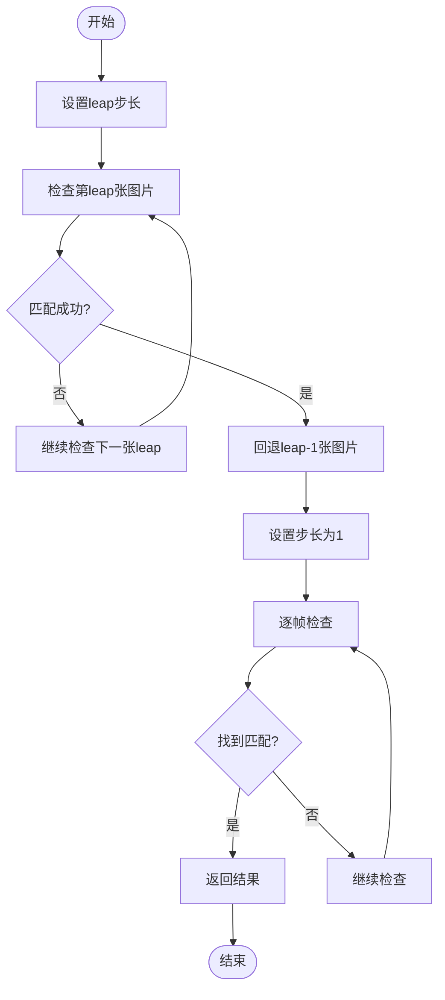
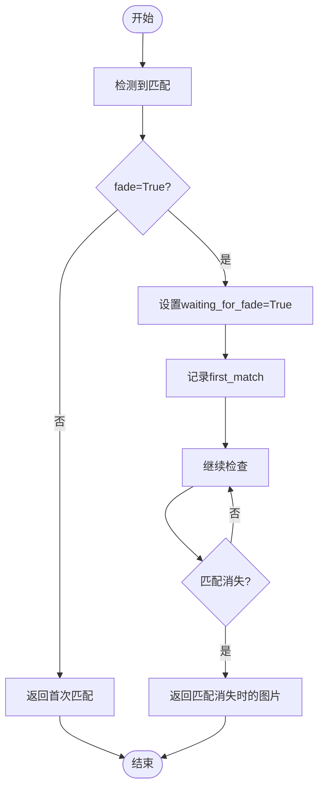

# 任务执行流程

<cite>
**本文档引用的文件**   
- [PerfGarden.py](file://PerfGarden.py)
- [README.md](file://README.md)
</cite>

## 目录
1. [trails函数工作机制](#trails函数工作机制)
2. [检测器函数调用机制](#检测器函数调用机制)
3. [跳跃式检测实现逻辑](#跳跃式检测实现逻辑)
4. [fade参数的渐进式扫描行为](#fade参数的渐进式扫描行为)
5. [参数传递过程](#参数传递过程)
6. [状态机设计](#状态机设计)
7. [实际使用场景示例](#实际使用场景示例)
8. [性能与精度权衡](#性能与精度权衡)

## trails函数工作机制

`trails`函数作为核心任务执行引擎，负责处理图片序列并根据YAML配置的任务序列依次调用不同的检测器函数。该函数通过设置跳跃间隔进行模板匹配检查，能够高效地在大量图片中定位目标。

函数接收已排序的图片文件名列表、文件夹路径、模板图片路径、匹配阈值、检查间隔、是否在匹配后继续进展直到匹配消失、图像裁剪比例以及检测器函数等参数。其主要工作流程包括：初始化检测器函数、处理仙人掌特殊场景、设置起始索引、遍历图片列表进行检测、处理匹配结果等。

在执行过程中，`trails`函数会根据`leap`参数决定检查间隔，实现跳跃式检测。当检测到匹配时，会根据`fade`参数决定是否继续检测直到匹配消失。函数返回状态码、匹配的文件名和检测结果，为上层调用提供清晰的执行结果。

**Section sources**
- [PerfGarden.py](file://PerfGarden.py#L267-L381)

## 检测器函数调用机制

`trails`函数支持调用多种检测器函数，包括`cattail`、`cactus`和`blover`。这些检测器函数通过`detector_func`参数传递给`trails`函数，并在执行时被调用。

`cattail`函数用于图片模板匹配，适合查找静态首尾帧，如按钮标题等固定元素。它通过OpenCV的模板匹配算法，在大图中寻找小图，能够在毫秒级完成识别。

`cactus`函数用于图片差异区域占比检测，能够容忍局部加载动画，适合检测到开始输出文字气泡等动态场景。它通过比较两张图片的差异程度来检测变化，大多数情况下无需任何配置。

`blover`函数用于检测图片中的圆圈数量，基于OpenCV的霍夫变换数学原理，可在复杂背景中快速识别圆形，无需逐像素分析。它特别适合"图片上传"场景，当页面只有加载中的圆圈且背景复杂时，能够识别上传过程中的"圆圈动画"。

这些检测器函数通过`process_subfolder`函数从YAML配置中读取任务类型，并根据任务类型确定相应的检测函数。如果任务类型未知，则默认使用`cattail`函数。

**Section sources**
- [PerfGarden.py](file://PerfGarden.py#L14-L85)
- [PerfGarden.py](file://PerfGarden.py#L88-L187)
- [PerfGarden.py](file://PerfGarden.py#L192-L263)
- [PerfGarden.py](file://PerfGarden.py#L477-L609)

## 跳跃式检测实现逻辑

跳跃式检测（leap）是`trails`函数的核心优化机制，通过设定步长快速扫描图片序列，在检测到初步匹配后回退并切换为逐帧模式进行精确定位。

实现逻辑如下：首先，函数根据`leap`参数设置起始索引，即从第`leap`张图片开始检查。然后，以`leap`为步长遍历图片列表，每隔`leap-1`张图片检查一次。当检测到匹配时，函数会回退`leap-1`张图片，将步长设置为1，开始逐帧检查。

这种机制能够在保证不漏检的前提下，大幅提升处理速度。例如，当`leap=5`时，函数每5张图片检查一次，当检测到匹配时，回退4张图片，从匹配点前4张开始逐帧检查，确保能够精确定位到第一张匹配的图片。



**Diagram sources **
- [PerfGarden.py](file://PerfGarden.py#L267-L381)

## fade参数的渐进式扫描行为

`fade`参数控制着`trails`函数的渐进式扫描行为，即在匹配出现后继续检测直至匹配消失，适用于识别状态变化的结束点。

当`fade=False`时，函数在检测到首次匹配成功时立即返回，适用于识别"进入页面"等场景。当`fade=True`时，函数在检测到首次匹配成功后，会继续检测直到匹配消失，然后返回匹配消失时的图片，适用于识别"离开页面"等场景。

这种渐进式扫描行为通过`waiting_for_fade`和`first_match`两个状态变量实现。当检测到匹配且`fade=True`时，`waiting_for_fade`被设置为`True`，`first_match`记录第一个匹配的图片。之后，函数继续检查后续图片，直到检测到匹配消失，此时返回匹配消失时的图片。



**Diagram sources **
- [PerfGarden.py](file://PerfGarden.py#L267-L381)

## 参数传递过程

`trails`函数的参数传递过程始于YAML配置文件，经过`gate_from_yaml`和`process_subfolder`函数，最终传递给具体的检测函数。

在YAML配置文件中，用户可以为每个任务指定`template`、`threshold`、`crop`、`fade`、`leap`等参数。`gate_from_yaml`函数读取YAML配置，提取任务信息和参数，存储在`tasks`列表中。

`process_subfolder`函数从`tasks`列表中获取任务参数，根据任务类型确定检测函数，并将参数传递给`trails`函数。`trails`函数将参数封装在`detector_kwargs`字典中，通过`**`操作符传递给具体的检测函数。

值得注意的是，`threshold`参数只有在明确提供时才会传递，其他参数则总是传递。这种设计允许检测函数使用自己的默认阈值，提高了灵活性。

**Section sources**
- [PerfGarden.py](file://PerfGarden.py#L394-L457)
- [PerfGarden.py](file://PerfGarden.py#L477-L609)
- [PerfGarden.py](file://PerfGarden.py#L267-L381)

## 状态机设计

`trails`函数内部采用状态机设计，通过`waiting_for_fade`、`first_match`、`result_found`等变量控制流程。

`waiting_for_fade`变量用于标记是否在等待匹配消失，当`fade=True`且检测到首次匹配时被设置为`True`。`first_match`变量记录第一个匹配的图片，用于后续处理。`result_found`变量标记是否已找到结果，用于控制循环退出。

状态机的工作流程如下：初始状态为`leap`模式，以`leap`为步长检查图片。当检测到匹配时，进入回退状态，回退`leap-1`张图片，切换到逐帧检查模式。在逐帧检查模式下，根据`fade`参数决定是否等待匹配消失。

这种状态机设计使得`trails`函数能够灵活应对不同的检测需求，既支持快速扫描，又支持精确定位，同时还能处理状态变化的场景。

**Section sources**
- [PerfGarden.py](file://PerfGarden.py#L267-L381)

## 实际使用场景示例

在实际使用中，`trails`函数可以应用于多种场景。例如，在分析"AI对话上传图片"的性能指标时，可以使用`leap=5`加速首帧检测，配合`fade=True`捕捉动画结束帧。

具体配置如下：
```yaml
- cattail:
    - template: "button.jpg"
    - crop: 30
    - fade: true
    - leap: 5
```

在这个配置中，`leap=5`使得函数每5张图片检查一次，大大加快了首帧检测速度。当检测到按钮消失时，`fade=True`使得函数继续检测，直到按钮重新出现，从而准确捕捉到动画结束帧。

另一个示例是检测上传完成。可以使用`blover`函数检测上传状态，设置`crop=-50`裁剪顶部50%区域，因为上传图片显示在屏幕上方，设置`fade=true`检测上传状态消失的时刻（上传完成）。

```yaml
- blover:
    - crop: -50
    - fade: true
```

这些实际使用场景展示了`trails`函数的灵活性和强大功能，能够满足不同场景下的检测需求。

**Section sources**
- [README.md](file://README.md#L157-L203)

## 性能与精度权衡

`trails`函数的设计在性能与精度之间取得了良好的平衡。跳跃式检测机制显著提升了处理速度，而回退逐帧检查确保了检测精度。

在高帧率录屏分析中，这种设计的优势尤为明显。传统的逐帧检查方法需要处理大量图片，耗时较长。而`trails`函数通过跳跃式检测，可以快速跳过大量无关图片，只在可能的匹配区域进行精确定位，大大提高了处理效率。

例如，在一个包含400多张图片的分析任务中，`trails`函数仅用0.67秒就完成了全部分析，而传统方法可能需要数倍的时间。这种效率优势使得`trails`函数特别适合处理大规模图像数据。

然而，这种设计也存在一些权衡。过大的`leap`值可能导致漏检，特别是在目标持续时间较短的情况下。因此，需要根据具体场景合理设置`leap`值，在保证不漏检的前提下最大化处理速度。

**Section sources**
- [README.md](file://README.md#L204-L240)