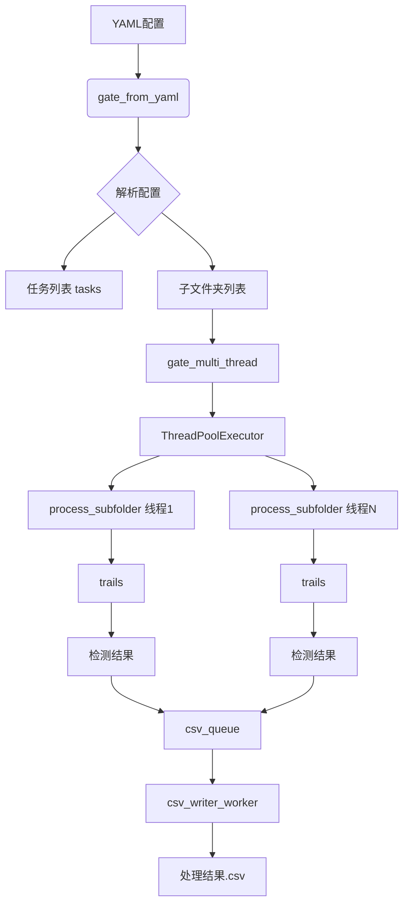

# 处理流程架构

<cite>
**本文档引用的文件**
- [PerfGarden.py](file://PerfGarden.py)
- [README.md](file://README.md)
</cite>

## 目录
1. [trails函数：YAML任务序列执行与控制逻辑](#trails函数yaml任务序列执行与控制逻辑)
2. [gate_multi_thread函数：多线程处理框架](#gate_multi_thread函数多线程处理框架)
3. [process_subfolder函数：子文件夹生命周期管理](#process_subfolder函数子文件夹生命周期管理)
4. [csv_writer_worker工作线程：异步CSV写入](#csv_writer_worker工作线程异步csv写入)
5. [数据流与组件协作](#数据流与组件协作)
6. [并发编程问题应对策略](#并发编程问题应对策略)

## trails函数：YAML任务序列执行与控制逻辑

`trails`函数是性能花园的核心逻辑调度器，负责按照YAML配置的任务序列依次执行检测操作。该函数接收一个已排序的图片文件名列表、文件夹路径以及任务参数，通过调用不同的检测器函数（如`cattail`、`blover`或`cactus`）来执行具体的图像识别任务。

该函数支持两种关键的控制逻辑：跳帧（skip）与渐进式扫描。跳帧通过`leap`参数实现，允许函数以指定的间隔（如每隔2张图片）进行检查，从而大幅提升处理速度。当在跳跃模式下检测到匹配时，函数会自动回退到匹配点之前的`leap-1`张图片，然后切换到逐帧检查模式（`leap=1`），确保不会漏检。这种“跳跃-回溯”的策略实现了速度与准确性的完美平衡。

渐进式扫描则通过`fade`参数实现，用于检测目标的出现与消失。当`fade=False`时，函数在首次检测到匹配时立即返回，适用于检测“进入页面”等场景。当`fade=True`时，函数会持续检查，直到匹配状态消失才返回，这适用于检测“离开页面”或“动画结束”等场景。此外，`cactus`检测器在未指定模板时，会自动使用任务序列中的第一张图片作为基准模板，这一设计使其在处理连续帧序列时表现出色。

**Section sources**
- [PerfGarden.py](file://PerfGarden.py#L267-L381)

## gate_multi_thread函数：多线程处理框架

`gate_multi_thread`函数利用`concurrent.futures.ThreadPoolExecutor`构建了一个高效的多线程处理框架，实现了对多个子文件夹的并行化处理。该函数接收母文件夹路径、任务列表、CSV表头和最大线程数作为参数。

其工作流程如下：首先，它会扫描母文件夹下的所有子文件夹，获取待处理的目录列表。然后，它创建一个`ThreadPoolExecutor`线程池，并为每个子文件夹提交一个`process_subfolder`任务。线程池会根据系统CPU核心数和配置的最大线程数，自动调度这些任务在多个线程上并发执行。这种设计极大地缩短了处理大量子文件夹的总耗时，充分利用了现代多核处理器的计算能力。

**Section sources**
- [PerfGarden.py](file://PerfGarden.py#L660-L728)

## process_subfolder函数：子文件夹生命周期管理

`process_subfolder`函数负责管理单个子文件夹内的完整生命周期，包括图片排序、路径解析与任务调度。该函数在单独的线程中执行，确保了线程间的隔离性。

其生命周期管理流程如下：
1.  **图片排序**：函数首先获取子文件夹内所有支持的图片文件（如jpg, png等），并使用自然排序算法进行排序。该算法能正确处理文件名中的数字，例如将"frame_2.jpg"排在"frame_10.jpg"之前。
2.  **路径解析**：通过`os.path.basename`获取子文件夹名称，并构建图片的完整路径。
3.  **任务调度**：函数遍历YAML配置中的任务列表，对每个任务执行以下操作：
    *   **跳过处理**：如果任务类型为`skip`，则从剩余图片列表中移除指定数量的图片。
    *   **检测器映射**：根据任务类型（`cattail`, `blover`, `cactus`）选择对应的检测函数。
    *   **执行检测**：调用`trails`函数执行检测，并记录结果。
    *   **状态管理**：如果任务失败（状态非"PASS"），则跳过后续所有任务。
    *   **进度推进**：如果检测成功，将匹配的图片及其之前的图片从剩余列表中移除，确保后续任务从正确的位置开始。

**Section sources**
- [PerfGarden.py](file://PerfGarden.py#L477-L609)

## csv_writer_worker工作线程：异步CSV写入

`csv_writer_worker`工作线程通过异步队列接收检测结果并写入CSV文件，有效避免了I/O阻塞主处理线程。该线程作为消费者，与作为生产者的`process_subfolder`函数协同工作。

其工作流程如下：
1.  **队列监听**：线程在一个无限循环中，通过`csv_queue.get(timeout=1)`从队列中获取数据。`timeout`机制防止了无限期阻塞。
2.  **结束信号**：当从队列中获取到`None`时，线程退出循环，结束运行。
3.  **重试写入**：为了处理可能的文件权限错误，写入操作包含重试机制。如果写入失败，会进行最多3次重试，每次重试间隔逐渐增加。
4.  **异常处理**：对于权限错误以外的异常，线程会打印致命错误信息并调用`os._exit(1)`直接终止整个程序，确保数据一致性。
5.  **任务完成通知**：每次成功写入后，调用`csv_queue.task_done()`通知队列，该任务已完成。

这种设计将耗时的I/O操作从主处理线程中剥离，保证了主处理流程的流畅性。

**Section sources**
- [PerfGarden.py](file://PerfGarden.py#L612-L657)

## 数据流与组件协作

性能花园的各组件通过精心设计的数据流紧密协作，队列在解耦生产者与消费者角色中起到了关键作用。

**Diagram sources**
- [PerfGarden.py](file://PerfGarden.py#L477-L609)
- [PerfGarden.py](file://PerfGarden.py#L612-L657)
- [PerfGarden.py](file://PerfGarden.py#L660-L728)

如上图所示，`gate_from_yaml`函数解析YAML配置，生成任务列表和子文件夹列表。`gate_multi_thread`作为协调者，启动线程池。每个`process_subfolder`线程作为生产者，执行检测并将结果（`csv_row`）放入`csv_queue`。`csv_writer_worker`作为唯一的消费者，从队列中取出结果并写入文件。这种生产者-消费者模式通过`queue.Queue`实现了完美的解耦，使得生产（检测）和消费（写入）可以以不同的速度独立运行。

## 并发编程问题应对策略

性能花园在并发编程方面采取了多项策略来应对线程安全、资源竞争与异常传播等问题。

*   **线程安全与资源竞争**：通过使用`queue.Queue`，该队列本身是线程安全的，避免了多个生产者线程同时写入文件导致的数据竞争。`csv_writer_worker`是唯一的写入者，从根本上解决了文件I/O的并发访问问题。此外，每个`process_subfolder`线程处理独立的子文件夹，它们之间没有共享的可变状态，避免了线程间的数据竞争。

*   **异常传播**：程序采用了分层的异常处理策略。在`trails`和检测器函数内部，通过返回状态码（如"ERROR"、"UNFOUND"）来处理可预见的错误（如图片读取失败），避免异常向上抛出。在`csv_writer_worker`中，对于可能导致数据损坏的严重I/O错误（如权限错误），程序选择直接终止（`os._exit(1)`），防止写入不完整或损坏的文件。对于`process_subfolder`线程中的异常，`ThreadPoolExecutor`的`future.result()`会捕获并打印错误，但不会导致整个程序崩溃，保证了其他子文件夹的处理可以继续进行。

*   **资源管理**：通过使用`with`语句管理文件资源，确保了即使在发生异常的情况下，文件也能被正确关闭。`writer_thread`被设置为守护线程（`daemon=True`），这意味着当主程序结束时，该线程会自动退出，避免了资源泄漏。

**Section sources**
- [PerfGarden.py](file://PerfGarden.py#L612-L657)
- [PerfGarden.py](file://PerfGarden.py#L660-L728)
- [PerfGarden.py](file://PerfGarden.py#L477-L609)