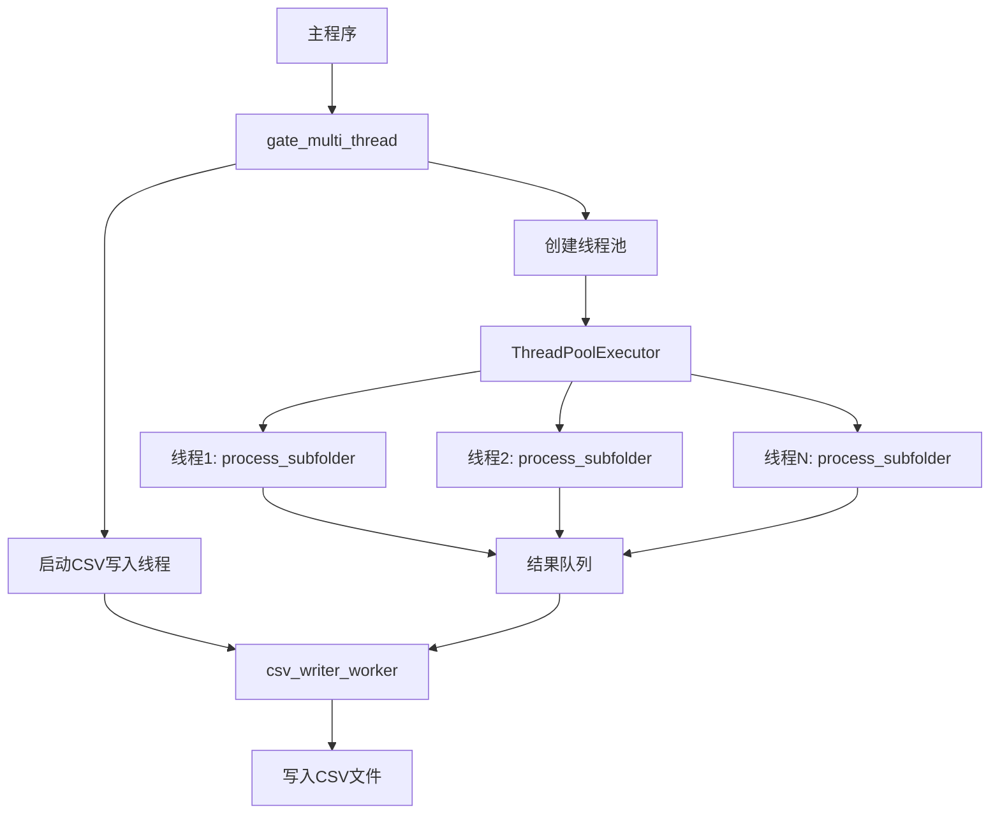
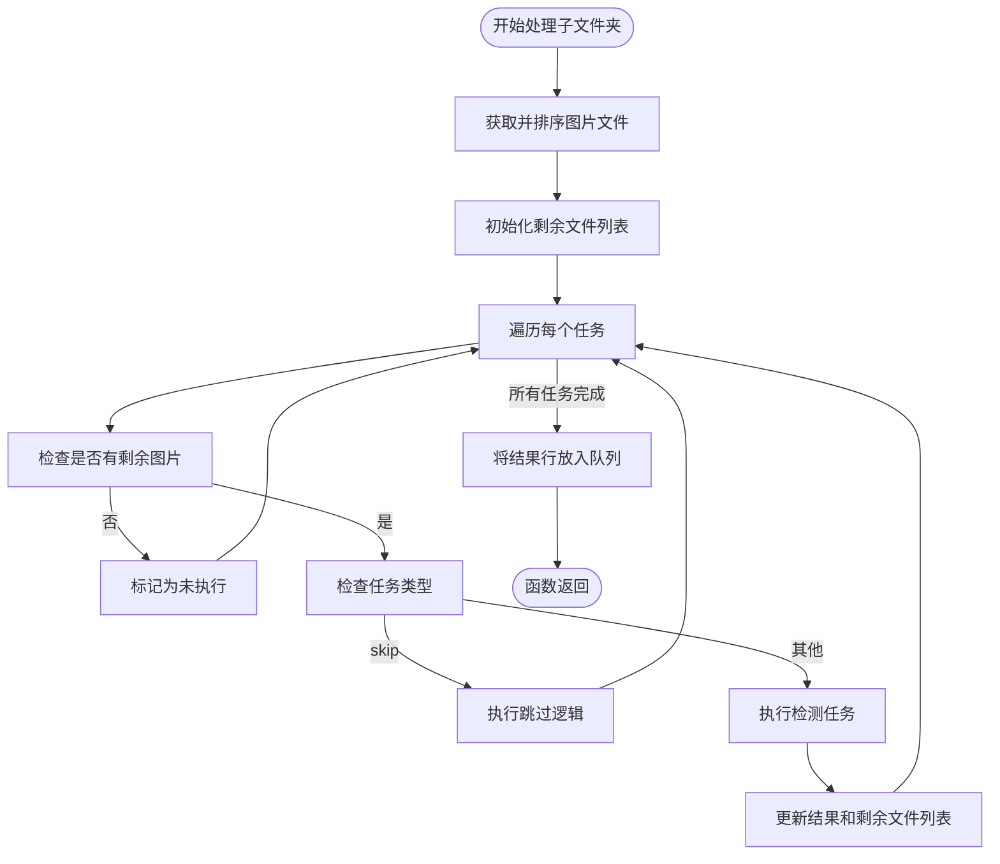
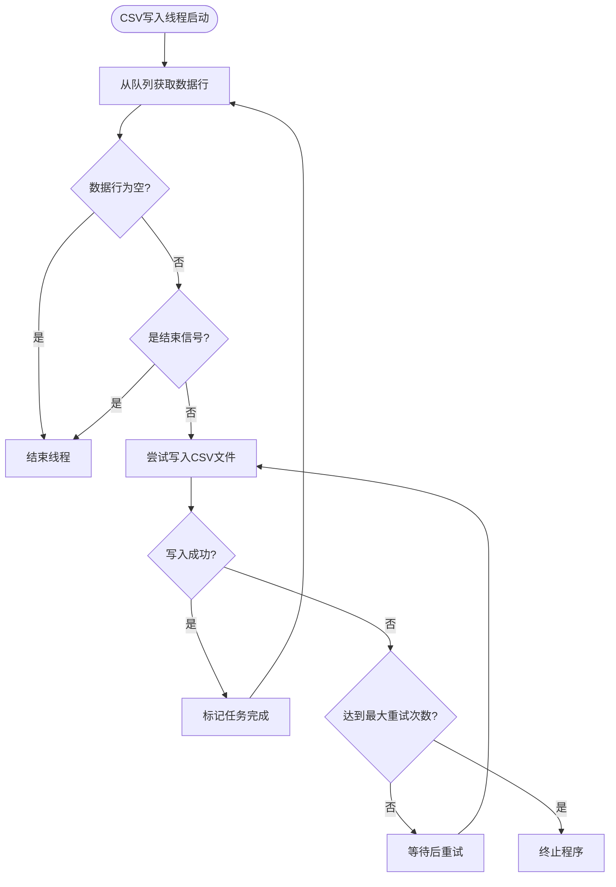
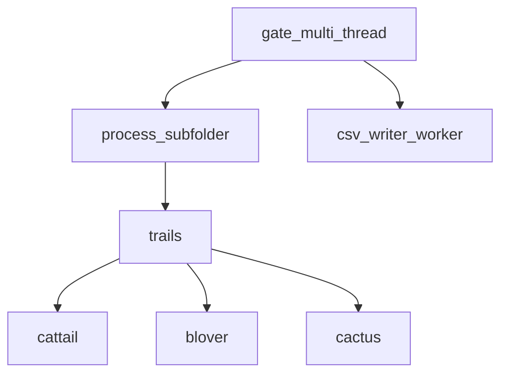

# 多线程处理框架

<cite>
**本文档引用的文件**
- [PerfGarden.py](file://PerfGarden.py)
</cite>

## 目录
1. [简介](#简介)
2. [核心组件](#核心组件)
3. [架构概述](#架构概述)
4. [详细组件分析](#详细组件分析)
5. [依赖分析](#依赖分析)
6. [性能考量](#性能考量)
7. [故障排除指南](#故障排除指南)
8. [结论](#结论)

## 简介
本文档系统性阐述了`gate_multi_thread`函数构建的多线程处理框架。该框架旨在高效处理大量子文件夹中的图像识别任务，通过并行化执行显著提升处理速度。框架利用`concurrent.futures.ThreadPoolExecutor`创建线程池，为每个子文件夹的处理任务分配独立线程，实现了任务的并行化执行。同时，框架通过`csv_writer_worker`工作线程和`queue.Queue`队列实现了结果的异步写入，避免了I/O操作对主线程的阻塞，确保了整体处理流程的高效与稳定。

## 核心组件
`gate_multi_thread`函数是整个多线程处理框架的核心入口。它接收母文件夹路径、任务列表、CSV表头和最大线程数作为参数，协调整个并行处理流程。该函数首先准备CSV结果文件，然后获取所有子文件夹列表。接着，它创建一个`queue.Queue`用于在工作线程间传递处理结果，并启动一个守护线程`writer_thread`来负责异步写入CSV文件。最后，它使用`ThreadPoolExecutor`管理一个固定大小的线程池，将每个子文件夹的处理任务提交给线程池执行。

**Section sources**
- [PerfGarden.py](file://PerfGarden.py#L660-L728)

## 架构概述
该多线程框架采用生产者-消费者模式和任务并行化设计。主线程作为协调者，负责初始化资源、创建线程池和启动写入线程。`process_subfolder`函数作为“生产者”，在每个工作线程中执行，负责处理单个子文件夹内的所有任务，并将处理结果放入共享队列。`csv_writer_worker`函数作为“消费者”，在独立的守护线程中运行，持续从队列中获取结果并写入CSV文件。这种设计将计算密集型的任务处理与I/O密集型的文件写入解耦，最大化了系统资源的利用率。

**Diagram sources**
- [PerfGarden.py](file://PerfGarden.py#L660-L728)
- [PerfGarden.py](file://PerfGarden.py#L477-L609)
- [PerfGarden.py](file://PerfGarden.py#L612-L657)

## 详细组件分析

### gate_multi_thread 函数分析
`gate_multi_thread`函数是多线程框架的调度中心。它首先创建一个`ThreadPoolExecutor`实例，其`max_workers`参数由`max_threads`决定。然后，它使用字典推导式创建一个`future_to_subfolder`映射，其中键是`Future`对象（代表异步任务），值是对应的子文件夹路径。这为后续的结果收集提供了便利。通过`executor.submit`方法，它将`process_subfolder`函数及其参数提交给线程池，线程池会自动分配空闲线程来执行这些任务。

**Section sources**
- [PerfGarden.py](file://PerfGarden.py#L660-L728)

### process_subfolder 函数分析
`process_subfolder`函数在独立线程中执行，负责处理单个子文件夹。它首先获取并自然排序该文件夹内的所有图片文件。然后，它遍历预定义的任务列表，对剩余的图片序列依次执行每个任务。每个任务的执行都调用`trails`函数，并根据任务类型选择相应的检测器（如`cattail`、`blover`或`cactus`）。处理完成后，它将结果构造成一行CSV数据，并通过`csv_queue.put(csv_row)`将其放入共享队列，等待写入线程处理。

**Diagram sources**
- [PerfGarden.py](file://PerfGarden.py#L477-L609)

### csv_writer_worker 函数分析
`csv_writer_worker`函数运行在一个独立的守护线程中，专门负责将结果写入CSV文件。它通过一个无限循环从`csv_queue`中获取数据。当获取到数据行时，它会尝试将其写入CSV文件，并包含重试机制以处理可能的权限错误。当它从队列中接收到`None`信号时，循环结束，线程退出。这种异步写入机制确保了主线程和工作线程不会因文件I/O而阻塞，从而保持了高吞吐量。

**Diagram sources**
- [PerfGarden.py](file://PerfGarden.py#L612-L657)

## 依赖分析
该多线程框架的组件间依赖关系清晰。`gate_multi_thread`函数直接依赖`process_subfolder`和`csv_writer_worker`函数。`process_subfolder`函数依赖`trails`函数来执行具体的图像检测任务，而`trails`函数又依赖`cattail`、`blover`和`cactus`等具体的检测器函数。`gate_multi_thread`通过`concurrent.futures`模块与`ThreadPoolExecutor`交互，通过`threading`模块创建守护线程，并通过`queue`模块与`csv_writer_worker`进行通信。这种模块化的设计使得各组件职责分明，易于维护和扩展。

**Diagram sources**
- [PerfGarden.py](file://PerfGarden.py#L660-L728)
- [PerfGarden.py](file://PerfGarden.py#L477-L609)
- [PerfGarden.py](file://PerfGarden.py#L612-L657)

## 性能考量
`gate_multi_thread`框架通过并行化处理显著提升了性能。线程池大小`max_threads`的配置逻辑非常关键：如果在`gate_from_yaml`函数中未指定，框架会从YAML配置文件中读取`max_threads`值；若两者均未提供，则默认使用`os.cpu_count()`返回的CPU核心数，或在无法获取时使用默认值4。这种配置方式确保了线程数能与硬件资源相匹配。任务提交与结果收集机制高效：通过`future_to_subfolder`映射管理异步任务，并使用`concurrent.futures.as_completed`迭代器，主线程可以立即处理任何已完成的任务，无需等待所有任务结束。线程间的数据隔离设计良好，每个线程独立处理不同的子文件夹和图片序列，避免了共享状态冲突。异常处理也得到妥善考虑，通过`future.result()`可以捕获子线程中抛出的异常，并在主线程中打印错误信息。根据文档中的性能数据，该框架能在0.67秒内完成400多张图片的分析，展现了其卓越的处理速度。

**Section sources**
- [PerfGarden.py](file://PerfGarden.py#L384-L474)
- [PerfGarden.py](file://PerfGarden.py#L660-L728)

## 故障排除指南
在使用该多线程框架时，可能遇到的常见问题包括：
1.  **CSV写入权限错误**：`csv_writer_worker`线程内置了重试机制，但若重试失败，程序会直接终止。确保CSV文件未被其他程序（如Excel）打开。
2.  **线程处理出错**：`gate_multi_thread`在收集结果时使用`try-except`捕获异常，并打印错误信息。检查子文件夹路径、图片文件或YAML配置是否正确。
3.  **性能未达预期**：检查`max_threads`设置是否合理。过高的线程数可能导致上下文切换开销过大。同时，确保图片尺寸不过大，因为图像处理是计算密集型操作。

**Section sources**
- [PerfGarden.py](file://PerfGarden.py#L612-L657)
- [PerfGarden.py](file://PerfGarden.py#L697-L710)

## 结论
`gate_multi_thread`函数构建了一个高效、稳健的多线程处理框架。它通过`ThreadPoolExecutor`实现任务并行化，通过守护线程和队列实现异步I/O，通过良好的数据隔离设计保证了线程安全。该框架在处理大量子文件夹时优势显著，能将处理时间从分钟级缩短到秒级。通过合理配置线程数，可以在CPU利用率和内存开销之间取得平衡，为批量图像处理任务提供了一个强大的自动化解决方案。