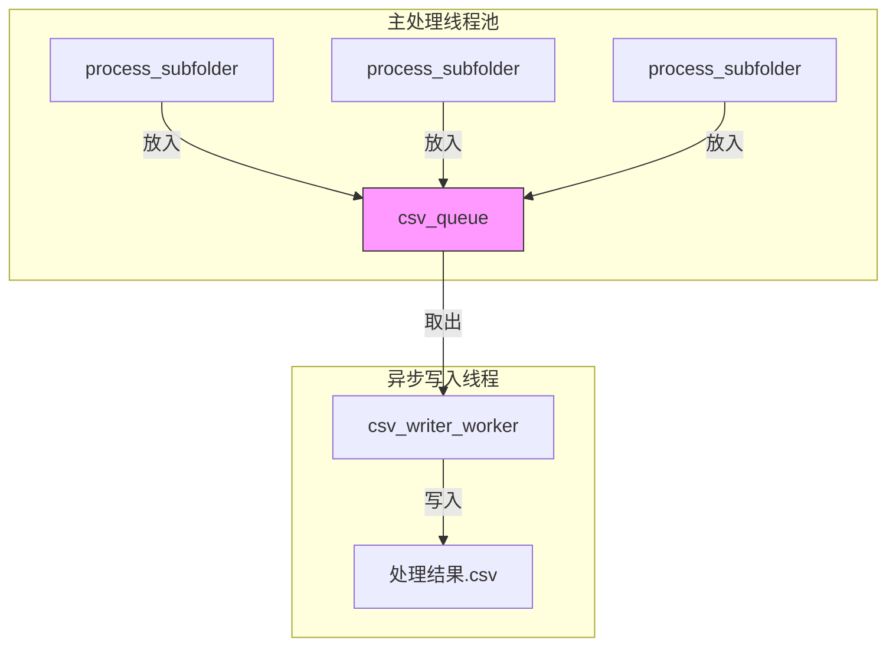
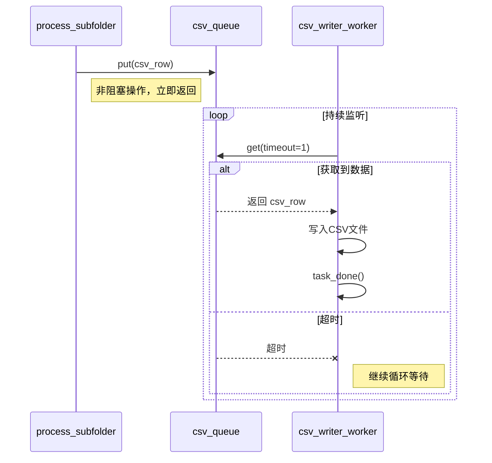
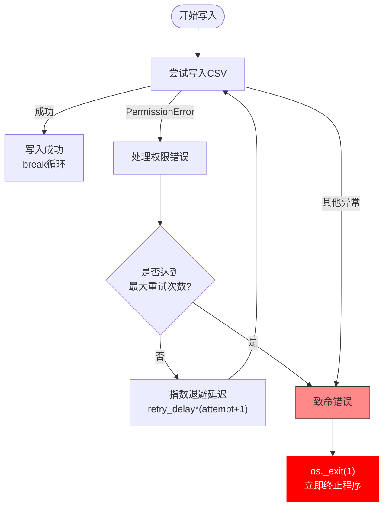

# 结果写入机制

<cite>
**本文档中引用的文件**
- [PerfGarden.py](file://PerfGarden.py)
</cite>

## 目录
1. [简介](#简介)
2. [核心组件](#核心组件)
3. [异步写入架构](#异步写入架构)
4. [生产者-消费者模式详解](#生产者-消费者模式详解)
5. [队列机制与线程协调](#队列机制与线程协调)
6. [错误处理与程序健壮性](#错误处理与程序健壮性)
7. [文件编码与兼容性](#文件编码与兼容性)
8. [结束信号与资源清理](#结束信号与资源清理)
9. [性能优势与稳定性](#性能优势与稳定性)

## 简介
本文档详细解析 PerfGarden 项目中基于队列的异步结果写入机制。该机制通过 `csv_queue` 作为生产者-消费者模式的核心枢纽，有效解耦了耗时的磁盘I/O操作与核心图像处理逻辑。主处理线程作为生产者将处理结果放入队列，而独立的守护线程 `csv_writer_worker` 作为消费者持续监听队列并执行文件写入操作，从而防止磁盘写入阻塞主线程，显著提升整体吞吐量。

## 核心组件
本机制涉及两个核心函数：`process_subfolder` 作为生产者，负责处理子文件夹任务并将结果放入队列；`csv_writer_worker` 作为消费者，负责从队列获取数据并写入CSV文件。两者通过 `queue.Queue()` 实现线程安全的数据传递。

**Section sources**
- [PerfGarden.py](file://PerfGarden.py#L477-L609)
- [PerfGarden.py](file://PerfGarden.py#L612-L657)

## 异步写入架构
系统在 `gate_multi_thread` 函数中初始化异步写入架构。通过创建一个线程安全的 `csv_queue` 队列，并启动一个守护线程运行 `csv_writer_worker` 函数，实现了写入操作与处理逻辑的完全分离。这种架构设计使得多个子文件夹的处理任务可以并行执行，而所有结果写入操作由单一工作线程有序完成。

**Diagram sources**
- [PerfGarden.py](file://PerfGarden.py#L688)
- [PerfGarden.py](file://PerfGarden.py#L690-L691)

## 生产者-消费者模式详解
### 生产者角色 (process_subfolder)
`process_subfolder` 函数在完成单个子文件夹的所有图像处理任务后，将结果构造成 `csv_row` 数据行，并通过 `csv_queue.put(csv_row)` 操作将其放入共享队列。这一操作是非阻塞的，生产者无需等待写入完成即可继续处理下一个任务或退出。

### 消费者角色 (csv_writer_worker)
`csv_writer_worker` 函数在一个无限循环中运行，通过 `csv_queue.get(timeout=1)` 从队列获取数据。当获取到数据时，立即尝试写入CSV文件；当队列为空时，最多等待1秒后继续循环，确保线程不会永久阻塞。

**Diagram sources**
- [PerfGarden.py](file://PerfGarden.py#L599)
- [PerfGarden.py](file://PerfGarden.py#L626)

## 队列机制与线程协调
系统使用 Python 标准库的 `queue.Queue` 实现线程安全的队列。该队列内置了锁机制，确保多线程环境下数据操作的原子性。生产者线程调用 `put()` 方法添加数据，消费者线程调用 `get()` 方法获取数据。每次成功写入后，消费者调用 `task_done()` 方法通知队列该任务已完成，为后续的资源清理提供依据。

## 错误处理与程序健壮性
`csv_writer_worker` 函数实现了多层次的错误处理机制以确保程序健壮性：

1. **权限错误处理**：当遇到 `PermissionError` 时，采用指数退避策略进行重试。设置最大重试次数 `max_retries=3`，每次重试延迟为 `retry_delay * (attempt + 1)`，避免频繁重试导致系统负载过高。

2. **致命异常处理**：对于无法恢复的异常（包括权限错误超过最大重试次数和其他异常），通过 `os._exit(1)` 立即终止整个程序。这种设计确保了数据完整性，避免了在写入失败情况下继续处理可能导致的数据丢失或不一致。

**Diagram sources**
- [PerfGarden.py](file://PerfGarden.py#L630-L647)

## 文件编码与兼容性
CSV文件采用 `utf-8-sig` 编码格式写入。这种编码在UTF-8的基础上添加了BOM（字节顺序标记），能够确保生成的CSV文件在Microsoft Excel等应用程序中正确显示中文字符，避免出现乱码问题。这是针对实际使用场景的重要兼容性设计。

**Section sources**
- [PerfGarden.py](file://PerfGarden.py#L634)
- [PerfGarden.py](file://PerfGarden.py#L678)

## 结束信号与资源清理
当所有生产者线程完成任务后，主控函数 `gate_multi_thread` 通过 `csv_queue.put(None)` 向队列发送结束信号。消费者线程 `csv_writer_worker` 在获取到 `None` 值时，会跳出无限循环并结束执行。随后，主控函数调用 `writer_thread.join()` 等待写入线程完全结束，确保所有数据被完整写入且资源被正确释放。

**Section sources**
- [PerfGarden.py](file://PerfGarden.py#L719)
- [PerfGarden.py](file://PerfGarden.py#L720)

## 性能优势与稳定性
该异步写入机制在处理大规模数据集时展现出显著的性能优势和稳定性：

1. **吞吐量提升**：通过解耦I/O操作，主线程不会被磁盘写入速度限制，可以持续高效处理图像任务。

2. **资源利用率优化**：写入操作集中处理，减少了频繁打开/关闭文件的系统开销。

3. **稳定性保障**：守护线程的健壮性设计确保了即使在异常情况下也能维护数据完整性。

4. **可扩展性**：该模式易于扩展，可以轻松适应更大规模的数据处理需求。

此机制是 PerfGarden 项目能够快速处理数百张图片的关键设计之一，体现了生产者-消费者模式在实际工程中的有效应用。