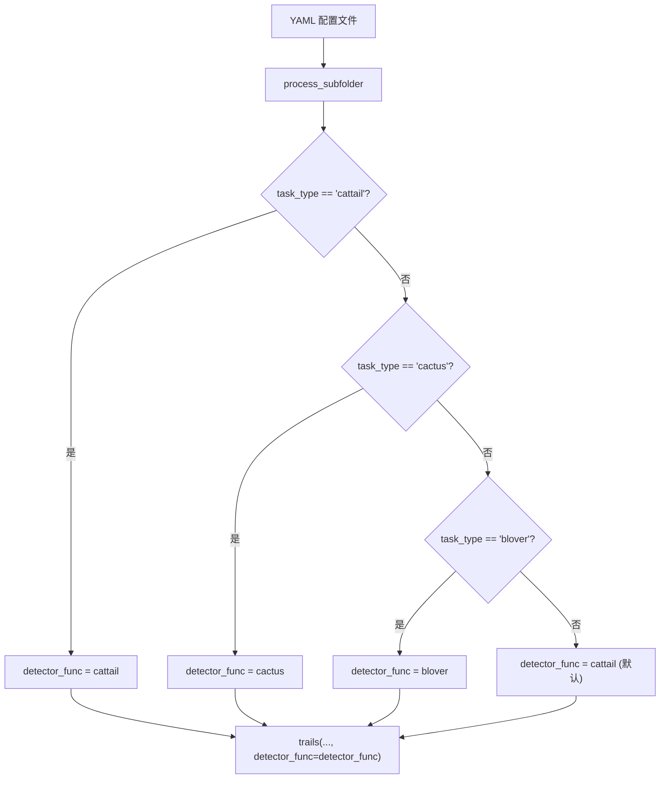
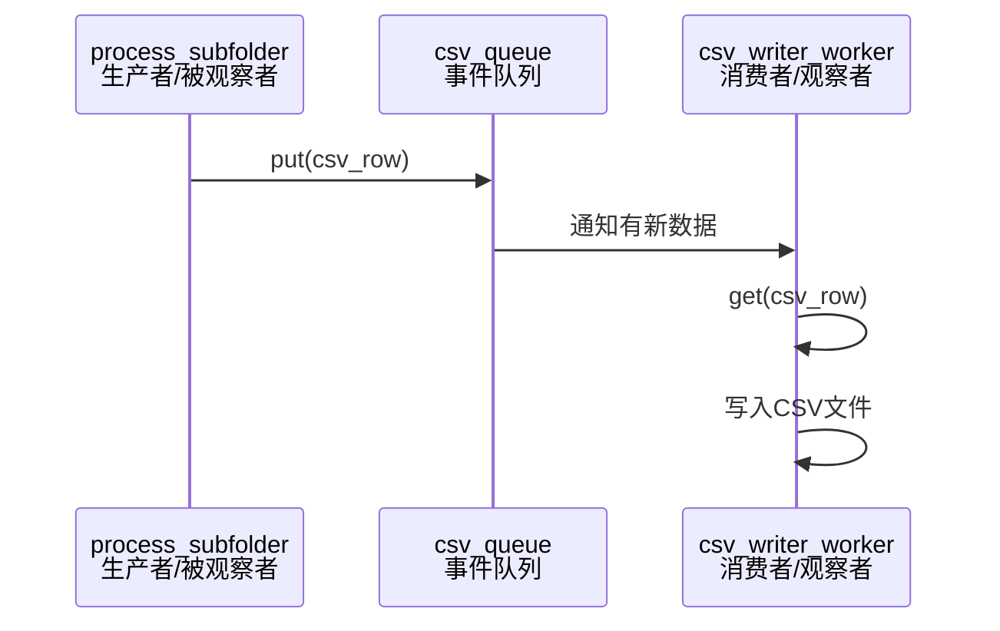

# 架构模式应用

<cite>
**Referenced Files in This Document**   
- [PerfGarden.py](file://PerfGarden.py)
- [README.md](file://README.md)
</cite>

## 目录
1. [引言](#引言)
2. [策略模式：可互换的检测算法](#策略模式可互换的检测算法)
3. [工厂模式：配置驱动的行为选择](#工厂模式配置驱动的行为选择)
4. [观察者模式：异步结果处理](#观察者模式异步结果处理)
5. [工程价值与扩展性](#工程价值与扩展性)
6. [结论](#结论)

## 引言

性能花园（Perf Garden）是一个基于 Python 与 OpenCV 的高效图像自动化框架，专为批量图像识别设计。其核心价值不仅在于快速处理图像任务，更体现在其精巧的软件设计模式应用上。本文档深入分析该工具中采用的三大设计模式：策略模式、工厂模式和观察者模式。这些模式共同构建了一个高内聚、低耦合的系统，使得检测算法的扩展、行为的动态配置以及数据处理的解耦成为可能。通过统一接口封装不同检测方法、基于 YAML 配置动态选择策略、以及生产者-消费者模型处理结果，性能花园展示了轻量级设计模式在脚本型工具中的巨大工程价值。

## 策略模式：可互换的检测算法

策略模式的核心在于定义一系列算法，并将每个算法封装起来，使它们可以相互替换。在性能花园中，`cattail`、`cactus` 和 `blover` 这三种检测方法正是策略模式的完美体现。

这三种函数——`cattail`（模板匹配）、`cactus`（图像差异检测）和 `blover`（圆圈检测）——虽然内部实现截然不同，但都遵循一个统一的接口。它们都接受相似的参数（如图片路径、阈值、裁剪比例），并返回结构一致的结果元组 `(status, matched, confidence, duration)`。这种接口的统一性是策略模式的关键。

核心调度函数 `trails` 充当了策略模式中的“上下文”角色。它不关心具体使用哪种检测算法，而是通过 `detector_func` 参数接收一个函数引用，并在运行时动态调用。这种设计将算法的使用与算法的实现完全分离。`trails` 函数的逻辑专注于任务调度、结果处理和流程控制，而具体的图像识别逻辑则由传入的检测函数负责。

这种模式极大地提升了代码的扩展性和维护性。未来若需支持新的检测算法（如边缘检测、颜色识别），开发者只需编写一个符合统一接口的新函数，而无需修改 `trails` 或其他核心调度逻辑。系统对“开-闭原则”（对扩展开放，对修改关闭）的遵循，使得功能扩展变得简单而安全。

**Section sources**
- [PerfGarden.py](file://PerfGarden.py#L14-L263)
- [PerfGarden.py](file://PerfGarden.py#L267-L381)

## 工厂模式：配置驱动的行为选择

工厂模式用于创建对象，而无需指定具体的类。在性能花园中，虽然没有一个显式的“工厂类”，但 `process_subfolder` 函数中根据 YAML 配置动态选择检测函数的逻辑，体现了一种隐式的工厂模式。

`process_subfolder` 函数读取 YAML 配置中的 `task_type` 字段（如 `cattail`, `cactus`, `blover`），并根据这个字符串值，通过条件判断来决定实例化（即引用）哪一个具体的检测函数。例如，当配置为 `cattail` 时，代码将 `detector_func` 变量指向 `cattail` 函数；当配置为 `cactus` 时，则指向 `cactus` 函数。

**Diagram sources**
- [PerfGarden.py](file://PerfGarden.py#L477-L609)

这种基于配置的动态行为选择，是工厂模式的精髓。它将“创建”检测策略的逻辑集中在一个地方（`process_subfolder` 函数），而不是分散在代码各处。这使得系统的行为完全由外部配置驱动，无需修改代码即可改变其功能。例如，用户可以通过简单地修改 YAML 文件，将一个任务从“模板匹配”切换到“图像差异检测”，实现了高度的灵活性和可配置性。

## 观察者模式：异步结果处理

观察者模式定义了对象之间的一对多依赖关系，当一个对象的状态发生改变时，所有依赖它的对象都会得到通知并自动更新。在性能花园中，`csv_writer_worker` 函数与多线程任务之间的关系，正是观察者模式的典型应用。

在此场景中，`process_subfolder` 函数作为“生产者”或“被观察者”，它在完成一个子文件夹的处理后，会将结果数据 `csv_row` 推送到一个共享的队列 `csv_queue` 中。而 `csv_writer_worker` 函数则作为“消费者”或“观察者”，它在一个独立的线程中持续监听这个队列。一旦队列中有新数据到达，`csv_writer_worker` 就会被“通知”，并立即执行将数据写入 CSV 文件的操作。

**Diagram sources**
- [PerfGarden.py](file://PerfGarden.py#L477-L609)
- [PerfGarden.py](file://PerfGarden.py#L612-L657)

这种设计实现了关注点的完美分离。`process_subfolder` 专注于图像处理和任务执行，无需关心结果如何持久化；`csv_writer_worker` 专注于数据的可靠写入，无需关心数据是如何产生的。通过队列这一中介，两者解耦，使得系统更加健壮。即使写入操作因文件锁定而需要重试，也不会阻塞主线程的图像处理任务，从而保证了整体处理流程的高效和稳定。

## 工程价值与扩展性

性能花园中采用的这些轻量级设计模式，为脚本型工具带来了显著的工程价值。

首先，**模块间耦合度显著降低**。策略模式将算法实现与调度逻辑分离，工厂模式将行为选择与配置信息分离，观察者模式将数据处理与数据生成分离。这种低耦合使得代码更易于理解、测试和维护。修改一个检测算法不会影响到结果写入的逻辑，反之亦然。

其次，系统具备**卓越的扩展性**。新增检测算法只需实现一个符合接口的函数；新增输出方式（如写入数据库）只需创建一个新的“观察者”线程监听结果队列。这种扩展是增量式的，不会对现有代码造成破坏。

最后，这些模式在脚本型工具中的适用优势在于其**简洁性和高效性**。相比于复杂的类继承体系，性能花园使用函数和简单的条件判断就实现了强大的设计模式，避免了过度工程化。这种轻量级的实现方式，既保留了设计模式带来的结构优势，又保持了脚本语言的灵活性和开发效率，非常适合快速迭代和解决特定领域的自动化问题。

**Section sources**
- [PerfGarden.py](file://PerfGarden.py#L267-L657)
- [README.md](file://README.md#L1-L269)

## 结论

性能花园通过巧妙地应用策略模式、工厂模式和观察者模式，构建了一个既高效又灵活的图像自动化框架。策略模式通过统一接口封装了 `cattail`、`cactus` 和 `blover` 等多样化的检测算法，提升了代码的复用性和可维护性。工厂模式通过解析 YAML 配置，实现了检测行为的动态选择，使系统功能完全由配置驱动。观察者模式利用队列和多线程，实现了结果处理的异步化，确保了核心处理流程的流畅与稳定。这三种模式的协同作用，不仅降低了模块间的耦合度，还为未来扩展新的检测算法或输出方式提供了清晰的路径。性能花园的案例证明，即使是轻量级的脚本工具，通过合理运用经典设计模式，也能获得企业级软件的架构优势，实现“自然快乐”的自动化工作流。