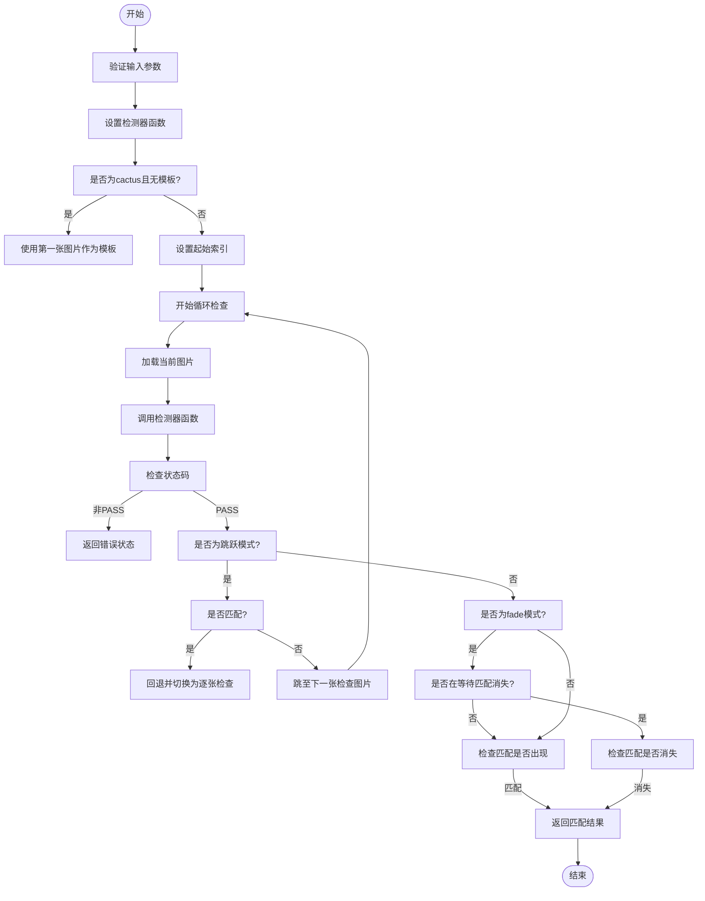
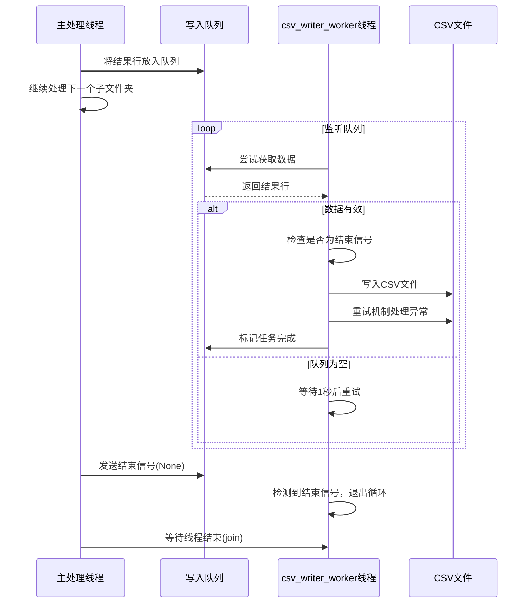

# 核心功能详解

<cite>
**本文档引用的文件**   
- [PerfGarden.py](file://PerfGarden.py)
- [README.md](file://README.md)
</cite>

## 目录
1. [图像检测算法实现](#图像检测算法实现)
2. [核心处理流程](#核心处理流程)
3. [异步结果写入机制](#异步结果写入机制)
4. [架构模式应用](#架构模式应用)
5. [性能优化考量](#性能优化考量)

## 图像检测算法实现

### cattail函数：模板匹配算法
cattail函数实现了基于OpenCV的模板匹配算法，用于在目标图片中查找预定义的模板图像。该函数首先对输入图片和模板图片进行参数校验和安全读取，确保图片路径有效且可读。随后，根据配置的裁剪比例对图片进行区域裁剪，以聚焦于特定区域（如底部按钮或顶部标题）。函数将图片转换为灰度图以提高匹配效率和鲁棒性，然后使用`cv2.matchTemplate`函数执行模板匹配操作。该操作通过滑动窗口技术在目标图片上滑动模板，计算每个位置的匹配度，最终通过`cv2.minMaxLoc`函数获取最高匹配度值。匹配结果以置信度（0-1之间的浮点数）表示，当置信度大于等于预设阈值时判定为匹配成功。

**Section sources**
- [PerfGarden.py](file://PerfGarden.py#L14-L85)

### cactus函数：图像差异检测算法
cactus函数通过像素差分和阈值化技术实现图像变化检测。该函数接收两张图片作为输入：待检测图片和作为基准的模板图片。首先进行参数校验和图片读取，然后根据裁剪比例对两张图片执行相同的裁剪操作，确保比较区域一致。函数使用`cv2.absdiff`计算两张图片的绝对差异，再通过`cv2.threshold`进行二值化处理，将差异像素标记为白色（255），非差异像素标记为黑色（0）。可选的降噪处理通过形态学开运算（`cv2.morphologyEx`）减少噪点干扰。最后，函数计算差异像素占总像素的百分比，当该百分比超过预设阈值时判定为检测到变化。此方法特别适用于检测动态内容（如文字气泡出现）或加载动画。

**Section sources**
- [PerfGarden.py](file://PerfGarden.py#L88-L187)

### blover函数：霍夫变换圆形检测
blover函数应用霍夫变换检测图片中的圆形特征。该函数首先读取图片并转换为灰度图，然后根据裁剪比例进行区域裁剪。为了减少噪声影响，函数使用`cv2.GaussianBlur`对图片进行高斯模糊处理。核心的圆形检测通过`cv2.HoughCircles`函数实现，该函数基于霍夫变换的数学原理，在累加器空间中寻找圆心和半径。函数配置了关键参数：`dp`控制图像分辨率与累加器分辨率之比，`minDist`设置圆心间最小距离以防止重叠检测，`param1`和`param2`分别控制Canny边缘检测的高阈值和圆心累加器阈值，`minRadius`和`maxRadius`限定检测圆的半径范围。检测结果返回圆的数量，当数量大于等于预设阈值时判定为匹配成功。

**Section sources**
- [PerfGarden.py](file://PerfGarden.py#L192-L263)

## 核心处理流程

### trails函数：任务序列协调
trails函数是核心逻辑调度器，负责协调任务序列的执行。该函数接收已排序的图片文件列表和任务参数，通过跳跃间隔（leap）策略提高处理效率。初始时，函数以设定的间隔（如每2张图片）进行检测，一旦发现匹配，则回退到匹配点附近，切换为逐张检查模式，以精确定位匹配发生的图片。函数支持`fade`模式，当`fade=True`时，会继续检查直到匹配消失，适用于检测"离开页面"等场景。trails函数通过`detector_func`参数实现策略模式，可动态调用不同的检测器函数（如cattail、cactus、blover）。对于cactus检测器，若未指定模板路径，函数会自动使用任务图片序列中的第一张图片作为模板基准。



**Diagram sources **
- [PerfGarden.py](file://PerfGarden.py#L267-L381)

### gate_multi_thread函数：多线程处理框架
gate_multi_thread函数构建了多线程处理框架，利用`concurrent.futures.ThreadPoolExecutor`实现并发处理。该函数首先准备CSV结果文件并创建写入队列。然后，为每个子文件夹创建一个处理任务，并提交到线程池中执行。通过`future_to_subfolder`字典跟踪每个任务的状态，使用`as_completed`方法收集已完成的任务结果。这种设计允许系统同时处理多个子文件夹，显著提高整体处理速度。函数还负责启动和管理CSV写入线程，确保结果的异步写入。

**Section sources**
- [PerfGarden.py](file://PerfGarden.py#L660-L728)

### process_subfolder函数：子文件夹处理生命周期
process_subfolder函数管理单个子文件夹的处理生命周期。该函数在独立线程中执行，首先获取并自然排序子文件夹内的所有图片文件。然后，初始化剩余图片列表，并按顺序执行每个任务。对于每个任务，函数根据任务类型（task_type）选择相应的检测器函数，并调用trails函数执行检测。检测结果被记录并用于更新CSV行。当任务成功完成时，函数会更新剩余图片列表，从匹配的图片之后继续处理后续任务。若任务失败或图片用完，剩余任务将被跳过。最后，处理结果通过队列异步写入CSV文件。

**Section sources**
- [PerfGarden.py](file://PerfGarden.py#L477-L609)

## 异步结果写入机制

### csv_writer_worker线程：避免I/O阻塞
系统采用异步结果写入机制，通过`csv_writer_worker`线程避免I/O操作阻塞主处理流程。`process_subfolder`函数将处理结果放入`csv_queue`队列后立即返回，继续处理下一个子文件夹，而不会等待文件写入完成。`csv_writer_worker`线程在后台持续监听队列，一旦有数据到达，即从队列中取出并写入CSV文件。该线程实现了重试机制，当遇到权限错误时会进行多次重试，确保写入的可靠性。通过`daemon=True`设置，写入线程作为守护线程运行，当主线程结束时自动终止。主处理流程在所有任务完成后，向队列发送`None`结束信号，并调用`join()`等待写入线程完成，确保所有结果都被写入。



**Diagram sources **
- [PerfGarden.py](file://PerfGarden.py#L612-L657)

## 架构模式应用

### 策略模式：可互换的检测器
系统应用了策略模式，将不同的图像检测算法（cattail、cactus、blover）设计为可互换的策略。`trails`函数作为上下文，通过`detector_func`参数接收具体的检测策略。在`process_subfolder`函数中，根据YAML配置的任务类型动态选择相应的检测函数：
```python
if task_type == "cattail":
    detector_func = cattail
elif task_type == "blover":
    detector_func = blover
elif task_type == "cactus":
    detector_func = cactus
```
这种设计使得添加新的检测算法变得简单，只需实现新的检测函数并在映射中添加对应关系，无需修改核心调度逻辑，符合开闭原则。

### 工厂模式：动态选择检测函数
系统通过`gate_from_yaml`函数实现了工厂模式，根据YAML配置动态创建和配置任务。该函数解析YAML文件，提取任务类型和参数，并将其转换为内部任务参数字典。对于不同格式的配置（旧版列表格式、新版字典格式、无参数格式），工厂函数都能正确处理并生成统一的任务对象。这种集中化的配置解析和任务创建机制，使得系统能够灵活适应不同的配置需求，同时保持内部处理逻辑的一致性。

**Section sources**
- [PerfGarden.py](file://PerfGarden.py#L384-L474)

## 性能优化考量

### 多线程并发优势
系统通过多线程处理实现了显著的并发优势。`gate_multi_thread`函数使用线程池同时处理多个子文件夹，充分利用多核CPU的计算能力。对于包含大量子文件夹的批量处理任务，这种并行处理方式可以将总处理时间从线性增长降低为接近常数，极大地提高了处理效率。例如，在8线程配置下，处理400多张图片仅需0.67秒，相比单线程处理速度提升显著。

### 潜在资源竞争问题
尽管多线程带来了性能提升，但也引入了潜在的资源竞争问题。主要风险在于多个线程同时写入同一个CSV文件。系统通过引入`csv_queue`队列和专用的`csv_writer_worker`线程解决了这一问题，实现了生产者-消费者模式。所有`process_subfolder`线程作为生产者将结果放入队列，而单一的写入线程作为消费者负责文件写入，从而避免了多线程直接写入文件导致的竞争和数据损坏。此外，系统还通过重试机制处理可能的权限冲突，确保了写入的可靠性。

**Section sources**
- [PerfGarden.py](file://PerfGarden.py#L660-L728)
- [PerfGarden.py](file://PerfGarden.py#L612-L657)