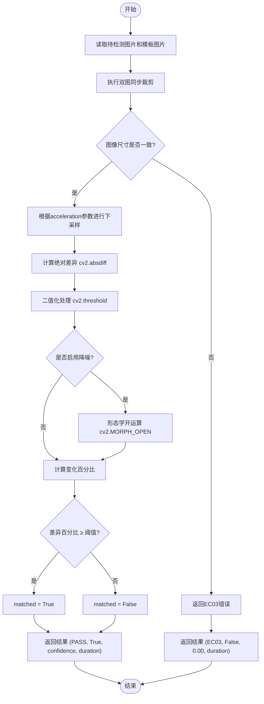

# cactus图像差异检测

<cite>
**本文档引用文件**   
- [PerfGarden.py](file://PerfGarden.py)
- [README.md](file://README.md)
</cite>

## 目录
1. [简介](#简介)
2. [核心检测机制](#核心检测机制)
3. [参数详解](#参数详解)
4. [关键处理流程](#关键处理流程)
5. [应用场景与使用案例](#应用场景与使用案例)
6. [错误码解析](#错误码解析)
7. [敏感性分析](#敏感性分析)

## 简介
cactus函数是PerfGarden框架中的核心图像差异检测工具，专为自动化识别图像变化而设计。该函数通过像素级差分计算，能够高效检测两幅图像之间的差异区域，特别适用于APP界面变化检测、内容加载监测等动态场景。其最大特点是简单易用，大多数情况下无需复杂配置即可自动处理。

**Section sources**
- [README.md](file://README.md#L130-L160)

## 核心检测机制
cactus函数的核心检测流程基于OpenCV的像素级差分算法，通过计算两幅图像的绝对差异并进行二值化处理，生成差异掩码来量化变化程度。

首先，函数使用`cv2.absdiff`对两幅输入图像进行逐像素差分计算，得到绝对差异矩阵。随后，通过`cv2.threshold`函数将差异矩阵二值化，设定阈值为3，将差异值大于3的像素点标记为255（白色），其余标记为0（黑色），从而生成差异掩码。这一过程有效突出了图像中的变化区域，同时抑制了微小的噪声干扰。

差异掩码生成后，函数通过`np.count_nonzero`统计非零像素点的数量，并除以掩码总像素数，计算出差异区域占总图像面积的百分比。当该百分比超过预设阈值时，判定为检测到显著变化。

**Diagram sources**
- [PerfGarden.py](file://PerfGarden.py#L88-L187)

**Section sources**
- [PerfGarden.py](file://PerfGarden.py#L88-L187)

## 参数详解
cactus函数提供了一系列可配置参数，以适应不同的检测需求和性能要求。

### threshold（差异百分比阈值）
threshold参数定义了判定图像变化的临界值，取值范围为0~100，默认值为1.0。当图像差异区域占比超过此阈值时，函数返回matched=True。该参数的业务意义在于平衡检测的灵敏度和准确性：较低的阈值（如0.5）能捕捉细微变化，适用于检测文字气泡出现等精细变化；较高的阈值（如5.0）则能过滤掉局部抖动，适用于检测大范围内容加载等显著变化。

### enable_denoising（降噪开关）
enable_denoising参数控制是否启用降噪处理，默认为False。当设置为True时，函数会使用`cv2.morphologyEx`进行形态学开运算（MORPH_OPEN），通过2x2的结构元素消除噪点干扰。这一处理能有效减少光照变化、压缩伪影等引起的误判，但可能会略微降低对微小变化的敏感度。

### acceleration（加速参数）
acceleration参数用于提升处理效率，可选值为1、2、4，默认值为2。该参数通过图像下采样实现加速：当acceleration=2时，图像尺寸缩小为原来的1/4（长宽各缩小一半），大幅减少计算量。虽然下采样会损失部分细节，但在大多数场景下仍能保持足够的检测精度，特别适合处理高分辨率图片或需要快速响应的场景。

**Section sources**
- [PerfGarden.py](file://PerfGarden.py#L88-L187)
- [README.md](file://README.md#L145-L155)

## 关键处理流程
cactus函数的处理流程包含多个关键环节，确保检测的准确性和鲁棒性。

### 双图裁剪同步
函数支持对输入图像和模板图像进行同步裁剪，通过crop参数控制裁剪比例。当crop>0时，保留图像底部区域；当crop<0时，保留顶部区域。这一设计允许用户聚焦于图像的特定区域（如底部按钮或顶部标题），提高检测效率和准确性。重要的是，裁剪操作会同时应用于待检测图像和模板图像，确保两者在相同区域进行比较。

### 尺寸一致性校验
在进行差异计算前，函数会严格校验两幅图像的尺寸是否一致。如果`img1.shape != img2.shape`，则立即返回EC03错误。这一步骤至关重要，因为不同尺寸的图像无法进行有效的像素级比较。尺寸校验不仅发生在原始图像层面，也适用于裁剪和下采样后的图像。

### 变化率统计
变化率统计是cactus函数的核心输出指标。函数通过`np.count_nonzero(diff_mask) / diff_mask.size * 100`计算差异百分比，其中`diff_mask.size`表示掩码的总像素数。该百分比作为confidence值返回，为用户提供量化的变化程度参考，而不仅仅是布尔型的匹配结果。

**Section sources**
- [PerfGarden.py](file://PerfGarden.py#L88-L187)

## 应用场景与使用案例
cactus函数在APP界面变化检测中具有广泛的应用价值。

在实际使用中，用户可根据具体场景调整参数。例如，在检测AI对话中文字开始出现的场景，由于变化区域较小，建议使用默认阈值1.0，并关闭降噪以保持高灵敏度。而在检测页面整体加载完成的场景，由于可能伴随加载动画等局部变化，建议将阈值提高到3.0-5.0，并启用降噪处理。

对于网络延迟较高的场景，图像可能出现模糊或压缩伪影，建议启用enable_denoising=True以过滤噪声。对于画面复杂度高的场景（如包含大量动态元素），可适当提高threshold值，避免误触发。当需要快速处理大量图片时，可设置acceleration=4以获得最大加速效果。

一个典型的使用案例是在"AI对话上传图片"性能测试中，cactus函数被用于检测内容开始加载的时刻。通过简单配置`- cactus:`，系统自动将第一张图片作为模板，检测后续帧的变化，精准捕捉到文字气泡出现的瞬间，为性能分析提供关键时间点。

**Section sources**
- [README.md](file://README.md#L200-L250)

## 错误码解析
cactus函数定义了明确的错误码体系，便于问题诊断和处理。

### EC01（参数错误）
当输入参数超出有效范围时返回EC01，包括：threshold不在0~100范围内、crop不在-99~99范围内、acceleration不为1、2或4。此错误通常由配置文件中的错误参数引起，需检查YAML配置的正确性。

### EC02（读取图片失败）
当无法读取待检测图片或模板图片时返回EC02。可能原因包括文件路径错误、文件损坏或权限不足。建议检查文件路径是否正确，文件是否存在且可读。

### EC03（尺寸不匹配）
当两幅图像经过裁剪和下采样后尺寸不一致时返回EC03。这通常发生在待检测图片和模板图片原始尺寸不同，且裁剪比例导致最终尺寸不匹配的情况下。解决方案是确保输入图片具有相同的原始尺寸，或调整裁剪参数。

**Section sources**
- [PerfGarden.py](file://PerfGarden.py#L88-L187)
- [README.md](file://README.md#L158-L160)

## 敏感性分析
cactus函数对某些类型的图像变化具有特定的敏感性特征。

该方法对光照变化较为敏感，因为光照变化会导致像素值整体偏移，可能被误判为显著变化。虽然启用降噪能在一定程度上缓解此问题，但在光照剧烈变化的场景中仍可能出现误判。建议在光照稳定的环境下使用，或适当提高阈值。

对于局部抖动（如加载动画、闪烁元素），cactus函数的敏感性取决于抖动区域的大小和阈值设置。小范围的局部抖动可能被降噪处理过滤，而大范围的抖动则可能触发检测。用户可根据需要调整threshold和enable_denoising参数来平衡对局部抖动的敏感度。

值得注意的是，cactus函数对内容的语义变化不敏感，只关注像素级差异。这意味着即使两个图像在语义上完全不同，只要像素差异小，也可能不被检测为变化；反之，即使语义相同但存在压缩伪影，也可能被检测为变化。这种特性使其更适合检测物理层面的变化，而非语义层面的变化。

**Section sources**
- [README.md](file://README.md#L156-L157)