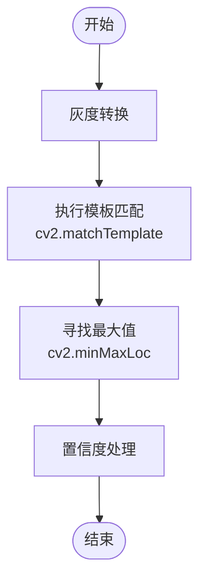
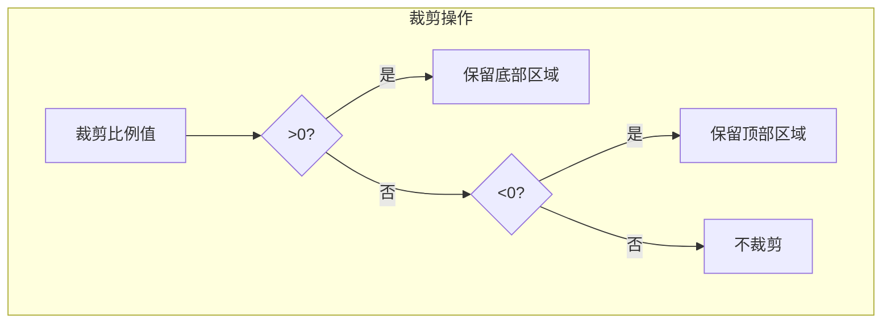
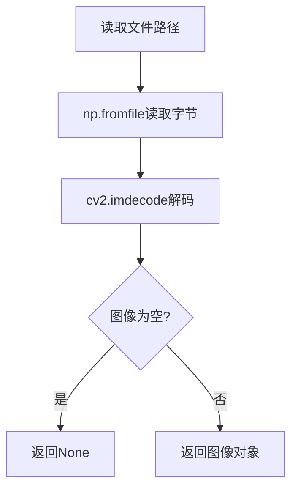

# cattail模板匹配检测

<cite>
**本文档引用文件**   
- [PerfGarden.py](file://PerfGarden.py)
- [README.md](file://README.md)
</cite>

## 目录
1. [cattail函数实现原理](#cattail函数实现原理)
2. [技术细节分析](#技术细节分析)
3. [参数作用机制](#参数作用机制)
4. [关键步骤实现逻辑](#关键步骤实现逻辑)
5. [实际调用示例](#实际调用示例)
6. [应用场景与局限性](#应用场景与局限性)
7. [错误码分析](#错误码分析)

## cattail函数实现原理

cattail函数是基于OpenCV的模板匹配检测方法，通过归一化相关系数（NCC）算法在待检测图片中查找模板内容。该函数实现了"在大图中找小图"的核心功能，采用优化的滑动窗口技术，在毫秒级完成识别任务。函数通过`cv2.matchTemplate`方法执行模板匹配，使用`cv2.TM_CCOEFF_NORMED`匹配方法计算归一化相关系数，从而确定模板在目标图像中的最佳匹配位置。

**Section sources**
- [PerfGarden.py](file://PerfGarden.py#L14-L85)

## 技术细节分析

### 归一化相关系数（NCC）算法计算流程

cattail函数采用OpenCV的`cv2.TM_CCOEFF_NORMED`方法实现归一化相关系数匹配。该算法通过计算模板图像与目标图像中每个可能位置的相似度得分，生成一个结果矩阵。算法首先将模板图像在目标图像上滑动，对每个位置计算两个图像块之间的相关系数，然后进行归一化处理，使结果值介于0到1之间。值越接近1表示匹配度越高。

**Diagram sources**
- [PerfGarden.py](file://PerfGarden.py#L72-L77)

### 灰度转换处理

函数在执行匹配前将彩色图像转换为灰度图像，通过`cv2.cvtColor`方法实现BGR到灰度的转换。这一处理减少了颜色变化对匹配结果的影响，提高了算法的鲁棒性。灰度化处理使得算法对颜色变化不敏感，专注于图像的结构和形状特征。

**Section sources**
- [PerfGarden.py](file://PerfGarden.py#L72-L73)

### 匹配结果提取机制

匹配结果通过`cv2.minMaxLoc`函数提取，该函数返回结果矩阵中的最大值及其位置。最大值表示最佳匹配的置信度，位置信息指示模板在目标图像中的坐标。函数仅使用最大值作为匹配结果，不考虑匹配位置的具体坐标，专注于判断是否存在匹配。

**Section sources**
- [PerfGarden.py](file://PerfGarden.py#L77)

## 参数作用机制

### threshold（匹配阈值）

匹配阈值参数控制匹配的严格程度，取值范围为0~1。值越高表示匹配要求越严格，需要更高的相似度才能判定为匹配成功。默认值为0.9，通常准确匹配的置信度在0.9以上。较低的阈值（如0.8）会增加匹配的灵敏度，但可能导致误匹配；较高的阈值则提高准确性，但可能漏检。

### crop（裁剪比例）

裁剪比例参数用于指定图像裁剪区域，取值范围为-99~99。正值表示从底部向上裁剪，保留底部指定百分比的区域；负值表示从顶部向下裁剪，保留顶部指定百分比的区域；零值表示不裁剪。该参数允许用户聚焦于图像的特定区域，提高匹配效率和准确性。

**Diagram sources**
- [PerfGarden.py](file://PerfGarden.py#L55-L64)

## 关键步骤实现逻辑

### 图像安全读取

函数通过内部的`_safe_read`辅助函数实现图像的安全读取，使用`cv2.imdecode`和`np.fromfile`组合处理文件路径中的中文字符和特殊字符问题。这种实现方式避免了OpenCV直接读取文件时可能出现的编码问题。

**Diagram sources**
- [PerfGarden.py](file://PerfGarden.py#L40-L44)

### 尺寸校验

在执行匹配前，函数会校验模板图像尺寸是否小于或等于目标图像尺寸。如果模板大于目标图像，则返回EC03错误码。这一校验确保了模板匹配操作的可行性。

**Section sources**
- [PerfGarden.py](file://PerfGarden.py#L66-L69)

### 区域裁剪

区域裁剪根据crop参数的值执行不同的裁剪策略。对于正值，保留图像底部区域；对于负值，保留图像顶部区域。裁剪操作通过NumPy数组切片实现，高效且简洁。

**Section sources**
- [PerfGarden.py](file://PerfGarden.py#L55-L64)

## 实际调用示例

### 模板图片准备

准备模板图片时，应直接从任务图片中裁剪出需要识别的元素，而非通过截图获取。确保模板图片与目标图像的像素大小一致，避免因尺寸变化影响匹配结果。对于不同尺寸的设备，需要准备相应的模板图片。

### 配置合理阈值

根据实际应用场景配置阈值：
- 对于清晰、对比度高的元素，可使用较高阈值（0.9-0.95）
- 对于模糊或有噪声的元素，可适当降低阈值（0.8-0.85）
- 在调试阶段，可先使用较低阈值找到匹配，再逐步提高阈值优化准确性

**Section sources**
- [README.md](file://README.md#L96-L123)

## 应用场景与局限性

### 典型应用场景

cattail方法适用于识别按钮、图标、标题等固定界面元素。在性能测试中，可用于检测页面进入、按钮点击、状态变化等关键节点。结合trails函数的fade和leap参数，可实现复杂的检测逻辑，如检测元素出现后消失的完整过程。

### 局限性

cattail方法对图像缩放和旋转敏感，当目标图像与模板图像存在明显尺寸变化或角度偏差时，匹配成功率会显著下降。此外，模板图片不能大于目标图像，且对于复杂背景中的元素，识别难度会增加。

### 优化建议

1. 使用裁剪参数聚焦于关键区域，减少计算量
2. 减小图片尺寸以提高处理速度，同时保持识别质量
3. 在不同设备上使用相应尺寸的模板图片
4. 结合其他检测方法（如cactus、blover）构建复合检测策略

**Section sources**
- [README.md](file://README.md#L157-L203)

## 错误码分析

### EC01（参数错误）

触发条件：threshold参数不在0~1范围内，或crop参数不在-99~99范围内。解决方案是检查并修正参数值，确保其在有效范围内。

**Section sources**
- [PerfGarden.py](file://PerfGarden.py#L18-L21)

### EC02（读取失败）

触发条件：无法读取目标图像或模板图像文件。可能原因包括文件路径错误、文件损坏或权限问题。解决方案是验证文件路径和文件完整性。

**Section sources**
- [PerfGarden.py](file://PerfGarden.py#L28-L31)

### EC03（尺寸不匹配）

触发条件：模板图像尺寸大于目标图像尺寸。解决方案是确保模板图片尺寸小于或等于目标图像尺寸，必要时重新裁剪模板图片。

**Section sources**
- [PerfGarden.py](file://PerfGarden.py#L66-L69)