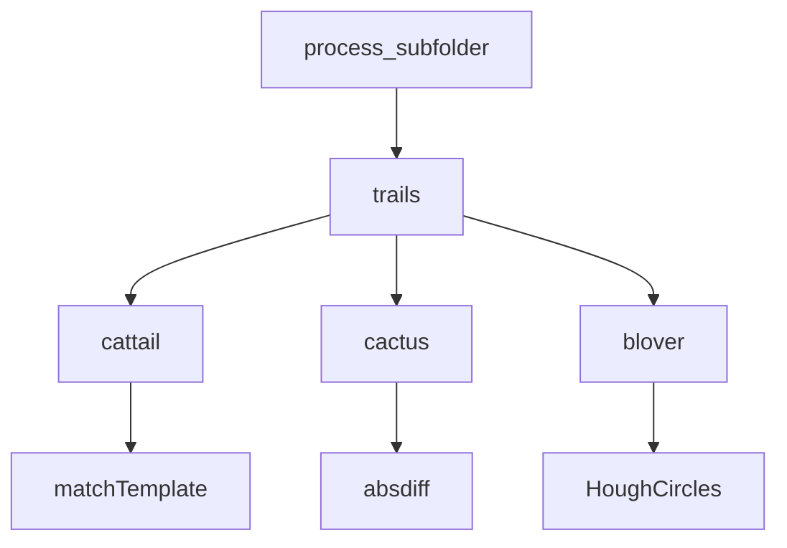

# 检测方法详解

<cite>
**Referenced Files in This Document**   
- [PerfGarden.py](file://PerfGarden.py)
- [README.md](file://README.md)
</cite>

## 目录
1. [引言](#引言)
2. [核心检测方法](#核心检测方法)
3. [cattail函数：模板匹配](#cattail函数模板匹配)
4. [cactus函数：图像差异检测](#cactus函数图像差异检测)
5. [blover函数：圆形特征检测](#blover函数圆形特征检测)
6. [主流程集成与异常处理](#主流程集成与异常处理)
7. [使用示例与场景选择](#使用示例与场景选择)
8. [总结](#总结)

## 引言

性能花园（Perf Garden）是一个基于Python与OpenCV的高效图像自动化框架，专为批量图像识别设计。该框架实现了三种核心图像检测方法：cattail（猫尾草）用于模板匹配，cactus（仙人掌）用于图像差异检测，以及blover（三叶草）用于圆形特征检测。这些方法共同构成了一个强大的图像分析工具集，能够应对从静态元素识别到动态变化检测的多种应用场景。本文档将深入讲解这三种核心检测方法的实现原理、参数配置、性能影响及实际应用。

## 核心检测方法

性能花园中的三种核心检测方法分别针对不同的图像识别需求。cattail方法基于OpenCV的模板匹配算法，适用于识别固定位置的UI元素；cactus方法通过计算图像间的像素级差异来检测变化，特别适合识别动态内容的出现；blover方法利用霍夫变换检测圆形特征，专为识别特定形状的UI元素而设计。这三种方法在`trails`函数的统一调度下协同工作，形成了一个灵活且高效的检测流程。

**Section sources**
- [PerfGarden.py](file://PerfGarden.py#L14-L263)

## cattail函数：模板匹配

### 技术原理

cattail函数基于OpenCV的`matchTemplate`算法实现模板匹配，其核心是归一化相关系数（NCC）计算。该算法通过滑动窗口的方式，将模板图像在待检测图像上逐像素移动，计算每个位置的匹配度。具体实现中，函数首先将输入图像和模板图像转换为灰度图，然后调用`cv2.matchTemplate`函数执行匹配，使用`cv2.TM_CCOEFF_NORMED`方法计算归一化互相关系数。匹配结果是一个二维数组，表示模板在原图每个位置的匹配度，通过`cv2.minMaxLoc`函数获取最大匹配值，即为最终的置信度。

### 参数机制

- **匹配阈值（threshold）**：取值范围为0~1，用于判断匹配是否成功。当计算出的最大匹配值大于或等于阈值时，判定为匹配成功。较高的阈值要求更精确的匹配，适用于对准确性要求高的场景；较低的阈值则更宽松，适用于模板与目标存在轻微差异的情况。
- **裁剪参数（crop）**：取值范围为-99~99，用于指定图像裁剪比例。正值表示从底部向上裁剪，保留底部区域；负值表示从顶部向下裁剪，保留顶部区域。该参数能有效缩小检测范围，提高检测速度和精度。
- **fade参数**：布尔值，当设置为`true`时，函数不仅检测目标的出现，还会继续检测直到目标消失，适用于需要确认状态变化完成的场景。
- **leap参数**：正整数，表示检测间隔。函数会每隔`leap`张图片进行一次检测，发现匹配后自动回溯到前`leap-1`张图片开始逐个检查，这种"智能间隔"策略能显著提高处理速度而不漏检。

### 性能影响

cattail函数的检测精度和性能受多个因素影响。首先，模板图像的质量至关重要，应直接从任务图片中裁剪获得，而非截图，以确保像素级匹配。其次，`crop`参数能有效减少计算量，特别是在目标位于图像特定区域时。`leap`参数通过减少检测次数来提升性能，但过大的值可能增加回溯检查的开销。整体而言，cattail函数在合理配置参数的情况下，能在毫秒级完成单次检测。

**Section sources**
- [PerfGarden.py](file://PerfGarden.py#L14-L85)
- [README.md](file://README.md#L100-L120)

## cactus函数：图像差异检测

### 技术实现

cactus函数通过图像差分与像素级比较来识别界面变化。其工作流程包括：首先读取待检测图像和模板图像，执行相同的裁剪操作以确保尺寸一致；然后计算两幅图像的绝对差异，并通过阈值化处理生成二值化的差异掩码；最后统计差异像素占总像素的比例，作为变化的置信度。该方法对图像内容的变化非常敏感，能有效识别文字出现、页面加载等动态场景。

### 降噪与加速

- **enable_denoising**：启用降噪处理时，函数会使用形态学开运算（`cv2.MORPH_OPEN`）去除差异掩码中的噪点，减少误报。这对于处理存在轻微噪声或压缩伪影的图像特别有用，但会略微增加计算时间。
- **acceleration**：加速策略通过下采样实现，将图像尺寸缩小`acceleration`倍（支持1、2、4倍），从而大幅减少计算量。虽然这会降低检测精度，但在大多数场景下仍能保持足够的准确性，是提升性能的有效手段。

### 工程意义

cactus函数的最大优势在于其简单易用性。当YAML配置中未指定模板路径时，系统会自动将当前任务的第一张图片作为模板基准，这一设计使其在处理连续帧序列时表现出色。该方法特别适合检测"内容开始输出"等动态场景，如AI对话中文字开始出现、页面内容开始加载等，无需复杂的模板准备即可实现高效检测。

**Section sources**
- [PerfGarden.py](file://PerfGarden.py#L88-L187)
- [README.md](file://README.md#L120-L140)

## blover函数：圆形特征检测

### 数学原理

blover函数利用霍夫变换检测圆形特征，其数学原理基于参数空间累加。对于图像中的每个边缘点，函数在参数空间（圆心坐标和半径）中投票可能的圆心位置。具体实现中，函数首先对灰度图像进行高斯模糊以减少噪声，然后应用Canny边缘检测获取边缘信息，最后调用`cv2.HoughCircles`执行霍夫圆变换。该方法能在复杂背景中快速识别圆形，无需逐像素分析。

### 代码实现

函数通过配置多个参数来优化检测效果：
- **dp**：图像分辨率与累加器分辨率之比，1:1保持原始分辨率。
- **minDist**：圆心间最小距离，防止重叠圆检测。
- **param1**：Canny边缘检测高阈值，值越大边缘检测要求越严格。
- **param2**：圆心累加器阈值，值越小检测越宽松，但假圆越多。
- **minRadius**和**maxRadius**：目标圆的最小和最大半径，根据实际目标尺寸设置。

### 应用场景

blover函数特别适合"图片上传"等场景，当页面只有加载中的圆圈且背景复杂时，它能可靠地识别上传过程中的"圆圈动画"。推荐用法是先用cattail定位到上传前的图片，再用blover确认上传状态，可设置`fade=true`检测圆圈出现后消失，从而确认图片上传完成。

**Section sources**
- [PerfGarden.py](file://PerfGarden.py#L192-L263)
- [README.md](file://README.md#L140-L160)

## 主流程集成与异常处理

### 输入输出格式

三种检测方法均遵循统一的输入输出格式。输入参数包括待检测图片路径、模板图片路径（cactus和cattail需要）、阈值、裁剪比例等。输出为四元组`(status, matched, confidence, duration)`，其中`status`表示状态码，`matched`表示是否检测成功，`confidence`为置信度，`duration`为执行耗时。

### 异常处理逻辑

各方法均实现了完善的异常处理机制：
- **参数校验**：在函数开始时检查输入参数的有效性，如阈值范围、裁剪比例等，无效参数返回相应的错误代码（如EC01）。
- **文件读取**：使用安全的图片读取函数，捕获读取异常，读取失败返回EC02状态码。
- **尺寸校验**：检查模板与目标图像的尺寸关系，避免不匹配导致的错误。

### 与主流程集成

所有检测方法通过`trails`函数集成到主流程中。`trails`函数作为统一的调度器，接收检测器函数作为参数，实现了检测逻辑与调度逻辑的解耦。`process_subfolder`函数根据YAML配置中的任务类型，动态选择相应的检测器函数，并通过`trails`执行检测任务。这种设计使得框架具有良好的扩展性，便于添加新的检测方法。



**Diagram sources**
- [PerfGarden.py](file://PerfGarden.py#L267-L381)
- [PerfGarden.py](file://PerfGarden.py#L477-L609)

**Section sources**
- [PerfGarden.py](file://PerfGarden.py#L267-L609)

## 使用示例与场景选择

### 场景选择指南

- **cattail**：适用于识别按钮、图标或标题等固定元素。当目标是静态且位置固定的UI元素时，应优先选择此方法。
- **cactus**：适用于检测动态变化，如文字出现、页面加载等。当无法使用固定模板匹配时，此方法是最佳选择。
- **blover**：适用于识别圆形UI元素，如加载动画、进度指示器等。当目标是特定形状的动态元素时，应选择此方法。

### 实际使用示例

以下是一个典型的YAML配置示例，用于分析"AI对话上传图片"的性能指标：

```yaml
- path: "C:/Users/.../测试"
- cattail:
    - template: "c:/Users/.../button.jpg"
    - crop: 30
    - fade: true
- cactus:
- blover:
    - crop: -50
    - fade: true
- skip: 80
- cattail:
    - template: "c:/Users/.../share.jpg"
    - crop: 50
```

该配置依次执行：检测导入按钮消失、检测内容开始加载、检测上传完成、跳过80张图片、检测分享图标出现。通过合理组合三种检测方法，可以精确捕捉关键时间点。

### 适用边界与局限性

- **cattail**：对图像大小和角度敏感，不同尺寸设备需要不同模板；模板不能比任务图片大。
- **cactus**：要求对比图片尺寸相同；加速和降噪会影响检测精度。
- **blover**：对圆形参数配置敏感，需要根据实际目标调整半径范围和检测阈值。

**Section sources**
- [README.md](file://README.md#L160-L260)

## 总结

性能花园通过cattail、cactus和blover三种核心检测方法，提供了一个全面的图像识别解决方案。cattail基于模板匹配，适用于静态元素识别；cactus通过图像差分检测动态变化；blover利用霍夫变换识别圆形特征。这三种方法在统一的调度框架下协同工作，结合裁剪、加速、降噪等优化策略，实现了高效、准确的图像分析。用户应根据具体场景选择合适的检测器，并合理配置参数，以达到最佳的检测效果。