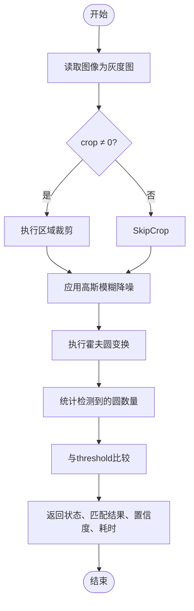
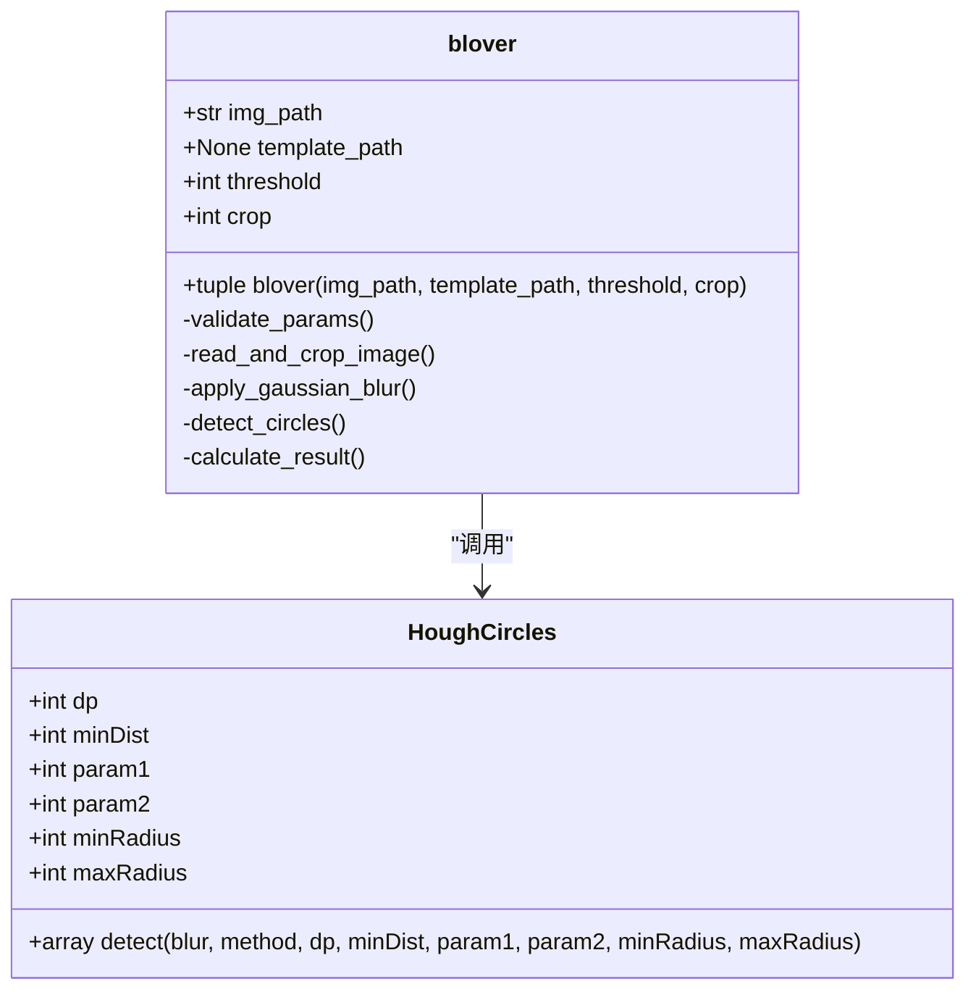

# blover圆圈检测

<cite>
**Referenced Files in This Document**   
- [PerfGarden.py](file://PerfGarden.py)
</cite>

## 目录
1. [简介](#简介)
2. [核心组件](#核心组件)
3. [图像预处理与裁剪逻辑](#图像预处理与裁剪逻辑)
4. [霍夫圆变换参数详解](#霍夫圆变换参数详解)
5. [返回值结构与状态码](#返回值结构与状态码)
6. [应用场景与调参建议](#应用场景与调参建议)

## 简介
`blover`函数是PerfGarden项目中用于检测图像中圆形目标的核心功能模块。该函数基于OpenCV的霍夫圆变换（HoughCircles）算法，专门设计用于识别特定数量的圆形图案，典型应用于加载动画、指示灯状态识别等场景。函数通过参数化配置实现灵活检测，并结合图像预处理技术提升鲁棒性。

## 核心组件

`blover`函数实现了完整的圆形检测流程，包括参数校验、图像读取、区域裁剪、噪声抑制、边缘检测和圆心定位。其核心依赖于OpenCV库的`cv2.HoughCircles`方法，通过配置多个关键参数来控制检测的精度与灵敏度。该函数不依赖外部模板，而是直接分析图像中的几何特征进行识别。

**Section sources**
- [PerfGarden.py](file://PerfGarden.py#L89-L160)

## 图像预处理与裁剪逻辑

在执行圆形检测前，`blover`函数对输入图像进行一系列预处理操作以提高检测准确性。首先将图像安全读取为灰度图，减少色彩干扰。随后根据`crop`参数执行区域裁剪，支持从顶部或底部保留指定比例的图像区域，有效聚焦于目标区域并排除无关背景干扰。

预处理阶段还包含高斯模糊（GaussianBlur）降噪步骤，使用5×5卷积核平滑图像，抑制高频噪声对边缘检测的影响。此步骤对于在复杂光照条件下稳定检测结果至关重要。

**Diagram sources**
- [PerfGarden.py](file://PerfGarden.py#L89-L160)

**Section sources**
- [PerfGarden.py](file://PerfGarden.py#L89-L160)

## 霍夫圆变换参数详解

`blover`函数通过精细配置`cv2.HoughCircles`的多个参数来优化检测效果。这些参数共同决定了算法对圆形特征的敏感度和准确性。

### dp（分辨率比例）
`dp=1`表示图像分辨率与累加器分辨率之比为1:1，保持原始分辨率精度。增大该值会降低累加器分辨率，使检测更粗糙但计算更快。

### minDist（最小圆心距）
`minDist=100`设定检测到的圆心之间的最小距离，防止同一目标被重复检测或相邻目标被误识别为单个大圆。该值应根据实际目标间的物理间距调整。

### param1（Canny边缘检测阈值）
`param1=90`作为Canny边缘检测器的高阈值，控制边缘提取的严格程度。值越大，仅保留更明显的边缘，建议范围50-150，需根据图像对比度调整。

### param2（累加器阈值）
`param2=32`是圆心检测的累加器阈值，值越小检测越宽松，可能导致误检；值越大则要求更高一致性，可能漏检弱边缘圆。建议范围10-50，是平衡准确率与召回率的关键参数。

### minRadius/maxRadius（半径范围限制）
`minRadius=20`和`maxRadius=25`限定检测圆的尺寸范围，有效过滤不符合物理特征的伪影。此范围应根据目标物体的实际像素尺寸精确设置。

**Diagram sources**
- [PerfGarden.py](file://PerfGarden.py#L89-L160)

**Section sources**
- [PerfGarden.py](file://PerfGarden.py#L89-L160)

## 返回值结构与状态码

`blover`函数返回四元组 `(status, matched, confidence, duration)`，其中`confidence`表示实际检测到的圆圈数量，而非传统意义上的置信度分数。

- **EB01**：参数错误状态码，当`threshold`非正整数或`crop`超出[-99,99]范围时返回。
- **EB02**：图像读取失败状态码，当指定路径的图像无法加载时触发。
- 正常情况下返回`"PASS"`状态，`matched`字段指示检测数量是否达到或超过`threshold`要求。

该设计使得函数既能用于精确匹配特定数量的圆，也可作为计数工具评估图像中圆形元素的密集程度。

**Section sources**
- [PerfGarden.py](file://PerfGarden.py#L89-L160)

## 应用场景与调参建议

`blover`函数特别适用于识别具有规律性圆形图案的场景，如网页加载动画、设备状态指示灯阵列等。其对圆形的完整性要求较高，在部分遮挡或严重变形情况下可能失效。光照不均或反光也会显著影响边缘检测质量。

**调参建议**：
1. **半径范围**：根据目标在图像中的实际像素尺寸精确设置`minRadius`和`maxRadius`，避免过宽导致误检。
2. **param2阈值**：在目标边缘清晰时适当提高`param2`（如40-50）以减少假阳性；在低对比度图像中降低至20-30以保证检出率。
3. **minDist设置**：确保大于目标圆直径，防止单个圆被多重检测。
4. **预处理增强**：对于噪声严重的图像，可考虑调整高斯模糊核大小或增加形态学滤波步骤。

通过合理配置参数，`blover`函数可在多种视觉检测任务中实现高效稳定的圆形识别能力。

**Section sources**
- [PerfGarden.py](file://PerfGarden.py#L89-L160)