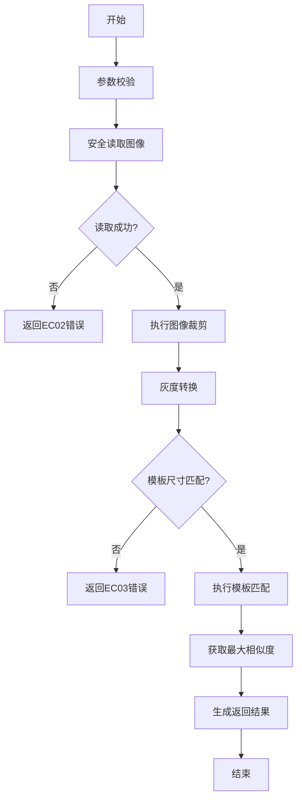
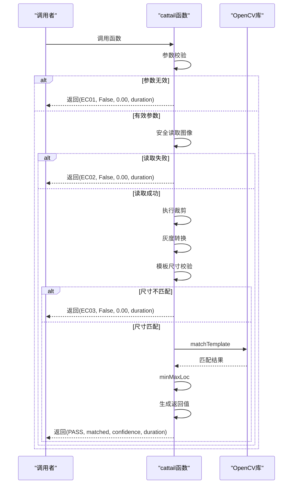

# cattail模板匹配

<cite>
**Referenced Files in This Document**  
- [PerfGarden.py](file://PerfGarden.py)
</cite>

## 目录
1. [引言](#引言)
2. [核心实现原理](#核心实现原理)
3. [参数校验机制](#参数校验机制)
4. [图像安全读取与预处理](#图像安全读取与预处理)
5. [图像裁剪逻辑](#图像裁剪逻辑)
6. [模板匹配核心流程](#模板匹配核心流程)
7. [返回值生成逻辑](#返回值生成逻辑)
8. [典型应用场景](#典型应用场景)
9. [优缺点分析](#优缺点分析)
10. [性能调优建议](#性能调优建议)

## 引言

`cattail`函数是PerfGarden自动化测试框架中的核心图像识别组件，专为高精度UI元素检测设计。该函数基于OpenCV的模板匹配技术，通过分析待测图像与模板图像的相似度来判断特定UI元素是否存在。其主要特点包括支持中文路径、区域裁剪、阈值控制等实用功能，适用于自动化测试、游戏脚本、界面监控等多种场景。

**Section sources**
- [PerfGarden.py](file://PerfGarden.py#L13-L84)

## 核心实现原理

`cattail`函数的核心原理是利用OpenCV提供的`matchTemplate`方法进行模板匹配。该方法通过滑动窗口的方式，在目标图像中逐像素地与模板图像进行比较，计算每个位置的相似度得分。最终返回最高相似度值及其对应的位置坐标。

整个流程包含多个关键步骤：参数校验、图像安全读取、图像裁剪、灰度转换、模板尺寸校验、相似度计算和结果处理。这些步骤共同确保了函数的鲁棒性和准确性。

**Diagram sources**
- [PerfGarden.py](file://PerfGarden.py#L13-L84)

## 参数校验机制

函数在执行前会对输入参数进行严格校验，确保后续操作的可靠性。

### 阈值范围校验
匹配阈值`threshold`必须在0到1之间（包含边界）。该值表示匹配成功的最低相似度要求，值越接近1表示匹配要求越严格。

### 裁剪比例校验
裁剪比例`crop`必须在-99到99之间（包含边界）。正数表示从底部向上裁剪并保留底部区域，负数表示从顶部向下裁剪并保留顶部区域，0表示不裁剪。

当任一参数超出合法范围时，函数立即返回状态码"EC01"，表示参数错误。

**Section sources**
- [PerfGarden.py](file://PerfGarden.py#L13-L84)

## 图像安全读取与预处理

### 中文路径支持
为解决OpenCV原生函数不支持中文路径的问题，`cattail`采用了`imdecode`结合`np.fromfile`的方案。首先使用`np.fromfile`以`uint8`格式读取文件二进制数据，然后通过`cv2.imdecode`解码为图像对象，从而完美支持包含中文字符的文件路径。

### 灰度转换必要性
在执行模板匹配前，函数将彩色图像转换为灰度图像。这一步骤具有重要意义：
- 减少计算量：从3通道降至1通道，显著降低计算复杂度
- 提高匹配稳定性：消除色彩差异带来的干扰
- 增强特征提取：边缘和纹理特征在灰度图像中更明显

**Section sources**
- [PerfGarden.py](file://PerfGarden.py#L13-L84)

## 图像裁剪逻辑

图像裁剪功能允许用户指定关注区域，有效提升匹配效率和准确性。

### 顶部保留策略
当`crop`为负数时，函数保留图像顶部区域。例如`crop=-30`表示保留原图高度的30%作为顶部区域。

### 底部保留策略
当`crop`为正数时，函数保留图像底部区域。例如`crop=50`表示保留原图高度的50%作为底部区域。

### 裁剪实现
裁剪操作通过NumPy数组切片实现，具体方式为：
- 顶部保留：`img[0:new_h, :]`
- 底部保留：`img[h - new_h: h, :]`

其中`new_h`为裁剪后的新高度，通过比例计算得出，并确保最小值为1以防止空图像。

**Section sources**
- [PerfGarden.py](file://PerfGarden.py#L13-L84)

## 模板匹配核心流程

### 模板尺寸校验
在执行匹配前，函数会检查模板图像尺寸是否超过目标图像。如果模板的宽度或高度大于目标图像，则返回状态码"EC03"，表示尺寸不匹配。这一校验避免了无效的匹配操作。

### 相似度计算算法
函数采用`TM_CCOEFF_NORMED`算法进行模板匹配。该算法基于归一化互相关系数，具有以下特点：
- 输出值范围为[-1, 1]，值越接近1表示匹配度越高
- 对光照变化具有一定的鲁棒性
- 计算结果经过归一化处理，便于设置统一阈值

匹配完成后，使用`cv2.minMaxLoc`函数获取结果矩阵中的最大值及其位置，该最大值即为最终的相似度得分。

**Section sources**
- [PerfGarden.py](file://PerfGarden.py#L13-L84)

## 返回值生成逻辑

函数返回四元组`(status, matched, confidence, duration)`，各字段含义如下：

### 状态码体系
- **EC01**：参数错误，表示输入参数超出合法范围
- **EC02**：读取失败，表示图像文件无法正常读取
- **EC03**：尺寸不匹配，表示模板图像大于目标图像
- **PASS**：正常执行，表示匹配过程顺利完成

### 匹配结果判断
`matched`字段根据`confidence`与`threshold`的比较结果确定。当相似度得分大于等于阈值时，返回`True`；否则返回`False`。

### 置信度处理
`confidence`字段为最大相似度值，经过`round`函数保留两位小数处理，便于结果展示和比较。

### 执行耗时
`duration`字段记录函数执行总耗时（单位：秒），精度为小数点后两位，用于性能监控和优化分析。

**Diagram sources**
- [PerfGarden.py](file://PerfGarden.py#L13-L84)

## 典型应用场景

### 固定UI元素识别
适用于检测位置固定的按钮、图标、logo等UI元素。例如：
- 游戏中的固定功能按钮
- 软件界面的标准控件
- 网页中的导航菜单

### 自动化测试验证
在UI自动化测试中，可用于验证特定界面元素是否出现，如：
- 登录成功后的欢迎界面
- 文件上传完成提示
- 对话框弹出状态

### 状态监控
可用于监控系统或应用的状态变化，如：
- 设备开机画面检测
- 程序启动完成标志
- 特定错误提示出现

**Section sources**
- [PerfGarden.py](file://PerfGarden.py#L13-L84)

## 优缺点分析

### 优点
- **高精度**：在理想条件下可达到极高的匹配精度
- **简单易用**：接口简洁，参数直观
- **鲁棒性强**：对光照变化有一定容忍度
- **中文支持**：完美解决中文路径问题

### 缺点
- **受缩放影响**：图像缩放会导致匹配失败
- **受旋转影响**：目标旋转后难以匹配
- **计算量大**：全图搜索耗时较长
- **模板依赖**：需要预先准备高质量模板

**Section sources**
- [PerfGarden.py](file://PerfGarden.py#L13-L84)

## 性能调优建议

### 合理设置阈值
根据实际需求调整匹配阈值：
- 要求严格匹配时：设置较高阈值（如0.95）
- 容忍一定差异时：设置较低阈值（如0.8）

### 使用裁剪减少计算区域
通过`crop`参数限定搜索范围，可显著提升性能：
- 已知目标位置时，裁剪至最小必要区域
- 避免在无关区域进行无谓计算

### 模板图像预处理
优化模板图像质量：
- 保持与目标图像相同的分辨率
- 去除无关背景干扰
- 确保关键特征清晰可见

### 结合其他技术
对于复杂场景，可考虑：
- 多尺度匹配：尝试不同缩放比例
- 特征点匹配：应对旋转和缩放
- 深度学习模型：处理更复杂的识别任务

**Section sources**
- [PerfGarden.py](file://PerfGarden.py#L13-L84)