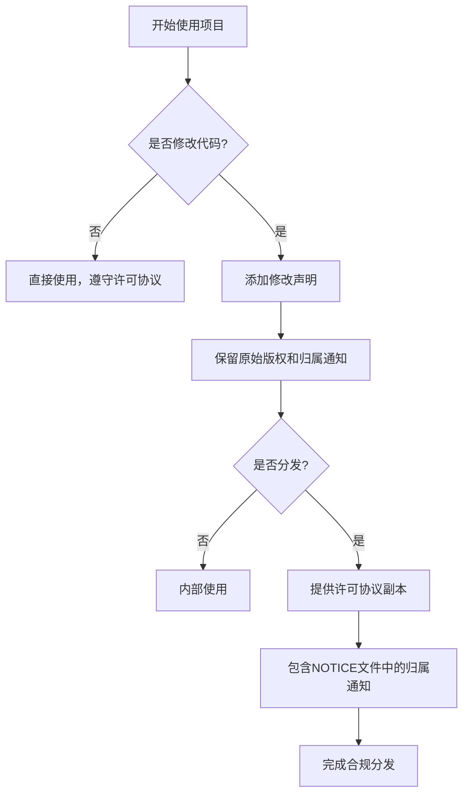
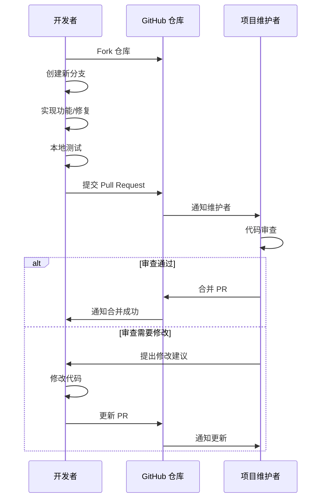

# 贡献与许可

<cite>
**Referenced Files in This Document**   
- [README.md](file://README.md)
- [PerfGarden.py](file://PerfGarden.py)
- [LICENSE](file://LICENSE)
</cite>

## 目录
1. [许可协议](#许可协议)
2. [社区贡献流程](#社区贡献流程)
3. [项目维护者信息](#项目维护者信息)
4. [协作机制](#协作机制)

## 许可协议

本项目遵循 Apache 2.0 许可协议，该协议允许用户自由使用、修改和分发代码，同时明确了相应的权利与限制。

**Section sources**
- [README.md](file://README.md#L230-L236)
- [LICENSE](file://LICENSE#L0-L201)

### 使用权利
根据 Apache 2.0 许可协议，您有权：
- **永久性、全球性**地使用本项目代码
- **无限制、免版税**地复制、修改和分发代码
- 将代码用于商业用途
- 创建衍生作品
- 在源代码或编译后的对象形式中分发作品

### 修改要求
当您修改本项目代码时，必须：
- 在所有修改过的文件中添加显著的声明，说明您更改了这些文件
- 保留原始作品中的所有版权、专利、商标和归属通知
- 如果原始作品包含 "NOTICE" 文本文件，则您分发的衍生作品也必须包含可读的归属通知副本

### 分发条件
分发本项目或其衍生作品时，您必须：
- 向任何接收者提供本许可协议的副本
- 可以为您自己的修改添加额外的许可条款
- 不能使用项目贡献者的名称、商标或服务标志进行推广，除非是为了合理描述作品来源

### 免责声明
本项目按“原样”提供，不提供任何形式的明示或暗示保证，包括但不限于适销性、特定用途适用性和非侵权性保证。使用者需自行承担使用风险。

### 专利授权
每个贡献者授予您一项永久的、全球性的、免版税的专利许可，允许您制造、使用、销售和进口本项目中由其贡献所必然侵犯的专利权利要求。

**Diagram sources**
- [LICENSE](file://LICENSE#L0-L201)

## 社区贡献流程

我们欢迎社区成员通过以下方式为项目做出贡献，共同推动项目发展。

### 提交问题报告（Issue）

当您发现项目中的问题或有改进建议时，请按照以下步骤提交 Issue：

1. 在 GitHub 仓库的 Issues 页面点击 "New Issue" 按钮
2. 选择合适的 Issue 模板（如 Bug 报告、功能请求等）
3. 详细描述问题现象、复现步骤和预期行为
4. 提供相关环境信息（Python 版本、OpenCV 版本等）
5. 如有可能，附上错误日志或截图

**Section sources**
- [README.md](file://README.md#L230-L236)

### 提交功能贡献（Pull Request）

通过 Pull Request 贡献新功能或修复 Bug 的流程如下：

1. Fork 本仓库到您的 GitHub 账户
2. 创建新的分支用于开发：`git checkout -b feature/your-feature-name`
3. 实现您的功能或修复
4. 确保代码符合项目风格要求
5. 提交更改并推送到您的分支
6. 在 GitHub 上创建 Pull Request，详细描述更改内容

### 代码风格要求

为保持代码一致性，请遵守以下代码风格规范：

- 使用 4 个空格进行缩进
- 遵循 PEP 8 Python 代码风格指南
- 函数和变量名使用小写字母和下划线（snake_case）
- 类名使用驼峰命名法（CamelCase）
- 添加适当的类型注解
- 为关键函数和类编写清晰的文档字符串

**Diagram sources**
- [PerfGarden.py](file://PerfGarden.py#L0-L592)

### 测试验证流程

为确保代码质量，所有贡献都应通过以下测试验证：

1. **单元测试**：为新功能编写相应的单元测试
2. **功能测试**：确保新功能按预期工作
3. **兼容性测试**：验证代码在不同环境下的兼容性
4. **性能测试**：确保代码不会显著影响性能

在提交 Pull Request 前，请确保所有现有测试都能通过，并且新代码有足够的测试覆盖。

## 项目维护者信息

本项目由以下人员维护：

- **主要开发者**：逊狼
- **AI 协助**：Claude-3.7-Sonnet 和 Deepseek-R1

项目基于 OpenCV 开发，特此对 OpenCV 项目表示诚挚感谢。

**Section sources**
- [README.md](file://README.md#L230-L236)

## 协作机制

为建立透明的协作机制，我们采取以下措施：

### 透明的开发流程
- 所有开发讨论都在公开的 Issues 和 Pull Requests 中进行
- 重大决策通过社区讨论达成共识
- 定期更新项目进展和未来规划

### 贡献者认可
- 在 README 文件中列出主要贡献者
- 为每个 Pull Request 的合并者添加贡献记录
- 定期发布贡献者感谢名单

### 沟通渠道
- GitHub Issues：用于报告问题和讨论功能需求
- GitHub Discussions：用于一般性讨论和技术交流
- Pull Requests：用于代码审查和合并

我们鼓励所有用户参与项目演进，共同打造一个高效、可靠的图像自动化框架。通过遵循开源规范，确保所有贡献都能为社区带来长期价值。

**Section sources**
- [README.md](file://README.md#L230-L236)