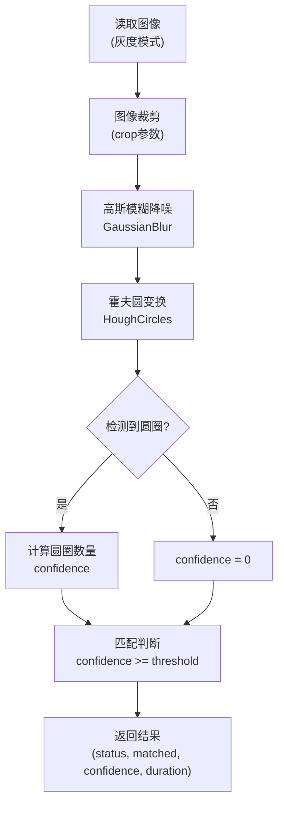

# blover任务（圆圈检测）

<cite>
**Referenced Files in This Document**   
- [PerfGarden.py](file://PerfGarden.py#L192-L263)
- [README.md](file://README.md#L138-L158)
</cite>

## 目录
1. [功能概述](#功能概述)
2. [核心参数详解](#核心参数详解)
3. [技术实现原理](#技术实现原理)
4. [实际应用案例](#实际应用案例)
5. [参数调优建议](#参数调优建议)
6. [常见失败模式与应对](#常见失败模式与应对)

## 功能概述

`blover`任务是Perf Garden框架中专门用于圆形目标检测的核心功能，基于霍夫变换（Hough Transform）算法实现。该功能专为识别图像中的圆形元素而设计，特别适用于检测仪表盘、按钮、加载动画中的旋转圆环等圆形特征。

与传统的模板匹配方法不同，`blover`不依赖于预定义的模板图像，而是通过数学方法直接在图像中寻找符合圆形特征的区域。这使得它在处理复杂背景或动态变化的圆形元素时具有显著优势，尤其适合识别那些无法通过静态模板匹配的场景。

**Section sources**
- [PerfGarden.py](file://PerfGarden.py#L192-L263)
- [README.md](file://README.md#L138-L158)

## 核心参数详解

### threshold（检测置信度阈值）
`threshold`参数定义了期望检测到的圆圈数量，必须为正整数。该参数不表示传统意义上的置信度阈值，而是作为目标圆圈数量的判断标准。当检测到的圆圈数量大于或等于`threshold`值时，判定为匹配成功。

例如，在检测单个上传加载动画时，通常设置`threshold=1`；若需同时检测多个仪表盘指针，则可根据实际情况设置更高的数值。

### crop（指定检测区域）
`crop`参数用于指定检测区域，通过裁剪图像来缩小搜索范围，提高检测效率和准确性。取值范围为-99到99：
- **正值**：从图像底部向上裁剪，保留底部指定百分比的区域，适用于检测底部按钮等元素
- **负值**：从图像顶部向下裁剪，保留顶部指定百分比的区域，适用于检测顶部标题或仪表盘
- **零值**：不进行裁剪，使用完整图像进行检测

### fade（渐进策略）
`fade`参数控制检测逻辑的模式：
- **false**：当目标圆圈首次出现时即判定为匹配成功，适用于检测"进入状态"
- **true**：需要目标圆圈先出现再消失才判定为匹配成功，适用于检测"完成状态"，如上传动画结束

### leap（跳跃处理间隔）
`leap`参数定义了图像序列的检查间隔。系统会每隔`leap`张图片进行一次检测，发现目标后自动回溯检查附近图片，既能大幅提升处理速度，又能确保不漏检关键帧。

**Section sources**
- [PerfGarden.py](file://PerfGarden.py#L192-L263)
- [README.md](file://README.md#L138-L158)

## 技术实现原理

**Diagram sources**
- [PerfGarden.py](file://PerfGarden.py#L192-L263)

**Section sources**
- [PerfGarden.py](file://PerfGarden.py#L192-L263)

### OpenCV HoughCircles调用细节

`blover`函数内部调用OpenCV的`cv2.HoughCircles`方法，关键参数映射关系如下：

| 霍夫变换参数 | 说明 | 推荐范围 |
|------------|------|---------|
| `dp=1` | 图像分辨率与累加器分辨率之比，1:1保持原始分辨率 | 通常保持为1 |
| `minDist=100` | 圆心间最小距离，防止重叠圆检测 | 根据目标间距调整 |
| `param1=90` | Canny边缘检测高阈值 | 50-150 |
| `param2=32` | 圆心累加器阈值 | 10-50 |
| `minRadius=20` | 目标最小半径 | 根据实际目标尺寸设置 |
| `maxRadius=25` | 目标最大半径 | 根据实际目标尺寸设置 |

这些参数共同决定了圆形检测的灵敏度和准确性，其中`param2`对检测结果影响最为显著。

**Section sources**
- [PerfGarden.py](file://PerfGarden.py#L241-L253)

## 实际应用案例

### 检测加载动画中的旋转圆环

在AI对话应用的性能测试中，`blover`可用于精确检测图片上传的加载动画。典型应用场景如下：

1. **任务配置**：设置`threshold=1`，因为通常只有一个加载圆环
2. **区域优化**：使用`crop=-50`裁剪顶部50%区域，聚焦于图片上传显示区域
3. **状态判断**：设置`fade=true`，检测圆环出现后消失的完整过程，确认上传完成
4. **效率提升**：配合`leap=2`实现智能间隔检测，大幅缩短处理时间

此方案能准确捕捉上传动画的起止时间点，为性能分析提供精确的时间戳。

**Section sources**
- [README.md](file://README.md#L208-L218)

## 参数调优建议

### 霍夫变换参数隐式设置的影响

`blover`函数中预设的霍夫变换参数对检测效果有重要影响：
- **`param2`值过小**：会导致检测过于宽松，可能出现假阳性（检测到不存在的圆）
- **`param2`值过大**：会使检测过于严格，可能导致漏检（错过真实的圆）
- **半径范围设置**：`minRadius`和`maxRadius`应根据实际目标尺寸精确设置，过宽的范围会增加计算负担

建议在实际使用前，通过少量样本图像进行参数调试，找到最佳平衡点。

### 调优策略
1. **初始调试**：在单张图像上调整`param2`值，观察检测结果
2. **范围优化**：根据目标圆的实际像素半径，精确设置`minRadius`和`maxRadius`
3. **性能平衡**：在保证准确性的前提下，适当调整`minDist`以提高处理速度

**Section sources**
- [PerfGarden.py](file://PerfGarden.py#L241-L253)

## 常见失败模式与应对

### 模糊导致检测遗漏
当图像模糊时，边缘信息不清晰，可能导致霍夫变换无法准确检测圆形。

**应对措施**：
- 适当降低`param1`和`param2`值，使边缘检测和圆心判定更宽松
- 确保输入图像具有足够分辨率
- 在预处理阶段适当增强图像对比度

### 遮挡导致检测失败
部分遮挡的圆形可能无法被完整识别。

**应对措施**：
- 调整`param2`值至较低水平，提高对不完整圆形的检测能力
- 结合`crop`参数，聚焦于可见区域
- 考虑使用更小的`minRadius`值，以适应部分可见的圆形特征

### 复杂背景干扰
背景中的圆形纹理可能产生误检。

**应对措施**：
- 精确设置`minRadius`和`maxRadius`，排除背景中的小圆形干扰
- 使用`crop`参数限定检测区域
- 适当提高`param2`值，增加检测的严格性

**Section sources**
- [PerfGarden.py](file://PerfGarden.py#L192-L263)
- [README.md](file://README.md#L138-L158)