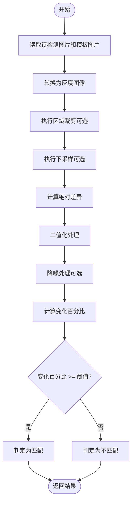
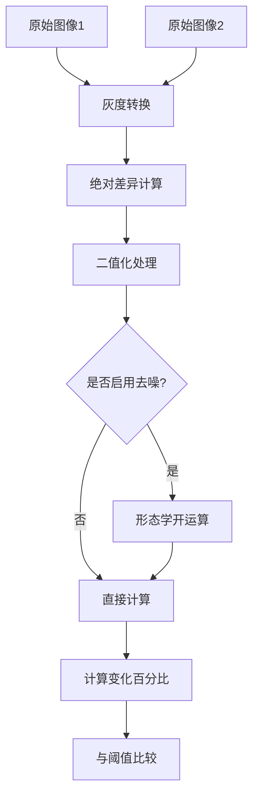

# cactus任务（图像差异检测）

<cite>
**Referenced Files in This Document**   
- [PerfGarden.py](file://PerfGarden.py)
- [README.md](file://README.md)
</cite>

## 目录
1. [简介](#简介)
2. [核心机制](#核心机制)
3. [参数详解](#参数详解)
4. [数学原理与处理逻辑](#数学原理与处理逻辑)
5. [配置示例与场景应用](#配置示例与场景应用)
6. [典型问题与解决方案](#典型问题与解决方案)
7. [性能考量](#性能考量)

## 简介

cactus任务是PerfGarden框架中的一种图像差异检测方法，专门用于识别连续帧之间的显著变化。该方法通过像素级差异分析，能够有效检测界面刷新、状态切换等动态场景，特别适用于AI对话中文字开始出现、页面内容加载等无法使用固定模板匹配的复杂识别场景。

**Section sources**
- [README.md](file://README.md#L150-L155)

## 核心机制

cactus任务的核心机制基于像素级差异分析，通过比较连续帧之间的差异来识别显著变化。当系统在YAML配置中未指定模板路径时，会自动将当前任务的第一张图片作为基准模板，这一设计使其在处理连续帧序列时表现出色。

该方法首先读取待检测图片和模板图片，进行灰度转换后计算两者的绝对差异。通过二值化处理将差异图转换为掩码，再计算变化区域占总像素的比例。当变化百分比超过预设阈值时，即判定为检测到显著变化。



**Diagram sources**
- [PerfGarden.py](file://PerfGarden.py#L100-L180)

**Section sources**
- [PerfGarden.py](file://PerfGarden.py#L100-L180)
- [README.md](file://README.md#L150-L155)

## 参数详解

### threshold（差异阈值）
差异阈值控制检测的灵敏度，取值范围为0~100，默认值为1.0。该参数表示差异百分比的阈值，当图片差异区域超过此值时判定为检测成功。对于加载动画等大范围变化场景，建议适当提高阈值；对于细微变化检测，则应降低阈值以提高灵敏度。

### crop（区域裁剪）
区域裁剪用于限定差异计算的区域，以提高检测效率和准确性。取值范围为-99~99，正值表示从底部向上裁剪并保留底部指定百分比，适合检测底部按钮等元素；负值表示从顶部向下裁剪并保留顶部指定百分比，适合检测顶部标题等元素；设为0则不进行裁剪，使用完整图片。

### enable_denoising（启用去噪）
是否启用去噪预处理以减少误报，布尔值，默认为false。启用后会使用形态学开运算去除小的噪声点，但可能降低对细微变化的敏感度。在高频噪声导致误触发的场景下，建议启用此功能。

### acceleration（加速模式）
加速模式开关，控制处理速度与精度的权衡，取值为1、2或4，默认为2。该参数表示下采样加速倍数，值越大处理越快但精度越低。在对精度要求不高的场景下，可适当提高加速倍数以提升处理速度。

**Section sources**
- [README.md](file://README.md#L170-L180)
- [PerfGarden.py](file://PerfGarden.py#L105-L115)

## 数学原理与处理逻辑

cactus任务的差异计算基于以下数学原理：首先将两张图片转换为灰度图，然后计算对应像素点的绝对差异值。通过OpenCV的`cv2.absdiff`函数实现像素级差异计算，得到差异图后使用`cv2.threshold`函数进行二值化处理，将差异值大于3的像素点标记为255（白色），其余标记为0（黑色）。

去噪处理采用形态学开运算，通过`cv2.morphologyEx`函数配合2x2的结构元素内核，先进行腐蚀操作去除孤立的噪声点，再进行膨胀操作恢复主要特征的大小。这种预处理能有效减少高频噪声导致的误报，同时保留主要的变化区域。

最终的变化百分比通过计算差异掩码中非零像素点的数量占总像素数的比例得到，公式为：`changed_percentage = np.count_nonzero(diff_mask) / diff_mask.size * 100`。



**Diagram sources**
- [PerfGarden.py](file://PerfGarden.py#L140-L160)

**Section sources**
- [PerfGarden.py](file://PerfGarden.py#L140-L160)

## 配置示例与场景应用

### 基础配置
最简单的cactus配置无需任何参数，系统会自动使用第一张图片作为模板：
```yaml
- cactus:  # 就这么简单！自动检测图像变化
```

### 界面刷新检测
检测页面内容开始加载，可适当提高阈值以适应大范围变化：
```yaml
- cactus:
    threshold: 5.0  # 提高阈值以适应加载动画
    crop: -30       # 只检测顶部30%区域
```

### 状态切换检测
检测AI对话中文字开始出现，需要高灵敏度：
```yaml
- cactus:
    threshold: 0.5   # 降低阈值以提高灵敏度
    enable_denoising: true  # 启用去噪减少误报
    acceleration: 1  # 关闭加速以保证精度
```

### 性能优化配置
在对精度要求不高的场景下，可启用加速模式：
```yaml
- cactus:
    threshold: 2.0
    acceleration: 4  # 4倍加速，牺牲精度换取速度
```

**Section sources**
- [README.md](file://README.md#L200-L230)

## 典型问题与解决方案

### 高频噪声导致误触发
当检测环境存在高频噪声（如屏幕闪烁、压缩伪影）时，可能导致cactus任务频繁误触发。解决方案是启用去噪功能，通过形态学开运算去除小的噪声点：
```yaml
- cactus:
    enable_denoising: true
    threshold: 1.5
```

### 大范围加载动画误判
对于包含大面积加载动画的场景，可能因变化区域过大而导致误判。解决方案是结合区域裁剪，只关注关键区域的变化：
```yaml
- cactus:
    threshold: 8.0
    crop: -20  # 只检测顶部20%区域，避开加载动画
```

### 细微变化检测失败
当需要检测非常细微的变化（如单个字符出现）时，可能因阈值过高而检测失败。解决方案是降低阈值并关闭加速模式：
```yaml
- cactus:
    threshold: 0.3
    acceleration: 1
    enable_denoising: false
```

**Section sources**
- [README.md](file://README.md#L175-L180)

## 性能考量

cactus任务在设计上充分考虑了性能与精度的平衡。通过下采样加速、区域裁剪等技术，能够在保证检测准确性的前提下大幅提升处理速度。在实际测试中，配合多线程处理，系统能在1秒内完成上百张图片的分析。

对于大规模图像处理任务，建议根据具体场景调整参数配置：在对精度要求高的场景下，可关闭加速模式并启用去噪；在对速度要求高的场景下，可适当提高加速倍数并放宽阈值。同时，合理使用区域裁剪不仅能提高检测效率，还能有效减少误报。

**Section sources**
- [README.md](file://README.md#L240-L250)