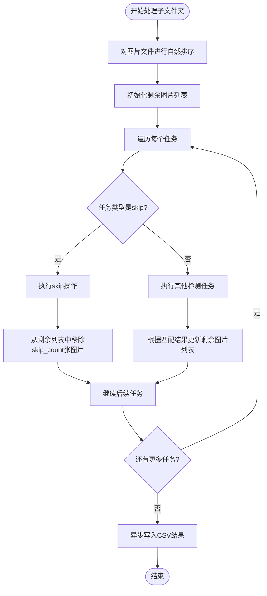

# skip任务（跳过图片）

<cite>
**本文档引用文件**   
- [PerfGarden.py](file://PerfGarden.py)
- [README.md](file://README.md)
</cite>

## 目录
1. [简介](#简介)
2. [核心功能](#核心功能)
3. [参数详解](#参数详解)
4. [任务调度逻辑](#任务调度逻辑)
5. [配置示例](#配置示例)
6. [使用建议](#使用建议)

## 简介
skip任务是Perf Garden框架中的流程控制机制，用于跳过指定数量的图片帧以实现非连续处理。该功能特别适用于处理高帧率视频分帧时减少计算量，通过跳过无用时间段、加载动画或过渡帧来提高处理效率。

**Section sources**
- [README.md](file://README.md#L110-L117)

## 核心功能
skip任务作为流程控制指令，其主要作用是跳过指定数量的图片帧，从而实现非连续处理。当处理高帧率视频分帧时，该功能可以显著减少需要处理的图片数量，降低计算量和处理时间。

在任务执行流程中，skip操作会直接从当前剩余图片列表中移除指定数量的图片，后续任务将从跳过后的图片开始处理。这种机制使得用户可以灵活地跳过已知的无用时间段，如应用启动加载、页面过渡动画等，专注于关键帧的检测。

**Section sources**
- [PerfGarden.py](file://PerfGarden.py#L477-L609)
- [README.md](file://README.md#L110-L117)

## 参数详解
### skip_count参数
skip_count参数定义了需要跳过的图片帧数，是skip任务的核心参数。

- **数据类型**：正整数
- **取值范围**：大于等于0
- **默认值**：无（必须显式指定）
- **功能说明**：指定要跳过的图片数量。当skip_count大于剩余图片数量时，系统会自动调整为剩余图片的总数。

在YAML配置文件中，skip任务的配置格式为：
```yaml
- skip: 10  # 跳过10张图片
```

**Section sources**
- [PerfGarden.py](file://PerfGarden.py#L520-L520)
- [PerfGarden.py](file://PerfGarden.py#L384-L474)

## 任务调度逻辑
skip任务的执行逻辑集成在process_subfolder函数中，与其他检测任务按顺序执行。其影响主要体现在后续任务的起始位置上。



**Diagram sources **
- [PerfGarden.py](file://PerfGarden.py#L477-L609)

**Section sources**
- [PerfGarden.py](file://PerfGarden.py#L477-L609)

## 配置示例
以下示例展示了如何将skip任务与其他检测任务组合使用：

```yaml
- path: "C:/test/samples"

- cattail:
    - template: "C:/templates/button.jpg"

- skip: 10  # 每跳过10帧

- cactus:  # 执行模板匹配

- cattail:
    - template: "C:/templates/next_button.jpg"
    - threshold: 0.8
    - crop: 50
    - fade: false
    - leap: 2
```

在此配置中，系统首先执行cattail任务检测按钮，然后跳过10张图片，接着执行cactus任务检测图像变化，最后再执行另一个cattail任务。这种组合方式可以有效减少处理时间，同时确保关键帧的检测。

**Section sources**
- [README.md](file://README.md#L110-L117)

## 使用建议
1. **合理设置跳过数量**：根据视频帧率和应用场景合理设置skip_count值。对于30fps的视频，跳过10帧约等于跳过0.33秒的内容。

2. **避免过度跳过**：过度跳过可能导致关键帧遗漏，特别是在需要精确时间点检测的场景中。建议在确保不会错过关键事件的前提下使用skip功能。

3. **与其他优化技术结合**：可以将skip任务与crop（区域裁剪）、leap（智能间隔）等其他优化技术结合使用，进一步提高处理效率。

4. **测试验证**：在实际使用前，建议对skip_count值进行测试验证，确保跳过操作不会影响最终的检测结果准确性。

5. **监控剩余图片**：当剩余图片数量不足时，系统会自动调整skip_count值，但仍需注意避免因过度跳过导致后续任务无法执行。

**Section sources**
- [README.md](file://README.md#L110-L117)
- [PerfGarden.py](file://PerfGarden.py#L477-L609)