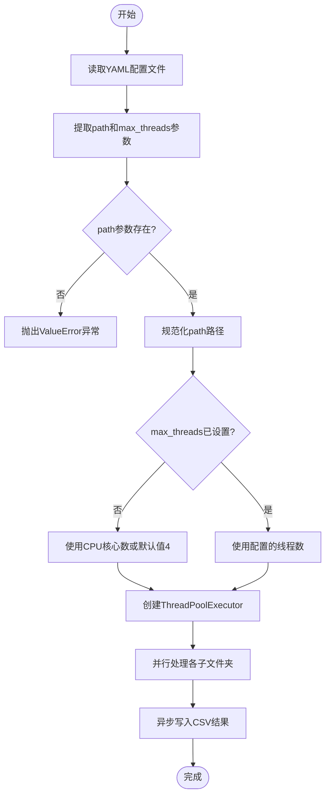

# 全局参数

<cite>
**Referenced Files in This Document**   
- [PerfGarden.py](file://PerfGarden.py)
- [README.md](file://README.md)
</cite>

## 目录
1. [全局参数](#全局参数)
2. [path参数详解](#path参数详解)
3. [max_threads参数详解](#max_threads参数详解)
4. [参数解析与多线程框架集成](#参数解析与多线程框架集成)
5. [常见配置错误与错误处理](#常见配置错误与错误处理)
6. [性能调优建议](#性能调优建议)

## path参数详解

`path`参数是YAML配置文件中的核心全局参数，用于定义待处理图片的根目录路径。该参数决定了任务的处理范围和CSV结果文件的输出位置。在配置时，必须使用引号包裹路径，并确保使用正确的斜杠格式（正斜杠`/`而非反斜杠`\`），以避免路径解析错误。

该参数支持绝对路径和相对路径两种格式。绝对路径提供明确的文件系统定位，而相对路径则相对于YAML配置文件的位置进行解析。当`gate_from_yaml`函数解析配置时，会使用`os.path.normpath`函数对路径进行规范化处理，确保跨平台兼容性。

如果YAML配置中未指定`path`参数，系统将抛出`ValueError`异常，提示"YAML配置中未指定母文件夹路径"，确保任务不会在错误的目录下执行。

**Section sources**
- [PerfGarden.py](file://PerfGarden.py#L394-L398)
- [README.md](file://README.md#L122)

## max_threads参数详解

`max_threads`参数控制并发处理的线程数量，直接影响系统的性能和资源占用。该参数设置多线程处理框架中线程池的最大工作线程数，允许系统并行处理多个子文件夹的任务，从而大幅提升处理速度。

当未在YAML配置中指定`max_threads`时，系统会自动采用默认值，即`os.cpu_count() or 4`，优先使用CPU核心数作为线程数，确保充分利用硬件资源。该参数的合理配置需要根据具体硬件环境进行调整：在多核处理器上可以设置较高的线程数以最大化并行性能，而在资源受限的环境中则应适当降低线程数以避免系统过载。

**Section sources**
- [PerfGarden.py](file://PerfGarden.py#L401-L403)
- [README.md](file://README.md#L123)

## 参数解析与多线程框架集成

`path`和`max_threads`参数通过`gate_from_yaml`函数被解析并集成到多线程处理框架中。该函数首先读取YAML配置文件，然后遍历配置项提取这两个全局参数。`path`参数被提取后存储在`parent_folder`变量中，用于后续确定处理范围和结果文件位置。

提取的`max_threads`参数随后被传递给`gate_multi_thread`函数，该函数使用`concurrent.futures.ThreadPoolExecutor`创建线程池，并将`max_threads`作为`max_workers`参数。这使得系统能够根据配置的线程数并行处理各个子文件夹，实现高效的批量图像处理。

**Diagram sources**
- [PerfGarden.py](file://PerfGarden.py#L384-L474)
- [PerfGarden.py](file://PerfGarden.py#L667-L705)

**Section sources**
- [PerfGarden.py](file://PerfGarden.py#L384-L474)

## 常见配置错误与错误处理

常见的配置错误包括路径不存在和线程数设置为非正整数。当`path`参数指向的目录不存在时，`os.scandir`在获取子文件夹时会抛出异常，导致任务无法执行。系统通过在`gate_from_yaml`函数中检查`parent_folder`是否为`None`来验证路径配置，若未指定路径则立即抛出`ValueError`异常。

对于`max_threads`参数，虽然系统允许任何正整数，但设置过高的线程数可能导致系统资源耗尽。系统在`gate_multi_thread`函数中直接使用该值作为线程池大小，如果设置为非正整数，`ThreadPoolExecutor`会抛出相应的异常。为避免此类问题，建议根据实际CPU核心数合理设置线程数，一般不超过CPU核心数的2-3倍。

**Section sources**
- [PerfGarden.py](file://PerfGarden.py#L447-L451)
- [PerfGarden.py](file://PerfGarden.py#L685-L688)

## 性能调优建议

为获得最佳性能，建议根据硬件环境调整`max_threads`参数。在多核处理器上，可将线程数设置为CPU核心数，以充分利用并行处理能力。对于大量小文件的处理场景，适当增加线程数可显著提升吞吐量。然而，在I/O密集型任务中，过多的线程可能导致上下文切换开销增加，反而降低性能。

对于`path`参数，建议将图片文件存储在高速存储设备上，并确保目录结构清晰。为提高处理效率，可预先对图片进行尺寸压缩，特别是对于手机截屏，将宽度缩小至720像素通常能在保持识别质量的同时大幅提升处理速度。同时，合理组织文件夹结构，避免单个目录包含过多文件，有助于提高文件系统访问效率。

**Section sources**
- [README.md](file://README.md#L254-L260)