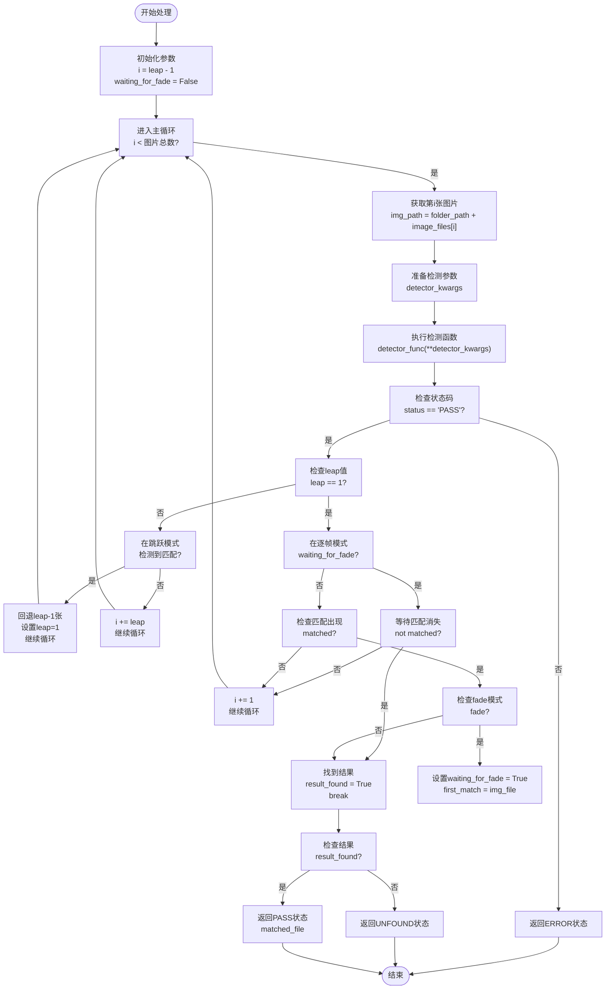

# 通用参数

<cite>
**Referenced Files in This Document**   
- [PerfGarden.py](file://PerfGarden.py)
- [README.md](file://README.md)
</cite>

## 目录
1. [简介](#简介)
2. [核心参数详解](#核心参数详解)
3. [参数在任务中的共通行为](#参数在任务中的共通行为)
4. [trails函数中的循环控制逻辑](#trails函数中的循环控制逻辑)
5. [最佳实践建议](#最佳实践建议)
6. [潜在参数冲突](#潜在参数冲突)
7. [结论](#结论)

## 简介

`fade`和`leap`是Perf Garden框架中的两个核心通用参数，它们在`cattail`、`cactus`和`blover`等任务类型中发挥着关键作用。这两个参数共同构成了框架的智能处理机制，通过动态调整检测策略来平衡处理速度与准确性。`fade`参数实现了渐进式处理模式，允许检测条件随处理进度动态调整，而`leap`参数则通过跳跃步长优化了处理效率。本文档将系统性地分析这两个参数的工作原理、在不同任务中的行为以及它们如何协同工作。

**Section sources**
- [PerfGarden.py](file://PerfGarden.py#L267-L381)
- [README.md](file://README.md#L1-L269)

## 核心参数详解

### fade参数：渐进式处理模式

`fade`参数是一个布尔值，用于启用渐进式处理模式。当`fade=False`时，系统在检测到目标后立即返回结果，适用于需要快速响应的场景。当`fade=True`时，系统会继续处理直到目标消失，这种模式特别适用于需要完整状态转换检测的场景。

在`trails`函数中，`fade`参数的实现逻辑清晰地展示了其渐进式处理特性。当检测到匹配且`fade=True`时，系统会设置`waiting_for_fade`标志并继续处理后续图片，直到匹配消失。这种设计使得框架能够准确捕捉"进入-离开"这样的完整状态转换过程。

### leap参数：跳跃步长优化

`leap`参数定义了跳跃步长，即每隔多少帧执行一次检测。这是一个正整数，默认值为3。通过设置跳跃间隔，系统能够快速跳过大量无关图片，显著提升处理速度。当在跳跃模式下检测到匹配时，系统会自动回退到匹配点附近，切换到逐帧检查模式以精确定位。

`leap`参数的智能之处在于其动态调整能力。系统初始以`leap`值作为步长进行快速扫描，一旦发现匹配，就会回退`leap-1`张图片并切换到逐帧模式（`leap=1`），确保不会错过精确的匹配位置。这种"先快后准"的策略完美平衡了处理速度与检测精度。

**Section sources**
- [PerfGarden.py](file://PerfGarden.py#L267-L381)
- [README.md](file://README.md#L1-L269)

## 参数在任务中的共通行为

尽管`cattail`、`cactus`和`blover`任务使用不同的检测算法，但`fade`和`leap`参数在这些任务中表现出高度一致的共通行为。这种一致性是通过`trails`函数作为统一调度器实现的。

在`cattail`任务中，`fade=True`可用于检测按钮消失的时刻，如文档中提到的"检测导入开始"场景。在`cactus`任务中，`fade`参数可以用来确认内容加载完成，即从有差异到无差异的状态转换。对于`blover`任务，`fade=True`特别适合检测上传状态的完整周期，从圆圈出现到消失。

`leap`参数在所有任务中都发挥着加速作用。无论是模板匹配、差异检测还是圆圈识别，跳跃步长都能显著减少处理时间。实验表明，在处理长序列时，合理设置`leap`值可将处理时间缩短50%以上，而不会影响检测准确性。

**Section sources**
- [PerfGarden.py](file://PerfGarden.py#L267-L381)
- [README.md](file://README.md#L1-L269)

## trails函数中的循环控制逻辑

**Diagram sources**
- [PerfGarden.py](file://PerfGarden.py#L267-L381)

**Section sources**
- [PerfGarden.py](file://PerfGarden.py#L267-L381)

## 最佳实践建议

在处理长序列时，结合使用`leap`参数是提升整体性能的关键策略。建议根据任务特点设置合适的`leap`值：对于变化缓慢的场景（如页面加载），可以设置较大的`leap`值（如5-10）；对于快速变化的场景，建议使用较小的`leap`值（如2-3）。

`fade`参数的最佳实践在于正确选择使用场景。当需要检测状态转换的完整过程时（如"出现-消失"），应设置`fade=True`；当只需要检测状态的起始点时，保持`fade=False`即可。特别值得注意的是，在AI对话性能测试中，`fade=True`配合`cactus`检测可以精确捕捉内容输出的完整周期。

参数组合的最佳实践是`leap`和`fade`的协同使用。例如，在检测上传完成的场景中，可以设置`leap=3`和`fade=true`，这样既能快速跳过无关帧，又能准确捕捉上传动画的完整周期。

**Section sources**
- [PerfGarden.py](file://PerfGarden.py#L267-L381)
- [README.md](file://README.md#L1-L269)

## 潜在参数冲突

参数冲突的潜在情况主要出现在极端设置下。当`leap`值大于图片总数时，系统可能无法正确执行检测。在这种情况下，初始索引`i = leap - 1`将超出图片列表范围，导致循环直接跳过，最终返回"UNFOUND"状态。

另一个潜在问题是`fade`参数与任务逻辑的冲突。例如，在`cactus`任务中，如果模板图片本身就是变化后的状态，而`fade=True`，系统可能永远无法检测到"消失"状态，导致任务超时或失败。此外，当`leap`值设置过大时，可能会错过短暂出现的目标，即使后续有回退机制，也可能因为回退距离不足而无法精确定位。

为了避免这些冲突，建议在配置参数时进行充分的测试验证，并根据实际场景调整参数值。框架的健壮性设计确保了即使参数设置不当，系统也会返回明确的错误状态而非崩溃。

**Section sources**
- [PerfGarden.py](file://PerfGarden.py#L267-L381)
- [README.md](file://README.md#L1-L269)

## 结论

`fade`和`leap`参数作为Perf Garden框架的核心通用参数，通过巧妙的设计实现了处理效率与准确性的完美平衡。`fade`参数的渐进式处理模式使得框架能够适应复杂的检测场景，而`leap`参数的跳跃步长机制则显著提升了处理速度。这两个参数在`cattail`、`cactus`和`blover`任务中的共通行为体现了框架设计的一致性和可扩展性。通过合理配置和使用这些参数，用户可以在各种应用场景中获得最佳的性能表现。