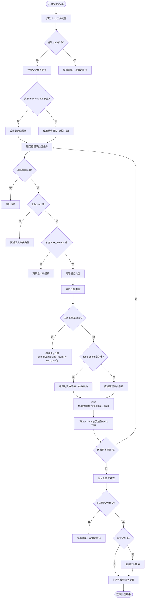

# 配置文件说明

<cite>
**Referenced Files in This Document**   
- [PerfGarden.py](file://PerfGarden.py)
- [README.md](file://README.md)
</cite>

## 目录
1. [全局参数](#全局参数)
2. [任务类型配置](#任务类型配置)
3. [完整YAML示例](#完整yaml示例)
4. [配置解析机制](#配置解析机制)

## 全局参数

全局参数定义了任务处理的基本环境和范围，必须在配置文件的开头部分进行设置。

### path（待处理图片根目录）
- **数据类型**: 字符串 (string)
- **是否必填**: 是
- **默认值**: 无
- **取值范围**: 有效的文件系统路径
- **说明**: 指定包含所有待处理子文件夹的根目录路径。所有任务将在此目录下的各个子文件夹中执行。路径应使用正斜杠 `/` 或双反斜杠 `\\`，并建议用引号包围以避免解析错误。

**Section sources**
- [README.md](file://README.md#L35-L61)
- [PerfGarden.py](file://PerfGarden.py#L292-L297)

### max_threads（并发线程数）
- **数据类型**: 整数 (integer)
- **是否必填**: 否
- **默认值**: 系统CPU核心数（最少为4）
- **取值范围**: 正整数
- **说明**: 控制并行处理的线程数量。每个线程独立处理一个子文件夹，增加线程数可显著提升处理速度，但会占用更多系统资源。若未指定，系统将自动使用CPU核心数作为线程数。

**Section sources**
- [README.md](file://README.md#L35-L61)
- [PerfGarden.py](file://PerfGarden.py#L300-L303)

## 任务类型配置

任务列表按顺序定义了在每个子文件夹中要执行的具体操作。任务将按配置顺序依次执行，后续任务使用前一个任务处理后剩余的图片。

### cattail任务（模板匹配）
`cattail`任务通过模板匹配技术在图片序列中查找特定图像。

- **template** (模板图像路径)
  - **数据类型**: 字符串 (string)
  - **是否必填**: 是
  - **默认值**: 无
  - **取值范围**: 有效的文件系统路径
  - **说明**: 指向用于匹配的模板图片文件路径。模板应从目标图片中精确裁剪获得，以确保最佳匹配效果。

- **threshold** (匹配阈值)
  - **数据类型**: 浮点数 (float)
  - **是否必填**: 否
  - **默认值**: 0.9
  - **取值范围**: 0.0 ~ 1.0
  - **说明**: 匹配的可信度阈值。值越接近1.0，要求匹配越精确。通常准确匹配在0.9以上。

- **crop** (裁剪区域)
  - **数据类型**: 整数 (integer)
  - **是否必填**: 否
  - **默认值**: 0
  - **取值范围**: -99 ~ 99
  - **说明**: 图像裁剪比例。正值表示从底部向上保留指定百分比（如 `50` 保留底部50%），负值表示从顶部向下保留指定百分比（如 `-30` 保留顶部30%），0表示不裁剪。

- **fade** (目标消失检测)
  - **数据类型**: 布尔值 (boolean)
  - **是否必填**: 否
  - **默认值**: false
  - **取值范围**: true / false
  - **说明**: 当设置为 `true` 时，任务会检测目标出现后消失的时刻，适用于"离开页面"等场景；`false` 则检测目标首次出现。

- **leap** (检查间隔)
  - **数据类型**: 整数 (integer)
  - **是否必填**: 否
  - **默认值**: 3
  - **取值范围**: 正整数
  - **说明**: 智能检查间隔。系统会每隔 `leap` 张图片检查一次，发现匹配后自动回溯到附近逐张检查，既保证不漏检又大幅提升速度。

**Section sources**
- [README.md](file://README.md#L35-L61)
- [PerfGarden.py](file://PerfGarden.py#L13-L84)

### blover任务（圆圈检测）
`blover`任务使用霍夫变换检测图片中的圆形元素，特别适用于识别加载动画等圆形图标。

- **threshold** (匹配圆数量)
  - **数据类型**: 整数 (integer)
  - **是否必填**: 否
  - **默认值**: 1
  - **取值范围**: 正整数
  - **说明**: 期望检测到的圆圈数量。系统会判断检测到的圆圈数是否等于或大于此阈值。

- **crop** (裁剪区域)
  - **数据类型**: 整数 (integer)
  - **是否必填**: 否
  - **默认值**: 0
  - **取值范围**: -99 ~ 99
  - **说明**: 与`cattail`任务相同，用于指定图像裁剪区域，提高检测效率和准确性。

- **fade** (目标消失检测)
  - **数据类型**: 布尔值 (boolean)
  - **是否必填**: 否
  - **默认值**: false
  - **取值范围**: true / false
  - **说明**: 与`cattail`任务相同，用于检测目标出现后消失的场景。

- **leap** (检查间隔)
  - **数据类型**: 整数 (integer)
  - **是否必填**: 否
  - **默认值**: 3
  - **取值范围**: 正整数
  - **说明**: 与`cattail`任务相同，用于设置智能检查间隔。

**Section sources**
- [README.md](file://README.md#L35-L61)
- [PerfGarden.py](file://PerfGarden.py#L89-L160)

### skip任务（跳过帧数）
`skip`任务用于跳过指定数量的图片，适用于处理开始阶段的无用帧或过渡动画。

- **skip** (跳过图片数)
  - **数据类型**: 整数 (integer)
  - **是否必填**: 是
  - **默认值**: 无
  - **取值范围**: 正整数
  - **说明**: 指定要跳过的图片数量。执行此任务后，后续任务将从剩余图片中继续处理。

**Section sources**
- [README.md](file://README.md#L35-L61)
- [PerfGarden.py](file://PerfGarden.py#L292-L329)

## 完整YAML示例

```yaml
- path: "C:/Users/Blind/Documents/samples" # 总文件夹路径
- max_threads: 8 # 最大并发线程数

- cattail: # 任务1：模板匹配
    - template: "C:/Users/Blind/Documents/templates/button.jpg" # 模板路径
    - threshold: 0.8 # 匹配阈值
    - crop: 50 # 裁剪底部50%
    - fade: false # 检测目标出现
    - leap: 2 # 每2张图检查一次

- skip: 10 # 任务2：跳过前10张图片

- blover: # 任务3：圆圈检测
    - threshold: 1 # 检测1个圆圈
    - crop: -30 # 裁剪顶部30%
    - fade: true # 检测目标出现后消失
    - leap: 3 # 每3张图检查一次
```

**Section sources**
- [README.md](file://README.md#L35-L61)

## 配置解析机制

配置解析的核心函数 `gate_from_yaml` 负责将YAML配置文件转化为内部可执行的任务队列。



**Diagram sources**
- [PerfGarden.py](file://PerfGarden.py#L275-L359)

**Section sources**
- [PerfGarden.py](file://PerfGarden.py#L275-L359)