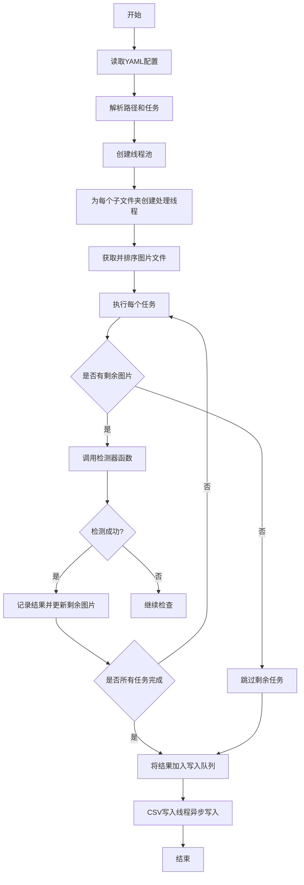

# 项目概述

<cite>
**本文档引用的文件**
- [PerfGarden.py](file://PerfGarden.py)
- [README.md](file://README.md)
</cite>

## 目录
1. [项目简介](#项目简介)
2. [设计目标与核心架构](#设计目标与核心架构)
3. [主要特性](#主要特性)
4. [目标用户群体](#目标用户群体)
5. [系统工作流程](#系统工作流程)
6. [核心检测方法原理](#核心检测方法原理)
7. [实际使用案例](#实际使用案例)
8. [技术栈](#技术栈)
9. [初学者指引](#初学者指引)

## 项目简介

性能花园（Perf Garden）是一个基于 Python 与 OpenCV 的高效图像自动化框架，专为批量图像识别设计。该项目旨在解决"录屏分帧打标"测试 APP 性能等场景中的人工机械操作问题。通过采用优化的 OpenCV 算法，配合多线程、智能间隔、跳过识别和裁剪等加速策略，Perf Garden 能在 1 秒内识别上百张图片，远快于传统人工或 OCR 识别方式。

该项目不仅速度快，还能适应多种使用场景，支持流水线和多线程处理，让大量图像任务变得轻松自如。其核心价值在于将复杂的图像分析任务自动化，帮助用户从繁琐的重复性工作中解放出来，专注于更有价值的分析工作。

**Section sources**
- [README.md](file://README.md#L1-L20)

## 设计目标与核心架构

性能花园的设计目标是创建一个高效、智能且稳健的图像自动化处理工具。其核心架构理念是通过 YAML 配置驱动的任务编排系统，实现灵活的任务定义和执行。系统采用模块化设计，将不同的图像检测方法封装为独立的检测器，通过统一的调度接口进行调用。

架构上，项目采用多线程并行处理机制，能够同时处理多个子文件夹中的图像任务，充分利用多核处理器的计算能力。每个子文件夹的处理任务在独立线程中执行，确保任务间的隔离性和稳定性。系统还实现了异常处理机制，单个任务出错不会影响整体流程，同时实时将结果写入 CSV 报告，确保工作进度不会丢失。

**Section sources**
- [README.md](file://README.md#L21-L50)
- [PerfGarden.py](file://PerfGarden.py#L660-L728)

## 主要特性

性能花园具备多项核心特性，使其成为强大的图像自动化处理工具：

- **多线程并行处理**：支持多线程并发执行，可根据处理器性能合理配置最大线程数，大幅提升处理速度。
- **多种图像检测方法**：支持模板匹配（cattail）、图像差异检测（cactus）和圆圈检测（blover）等多种检测方法，适应不同场景需求。
- **YAML 配置驱动**：通过 YAML 配置文件定义任务流程，支持自上而下依次执行所有任务，配置灵活且易于维护。
- **CSV 报告生成**：实时将处理结果写入 CSV 文件，便于后续分析和数据导出。
- **智能任务调度**：支持"智能间隔"功能，通过设置 leap 参数实现每隔几张图片检测一次，发现目标后自动回溯检查，大幅提升处理速度且不会漏检。
- **状态变化检测**：通过 fade 参数支持检测目标的出现和消失，适用于页面进入/离开等场景的判断。

**Section sources**
- [README.md](file://README.md#L51-L80)
- [PerfGarden.py](file://PerfGarden.py#L384-L474)

## 目标用户群体

性能花园主要面向以下三类用户群体：

- **性能测试工程师**：可用于测试 APP 的响应时间、界面状态变化等性能指标，特别是在 AI 对话、图片上传等动态场景的性能分析中发挥重要作用。
- **自动化脚本开发者**：可作为图像自动化处理的基础框架，集成到更复杂的自动化测试系统中，实现录屏分帧打标等任务的自动化。
- **图像分析人员**：适用于需要批量处理和分析图像序列的场景，如监控视频分析、实验数据图像处理等。

这些用户群体通常需要处理大量图像数据，对处理速度和准确性有较高要求，而性能花园正好满足了这些需求。

**Section sources**
- [README.md](file://README.md#L81-L90)

## 系统工作流程

性能花园的系统工作流程从 YAML 配置解析开始，经过多线程任务调度，到检测策略执行与结果异步写入，形成一个完整的自动化处理闭环。

首先，系统通过 `gate_from_yaml` 函数读取 YAML 配置文件，解析出母文件夹路径、最大线程数和任务列表。然后，`gate_multi_thread` 函数创建线程池，为每个子文件夹分配独立的处理线程。在每个线程中，`process_subfolder` 函数负责处理该子文件夹的所有任务。

任务处理的核心是 `trails` 函数，它根据配置的检测方法（cattail、cactus 或 blover）和参数，对图像序列进行分析。检测结果通过队列异步写入 CSV 文件，由独立的 `csv_writer_worker` 线程负责写入操作，确保主处理线程不会被 I/O 操作阻塞。

整个流程体现了生产者-消费者模式的设计思想，实现了计算与 I/O 的分离，保证了系统的高效性和稳定性。

**Diagram sources**
- [PerfGarden.py](file://PerfGarden.py#L384-L474)
- [PerfGarden.py](file://PerfGarden.py#L660-L728)
- [PerfGarden.py](file://PerfGarden.py#L477-L609)

## 核心检测方法原理

性能花园实现了三种核心检测方法，每种方法都有其特定的应用场景和工作原理。

### 模板匹配（cattail）

模板匹配是"在大图中找小图"的技术，基于 OpenCV 优化的滑动窗口算法。系统将待检测图片和模板图片转换为灰度图，然后使用 `cv2.matchTemplate` 函数计算模板在大图中的匹配程度。返回的匹配值在 0 到 1 之间，值越接近 1 表示匹配度越高。该方法适合识别按钮、图标或标题等固定元素，但对图像大小和角度较为敏感。

### 图像差异检测（cactus）

图像差异检测通过比较两张图片的像素级差异来检测变化。系统首先对两张图片进行相同的预处理（如裁剪），然后计算它们的绝对差异，通过二值化处理得到差异区域掩码。最后统计差异像素占总像素的比例，当超过设定阈值时判定为检测成功。该方法特别适合检测内容开始输出等动态场景，且大多数情况下无需配置模板。

### 圆圈检测（blover）

圆圈检测基于 OpenCV 的霍夫变换数学原理，能够在复杂背景中快速识别圆形。系统先对图片进行高斯模糊降噪，然后应用霍夫圆变换检测图像中的圆圈。该方法特别适合"图片上传"场景，当页面只有加载中的圆圈动画且背景复杂时，能够有效识别上传状态。

**Section sources**
- [README.md](file://README.md#L120-L200)
- [PerfGarden.py](file://PerfGarden.py#L14-L85)
- [PerfGarden.py](file://PerfGarden.py#L88-L187)
- [PerfGarden.py](file://PerfGarden.py#L192-L263)

## 实际使用案例

性能花园在实际应用中有多种使用场景，以下是两个典型的案例说明。

### AI 对话响应时间分析

在分析 AI 对话响应时间的场景中，可以通过以下步骤进行性能测试：
1. 使用 cattail 方法检测用户发送消息后，发送按钮消失的时刻（fade=true），作为计时起点。
2. 使用 cactus 方法检测对话界面开始出现文字气泡的变化，作为内容开始输出的标志。
3. 再次使用 cattail 方法检测 AI 完成回复后分享图标出现的时刻，作为计时终点。

通过这三个关键时间点，可以精确计算出 AI 的响应延迟、内容生成时间和完整回复时间。

### 界面状态变化检测

在检测界面状态变化的场景中，可以：
1. 使用 cattail 方法检测进入特定页面的标志性元素出现。
2. 使用 blover 方法检测页面中的加载动画（如旋转圆圈）的出现和消失，判断数据加载完成状态。
3. 使用 cactus 方法检测页面内容的动态更新，如列表项的增加或变化。

这些检测方法的组合使用，可以全面监控应用界面的状态变化过程。

**Section sources**
- [README.md](file://README.md#L201-L250)

## 技术栈

性能花园的技术栈主要包括以下组件：

- **Python**：作为主要编程语言，提供简洁的语法和丰富的库支持。
- **OpenCV**：提供核心的图像处理功能，包括模板匹配、霍夫变换等算法实现。
- **NumPy**：用于高效的数值计算和数组操作，支持 OpenCV 的图像数据处理。
- **PyYAML**：用于解析 YAML 配置文件，实现灵活的任务配置。

这些技术的组合使得性能花园既能保持高性能的图像处理能力，又具备良好的可配置性和扩展性。

**Section sources**
- [README.md](file://README.md#L251-L260)
- [PerfGarden.py](file://PerfGarden.py#L1-L10)

## 初学者指引

为了帮助初学者更好地理解和使用性能花园，以下是必要的基础知识指引：

### Python 编程基础

了解 Python 的基本语法、函数定义、条件判断和循环结构是使用本项目的基础。特别是理解函数参数传递、返回值处理和异常处理机制，有助于更好地理解代码逻辑。

### 图像处理基础

掌握基本的图像处理概念，如像素、灰度图、图像裁剪等。了解模板匹配、图像差异分析和霍夫变换的基本原理，有助于选择合适的检测方法和调整参数。

### YAML 配置语法

学习 YAML 的基本语法，包括字典、列表的表示方法，以及如何正确书写路径和参数。理解 YAML 配置文件的层次结构，能够正确编写任务配置。

通过掌握这些基础知识，初学者可以更快地上手使用性能花园，并根据实际需求进行定制和扩展。

**Section sources**
- [README.md](file://README.md#L261-L268)
- [PerfGarden.py](file://PerfGarden.py#L1-L10)