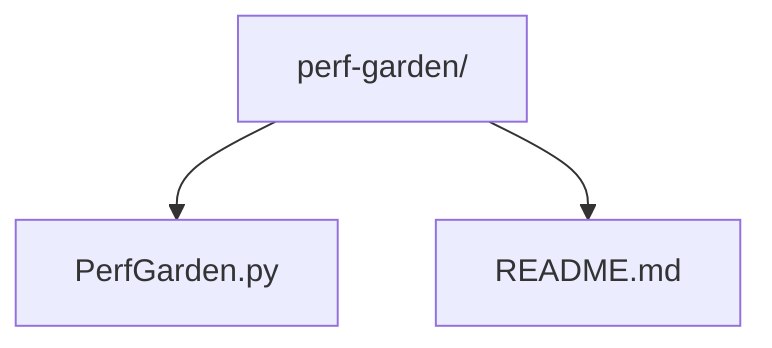
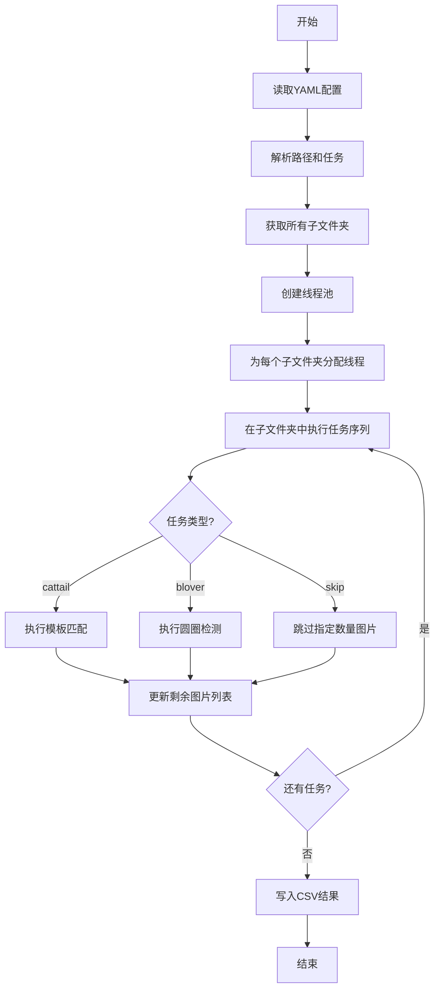
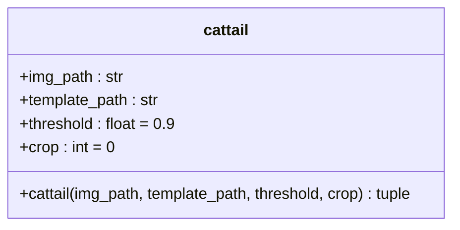
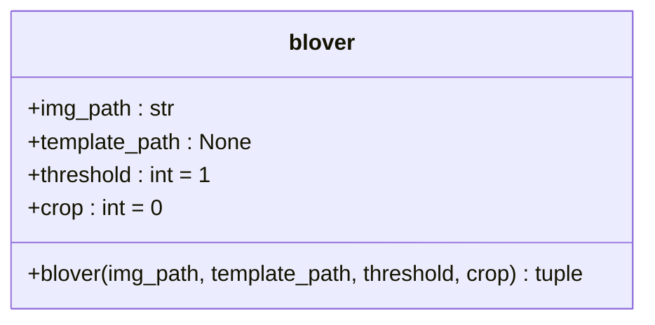
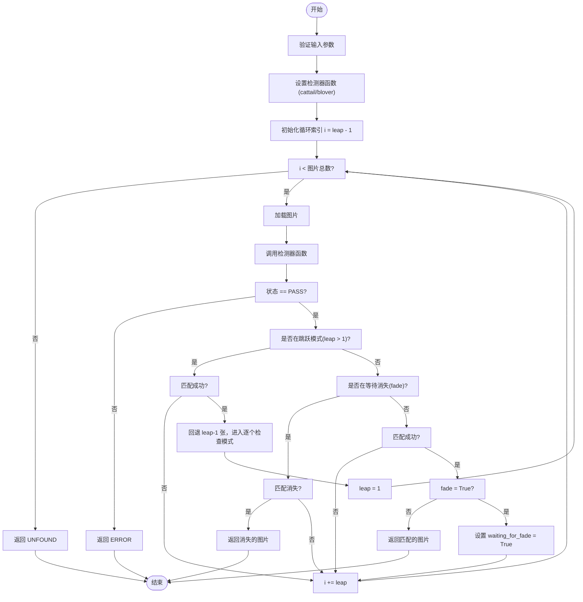
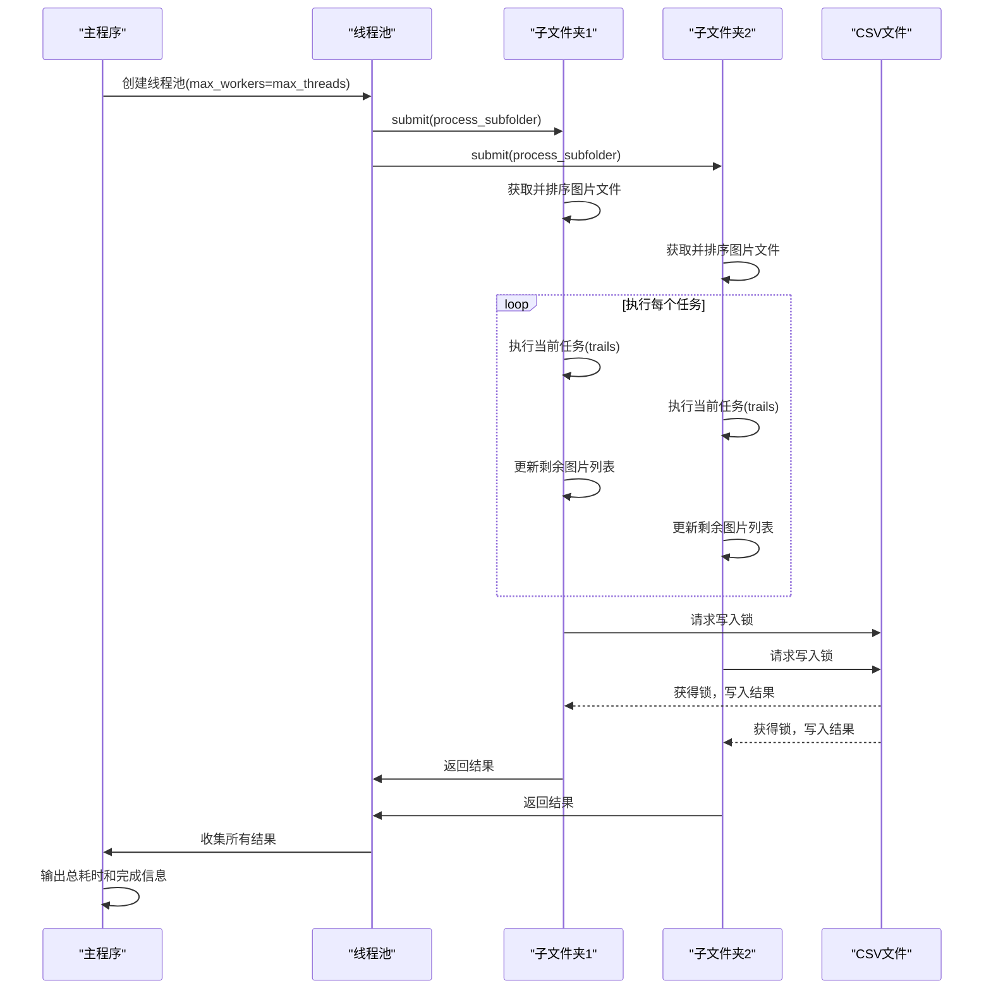
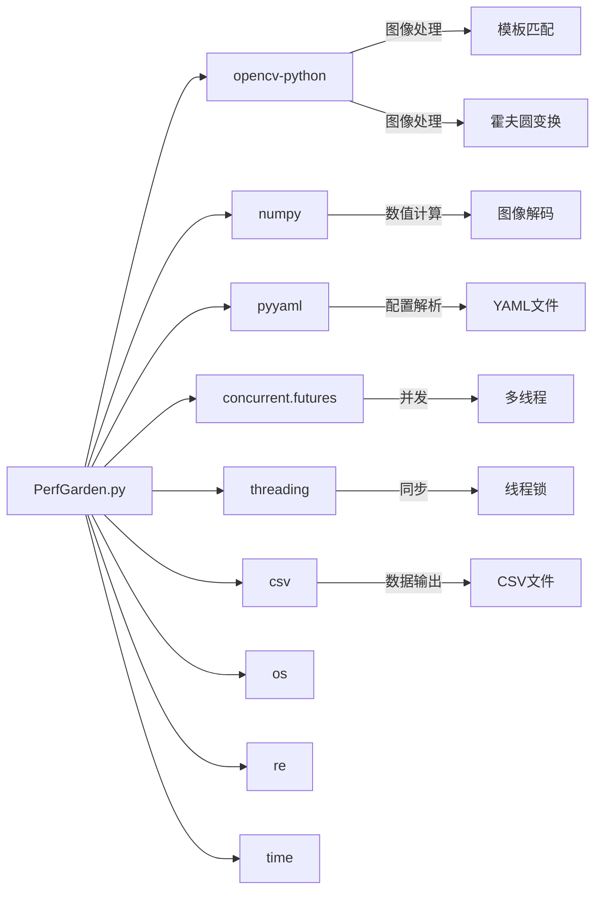

# 项目概述

<cite>
**本文档引用的文件**  
- [PerfGarden.py](file://PerfGarden.py)
- [README.md](file://README.md)
</cite>

## 目录
1. [简介](#简介)
2. [项目结构](#项目结构)
3. [核心组件](#核心组件)
4. [架构概述](#架构概述)
5. [详细组件分析](#详细组件分析)
6. [依赖分析](#依赖分析)
7. [性能考量](#性能考量)
8. [故障排除指南](#故障排除指南)
9. [结论](#结论)

## 简介
Perf Garden（性能花园）是一个基于 Python 与 OpenCV 的高效图像自动化框架，专为批量图像识别设计。该项目旨在解决“录屏分帧打标”、APP 性能测试等场景中的人工机械操作问题。通过模板匹配（cattail）、圆圈检测（blover）和多线程处理等技术，Perf Garden 能够在极短时间内完成大量图像的分析任务，处理速度远超传统 OCR 方法。

项目采用过程式与函数式结合的架构风格，实现了策略模式（通过 `detector_func` 参数选择检测算法）、工厂模式（动态创建任务参数）和观察者模式（通过 `fade` 参数监控状态变化）。其核心数据流路径为：从 YAML 配置文件解析任务参数，通过多线程分发到各个子文件夹，执行图像检测，并将结果实时写入 CSV 报告文件。项目设计稳健，能自动处理异常，确保单个任务失败不会影响整体流程。

## 项目结构
项目结构简洁明了，包含一个主执行脚本和一个详细的说明文档。

**Diagram sources**
- [README.md](file://README.md)

**Section sources**
- [README.md](file://README.md)

## 核心组件
Perf Garden 的核心功能由几个关键函数构成，它们共同实现了从配置解析到结果输出的完整流程。

**Section sources**
- [PerfGarden.py](file://PerfGarden.py#L13-L84)
- [PerfGarden.py](file://PerfGarden.py#L89-L160)
- [PerfGarden.py](file://PerfGarden.py#L164-L272)
- [PerfGarden.py](file://PerfGarden.py#L275-L359)
- [PerfGarden.py](file://PerfGarden.py#L362-L518)
- [PerfGarden.py](file://PerfGarden.py#L521-L583)

## 架构概述
Perf Garden 的整体架构遵循一个清晰的数据流和控制流。系统从 YAML 配置文件开始，解析出任务列表和全局参数，然后利用多线程技术并行处理多个子文件夹中的图像序列。每个子文件夹被视为一个独立的测试轮次，其内部的图片按顺序进行处理。

**Diagram sources**
- [PerfGarden.py](file://PerfGarden.py#L275-L359)
- [PerfGarden.py](file://PerfGarden.py#L521-L583)

## 详细组件分析

### cattail 模板匹配分析
`cattail` 函数是 Perf Garden 的核心检测方法之一，用于在大图中查找预定义的小图（模板）。

**Diagram sources**
- [PerfGarden.py](file://PerfGarden.py#L13-L84)

### blover 圆圈检测分析
`blover` 函数专门用于检测图像中的圆形，特别适用于识别加载动画等无文字的动态元素。

**Diagram sources**
- [PerfGarden.py](file://PerfGarden.py#L89-L160)

### 核心调度逻辑分析
`trails` 函数是任务执行的调度中心，它管理着图像序列的遍历、检测函数的调用以及 `fade` 和 `leap` 等高级参数的逻辑。

**Diagram sources**
- [PerfGarden.py](file://PerfGarden.py#L164-L272)

### 多线程任务分发分析
`gate_multi_thread` 和 `process_subfolder` 函数共同构成了项目的多线程处理引擎，实现了任务的并行化。

**Diagram sources**
- [PerfGarden.py](file://PerfGarden.py#L362-L518)
- [PerfGarden.py](file://PerfGarden.py#L521-L583)

## 依赖分析
Perf Garden 依赖于几个关键的第三方库来实现其功能。

**Diagram sources**
- [PerfGarden.py](file://PerfGarden.py#L1-L10)

## 性能考量
Perf Garden 的性能优化体现在多个层面。首先，它利用了 OpenCV 经过高度优化的底层算法，如 `cv2.matchTemplate` 和 `cv2.HoughCircles`，这些算法在 C++ 层面进行了加速。其次，项目通过 `crop` 参数实现了区域裁剪，显著减少了需要处理的像素数量。`leap` 参数实现了“智能间隔”，通过跳跃式检查和回溯机制，在保证不漏检的前提下大幅减少了检测次数。

最显著的性能提升来自多线程处理。`gate_multi_thread` 函数使用 `ThreadPoolExecutor` 并行处理不同的子文件夹，充分利用了多核 CPU 的计算能力。根据 README 中的测试数据，对于包含 200 多帧图片的 5 轮测试，Perf Garden 仅需 1.74 秒即可完成，而传统 OCR 方法需要 84.6 秒，速度提升了约 50 倍。

此外，项目还提供了进一步优化的建议，如减小图片尺寸（建议宽度缩小至 720 像素），这可以在保持识别质量的同时进一步提升处理性能。

**Section sources**
- [README.md](file://README.md#L1-L236)

## 故障排除指南
当使用 Perf Garden 时，可能会遇到一些常见问题。`cattail` 函数可能返回 EC01（参数错误）、EC02（读取图片失败）或 EC03（模板图片比任务图片大）错误。最常见的匹配失败原因是模板图片来源不当，应确保模板是从任务图片中直接裁剪得到的，而非截图，且尺寸和角度要匹配。

`blover` 函数可能返回 EB01（参数错误）或 EB02（读取图片失败）。如果圆圈检测不准确，可以尝试调整 `blover` 函数内部的 `param1` 和 `param2` 等霍夫变换参数。

在多线程写入 CSV 文件时，可能会遇到权限错误。项目通过实现一个带有重试机制的写入函数来解决此问题，最多重试 3 次，每次间隔递增，以应对文件被临时锁定的情况。

**Section sources**
- [PerfGarden.py](file://PerfGarden.py#L13-L84)
- [PerfGarden.py](file://PerfGarden.py#L89-L160)
- [PerfGarden.py](file://PerfGarden.py#L362-L518)

## 结论
Perf Garden 是一个设计精巧、性能卓越的图像自动化框架。它成功地将复杂的图像识别任务简化为一个可配置的流水线，通过 YAML 文件即可定义复杂的检测逻辑。项目结合了过程式编程的清晰性和函数式编程的灵活性，利用策略模式实现了检测算法的解耦，通过工厂模式动态构建任务，以及观察者模式来监控状态变化。

其多线程架构和多种加速策略（裁剪、跳跃、跳过）使其能够高效处理海量图像数据，特别适用于 APP 性能测试、录屏分析等需要从视频帧中提取关键时间点的场景。项目文档详尽，示例清晰，为初学者和高级开发者都提供了良好的使用体验。总体而言，Perf Garden 是一个将“用图像的方法解决图像的问题”这一理念付诸实践的优秀工具。